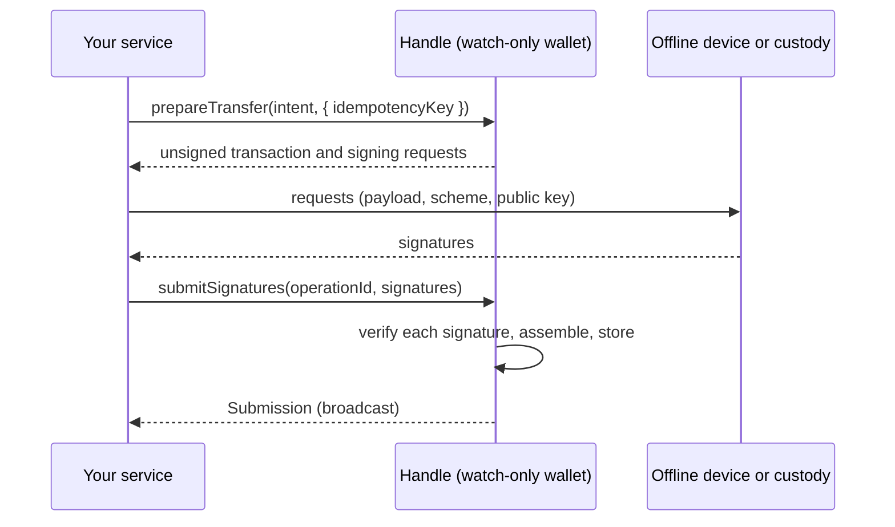

# Cold and asynchronous signing

A wallet without a signer, such as `{ publicKey: '<hex>' }`, is watch-only. `transfer` then
throws `SIGNER_UNAVAILABLE`, but `prepareTransfer` works. It builds and stores the unsigned
transaction and reserves the nonce. Then it returns the signing requests. You sign them
elsewhere and hand back the signatures:



```ts
const cold = aio.blockchain({ chain: 'fakechain', wallet: 'cold' }); // wallets.cold = { publicKey }
const prepared = await cold.prepareTransfer({ to, amount: 7n }, { idempotencyKey: 'cold-1' });
const requests = prepared.unsigned?.signingRequests ?? []; // { id, scheme, payload, publicKey }
const signatures = await offlineDevice.sign(requests); // SignatureBundle[]: { requestId, bytes, recovery? }
const sub = await cold.submitSignatures(prepared.operation.id, signatures);
```

The core verifies each signature against its request's public key (`SIGNATURE_MISMATCH`
otherwise). The Operation moves to `signed` only when every request is signed. You can submit
partial sets. A `callbackSigner` that answers `{ status: 'pending', ticket }` parks the
Operation in `awaiting-signature` in the same way. Finish it with `submitSignatures`, or call
`abandon(operationId)`. `abandon` works only before anything is signed. It releases the
nonce and cancels pending signer tickets.

Where the chain's driver can read one, `submitSignatures` also takes the whole transaction
signed elsewhere, for example a PSBT back from a hardware wallet:
`cold.submitSignatures(prepared.operation.id, { encoding: 'base64', data: signedPsbt })`. The
driver extracts the signatures, and only their bytes are used: the core verifies each one
against its stored request, exactly like a bundle. A payload that is not the prepared
transaction is refused: `INVALID_INTENT` when the driver tells it apart, otherwise
`SIGNATURE_MISMATCH` from the core's check. A chain whose driver cannot read one throws
`UNSUPPORTED_CAPABILITY` (submit bundles there). The Operation must belong to the handle's
chain, network and wallet, as for bundles.

On Bitcoin, the prepared payload is the PSBT, as base64, with one signing request per input.
Sign it with any PSBT signer and hand back the signed PSBT as base64. Only its signatures
are used, and each is verified like a bundle; a PSBT whose transaction differs from the
prepared one fails with `INVALID_INTENT`.

```ts
const prepared = await btc.prepareTransfer({ to, amount: '0.01' }, { idempotencyKey: 'cold-7' });
const psbt = prepared.unsigned?.payload.data; // base64: sign it on the hardware wallet
await btc.submitSignatures(prepared.operation.id, { encoding: 'base64', data: signedPsbt });
```

On Solana, the one signing request is an `ed25519` signature over the transaction's message
bytes (`payloadKind: 'message'`), and `submitSignatures` takes bundles only. The message
names a recent blockhash, valid for about a minute: sign within that time. Signatures that
come later give a transaction that nodes refuse (`blockhash not found`); it ends `expired`
once that is proven, and `rebuild` then needs a synchronous signer.

On TON, the one signing request is an `ed25519` signature over the 32-byte hash of the
wallet request (`payloadKind: 'message'`), and a watch-only wallet needs its `ton` settings
next to its `publicKey`. The request lives 60 seconds of chain time from its build: sign it
within that minute, or it ends `expired`, and `rebuild` then needs a synchronous signer.

## Next steps

- [Keys, signers and secrets](./keys.md): `callbackSigner` for HSM, KMS and MPC custody.
- [Wait for confirmation](./confirmations.md): follow the transfer once it is broadcast.
