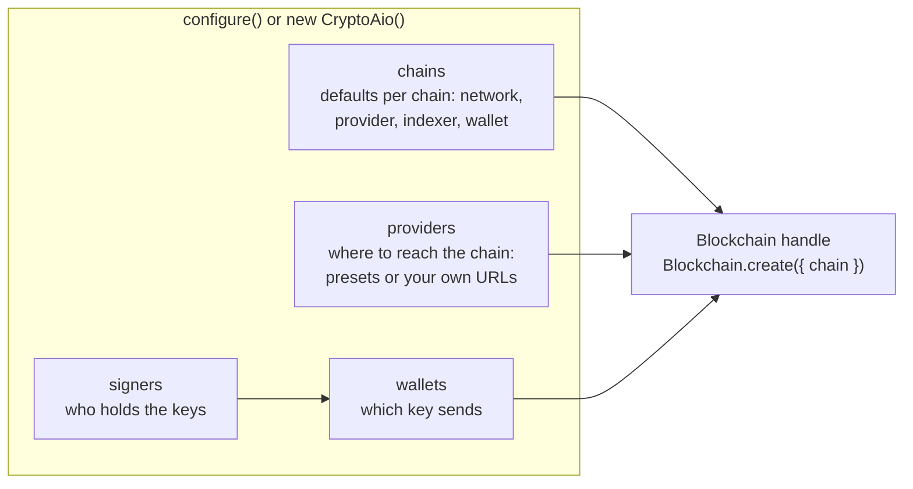

# Connect to a real network

The [Quick start](../start/quick-start.md) ran on the in-memory fake chain. A real network
needs four more things, and every family configures them the same way:



- **`providers`** name the servers that speak to the chain for you. A `preset` (`alchemy`,
  `infura`, `ankr`, `trongrid`, `toncenter`, `mempool`, …) needs only an API key; your own node
  is `{ endpoints: [{ url }] }`. Give each network two or three independent providers in
  production, so that proofs are cross-checked ([why](../tour/evidence.md)).
- **`signers`** hold private keys: `localSigner` in memory, or `callbackSigner` in front of
  your HSM, KMS or MPC custody ([Keys, signers and secrets](./keys.md)).
- **`wallets`** say which key sends, by naming a signer, or only a public key for a
  watch-only wallet.
- **`chains`** set each chain's defaults; a handle can override any of them.

Wrap every API key, credentialed URL and private key in `secret(...)`, so it never appears in
logs, errors or events. And remember that only in-memory stores ship: production also needs
durable stores ([Go to production](./production.md)).

Pick your family below. Each section is self-contained.

## EVM chains

Install the SDK with `npm install ethers` (the default library), or `npm install web3` and
set `library: 'web3'`. In production, you configure the default container once at startup
with `configure`, or you create one `new CryptoAio({ namespace })` per tenant. Only in-memory
stores ship, so production also needs your own durable `OperationStore`, `LockManager`,
`SequenceStore` and `CursorStore`, passed as `stores` and validated with the contract suites
in `crypto-aio/testing` ([how](../explore/stores.md)).

```ts
import { Blockchain, configure, localSigner, secret } from 'crypto-aio';

configure({
  providers: {
    alchemy: { preset: 'alchemy', apiKey: secret(process.env.ALCHEMY_KEY ?? '') },
    infura: { preset: 'infura', apiKey: secret(process.env.INFURA_KEY ?? '') },
  },
  signers: {
    'hot-1': localSigner({ id: 'hot-1', secp256k1: secret(process.env.HOT_KEY ?? '') }),
  },
  wallets: { 'wallet-main': { signer: 'hot-1', tier: 'hot' } },
  chains: {
    ethereum: {
      network: 'mainnet', library: 'ethers', provider: ['alchemy', 'infura'], wallet: 'wallet-main',
    },
  },
  lifecycle: { requireIdempotencyKey: true },
});

const eth = Blockchain.create({ chain: 'ethereum' });
await eth.ready(); // loads the adapter and checks the provider serves the right network
```

Two providers let proofs cross-check: by default, two healthy endpoints must agree before
the library proves finality or a failure. With one endpoint, the proof quorum is 1.

The chains are `ethereum` (`mainnet`, `sepolia`, `hoodi`), `bsc` (`mainnet`, `testnet`),
`polygon` (`mainnet`, `amoy`), `avalanche` (`mainnet`, `fuji`), `arbitrum`, `optimism` and
`base` (`mainnet`, `sepolia`). The presets are `alchemy`, `infura` and `ankr` (with an
`apiKey`), and `public` for the free public endpoints some chains' documentation lists. It
is not for production; a handle with no provider configured falls back to it where it serves
the network, with a logged warning.
[EVM networks](../reference/networks/evm.md) lists what each network supports.

A first read needs no key and no signer:

```ts
const fuji = Blockchain.create({ chain: 'avalanche', network: 'fuji', provider: 'public' });
await fuji.getBlockHeight();
```

From there, `transfer`, `waitForConfirmation` and `scanner` work as on the fake chain.
`amount: '0.01'` means 0.01 ETH on `ethereum`, and `asset: 'USDC'` sends USDC on mainnet.

## Tron

Install the SDK with `npm install tronweb`. The `trongrid` preset serves blocks,
transactions and broadcasts with an API key, and as the `indexer` it serves address history.
**Mainnet needs a key** (keyless TronGrid answers most mainnet requests with HTTP 429) and,
for cross-checked proofs, a second, independent provider such as your own node.

```ts
import { Blockchain, configure, localSigner, secret } from 'crypto-aio';

configure({
  providers: {
    tron: { preset: 'trongrid', apiKey: secret(process.env.TRONGRID_API_KEY ?? '') },
    // Your node behind a proxy that serves /wallet, /walletsolidity and /jsonrpc.
    'own-node': { endpoints: [{ name: 'node', url: secret(process.env.TRON_NODE_URL ?? '') }] },
  },
  signers: { hot: localSigner({ id: 'hot', secp256k1: secret(process.env.TRON_HOT_KEY ?? '') }) },
  wallets: { 'tron-hot': { signer: 'hot' } },
  chains: {
    tron: { network: 'mainnet', provider: ['tron', 'own-node'], indexer: 'tron', wallet: 'tron-hot' },
  },
  lifecycle: { requireIdempotencyKey: true },
});

const tron = Blockchain.create({ chain: 'tron' });
await tron.ready(); // loads tronweb; every endpoint must serve mainnet's block 0
const sub = await tron.transfer(
  { asset: 'USDT', to: 'T…', amount: '25', memo: 'order 7' },
  { idempotencyKey: 'withdrawal-42' },
);
await sub.wait({ finality: 'final' }); // the solidified block
```

What differs on Tron: fees are paid in bandwidth and energy (or TRX that buys them), a TRC-20
transfer carries a fee limit bounded by your `maxFeeLimit` option, a memo is public forever
and costs 1 TRX, and a transaction expires instead of being replaced: there is no replace or
cancel, and an expired transfer is re-issued with `rebuild`.
[Tron networks](../reference/networks/tron.md) explains each of these.

## Bitcoin

Install the SDK with `npm install bitcoinjs-lib`. Bitcoin reads everything from Esplora
servers, named twice: as the `provider` (blocks, transactions, fee estimates, broadcasts and
proofs) and as the `indexer` (the wallet's unspent outputs, balances and history). The
`mempool` (mempool.space) and `blockstream` (blockstream.info) presets are free,
rate-limited public services, and `public` uses both. Run your own Esplora for production
and configure it as `{ endpoints: [{ url }] }`.

```ts
import { CryptoAio, localSigner, secret, type UtxoFeeOverride } from 'crypto-aio';

const aio = new CryptoAio({
  signers: { hot: localSigner({ secp256k1: secret(process.env.BTC_KEY ?? '') }) },
  wallets: { treasury: { signer: 'hot', utxo: { addressType: 'p2wpkh' } } },
  chains: {
    bitcoin: {
      network: 'mainnet', provider: ['mempool', 'blockstream'], indexer: 'mempool', wallet: 'treasury',
    },
  },
  lifecycle: { broadcastFanout: 2 }, // send each transaction to both providers
});
const btc = aio.blockchain({ chain: 'bitcoin' });
const fee: UtxoFeeOverride = { satPerVByte: '2.5' }; // or 'slow' | 'normal' | 'fast'
const sub = await btc.transfer(
  {
    outputs: [
      { to: 'bc1qw508d6qejxtdg4y5r3zarvary0c5xw7kv8f3t4', amount: '0.001' },
      { to: 'bc1p5cyxnuxmeuwuvkwfem96lqzszd02n6xdcjrs20cac6yqjjwudpxqkedrcr', amount: 25_000n },
    ],
    fee,
  },
  { idempotencyKey: 'payout-42' },
);
await sub.wait({ finality: 'final' }); // 6 confirmations
```

Amounts are BTC as decimal strings or satoshis as `bigint`. Two independent providers let
proofs cross-check: with one Esplora endpoint, its operator alone decides finality. See
[Bitcoin networks](../reference/networks/bitcoin.md) for the address types, the fee options,
replace and cancel, and the limits, such as the public services' 500-output limit per
address.

## Solana

Install the SDK next to the package, `npm install @solana/web3.js`, and run on Node.js 22.12
or later: on 22.0 to 22.11, loading the SDK fails with Node's `ERR_REQUIRE_ESM`. The
`alchemy`, `infura` and `ankr` presets serve mainnet and devnet with an `apiKey`. `public`,
the cluster's own endpoint, also serves testnet, but it is only for trying things out: its
rate limits let it prove that a transfer never landed only slowly, over many passes, so
such a transfer becomes `expired`, and can be rebuilt, minutes later than on a keyed
provider.

```ts
import { Blockchain, configure, localSigner, secret } from 'crypto-aio';

configure({
  providers: {
    alchemy: { preset: 'alchemy', apiKey: secret(process.env.ALCHEMY_KEY ?? '') },
    ankr: { preset: 'ankr', apiKey: secret(process.env.ANKR_KEY ?? '') },
  },
  signers: {
    'sol-hot': localSigner({ id: 'sol-hot', ed25519: secret(process.env.SOL_SEED_HEX ?? '') }),
  },
  wallets: { payouts: { signer: 'sol-hot' } },
  chains: {
    solana: {
      network: 'devnet',
      provider: ['alchemy', 'ankr'],
      wallet: 'payouts',
      // The highest compute-unit price signed, in micro-lamports (default 10_000_000)
      options: { maxComputeUnitPrice: 2_000_000n },
    },
  },
  lifecycle: { requireIdempotencyKey: true },
});

const sol = Blockchain.create({ chain: 'solana' });
await sol.ready(); // loads @solana/web3.js; each endpoint must report devnet's genesis hash
const me = await sol.walletAddress(); // me.canonical is base58; fund it before sending
const sub = await sol.transfer(
  { asset: 'USDC', to: '<wallet address>', amount: '25', memo: 'invoice 42' },
  { idempotencyKey: 'payout-42' },
);
await sub.wait({ finality: 'final' }); // the finalized commitment
```

The key is the wallet's 32-byte ed25519 seed, as hex, not the 64-byte keypair of a Solana
CLI key file (its first 32 bytes are the seed). A decimal string is in the asset's units, so
`amount: '25'` is 25 USDC here, and a `bigint` is in base units (lamports for SOL). `to` is
the recipient's wallet, never its token account: the transfer pays into the wallet's
associated token account and creates it when it is missing, at the sender's cost (a `rent`
charge in the estimate). Solana has no replace or cancel: a transaction that never lands is
proven `expired` once its blockhash's window has passed, and `bc.rebuild(id)` then signs a
new transaction on a fresh blockhash. With one provider the proof quorum is 1, so in
production use two or three independent providers.
[Solana networks](../reference/networks/solana.md) covers the fees, the checks before signing,
expiry, refusals, scanning and history.

## TON

Install the SDKs next to the package: `npm install @ton/ton @ton/core @ton/crypto`. TON reads
from two services, both named on the handle: the `provider` is toncenter's API v2 (account
state, fee emulation, sending) and the `indexer` is its API v3 (which transaction a message
became, message traces, history). The indexer is required. The `toncenter` preset serves
both with an API key; `public` is keyless, limited to one request per second across both
APIs, and only for trying things out.

```ts
import { Blockchain, configure, localSigner, secret } from 'crypto-aio';

configure({
  providers: { toncenter: { preset: 'toncenter', apiKey: secret(process.env.TONCENTER_KEY ?? '') } },
  signers: { 'ton-hot': localSigner({ id: 'ton-hot', ed25519: secret(process.env.TON_SEED_HEX ?? '') }) },
  wallets: { payouts: { signer: 'ton-hot', ton: { version: 'v5r1' } } },
  chains: { ton: { network: 'testnet', provider: 'toncenter', indexer: 'toncenter', wallet: 'payouts' } },
  lifecycle: { requireIdempotencyKey: true },
});

const ton = Blockchain.create({ chain: 'ton' });
const me = await ton.walletAddress(); // me.display: 0Q… on testnet; fund it before sending
const sub = await ton.transfer(
  { to: '0Q…', amount: '1.5', memo: 'invoice 42' }, // 1.5 GRAM, to a non-bounceable address
  { idempotencyKey: 'payout-42' },
);
await sub.wait({ finality: 'final' }); // masterchain inclusion and a completed message trace
```

The wallet's `ton` settings decide its address: `version` (`v4r2` or `v5r1`), and
optionally `workchain`, `subwalletId` (v4r2) or `subwalletNumber` (v5r1). A v5r1 wallet has
a different address on mainnet and testnet, and a wallet deploys itself with its first
transfer. The key is the wallet's 32-byte ed25519 seed, not its mnemonic
([Keys, signers and secrets](./keys.md#local-signers)). The coin is Gram (ticker `GRAM`,
formerly Toncoin), and `TON` is an alias for it; `asset: 'USDT'` sends Tether's jetton on
mainnet. The address form decides bounce, a transfer has one output, and a wallet sends one
transfer at a time. With toncenter alone, the proof quorum is 1: in production, use two or
three independent providers. [TON networks](../reference/networks/ton.md) covers all of this.

## Avalanche X-Chain and P-Chain

Install the SDK with `npm install @avalabs/avalanchejs`. These are Avalanche's two UTXO
chains, `avalanche-x` and `avalanche-p`; the C-Chain is an EVM chain, the `avalanche` chain
of the EVM section above. A handle needs a `provider`, a node's chain API at the chain's own
URL (such as `https://node.example/ext/bc/X`), and an `indexer`, the Avalanche Data API:
`glacier` with an API key, or `public` (keyless, for trying things out, and also a public node
as the `provider`).

```ts
import { CryptoAio, localSigner, secret } from 'crypto-aio';

const aio = new CryptoAio({
  providers: {
    node: { endpoints: [{ name: 'main', url: secret(process.env.AVAX_X_RPC_URL ?? '') }] },
    glacier: { preset: 'glacier', apiKey: secret(process.env.GLACIER_API_KEY ?? '') },
  },
  signers: { hot: localSigner({ id: 'hot', secp256k1: secret(process.env.AVAX_KEY ?? '') }) },
  wallets: { treasury: { signer: 'hot' } },
  chains: { 'avalanche-x': { network: 'fuji', provider: 'node', indexer: 'glacier', wallet: 'treasury' } },
  lifecycle: { requireIdempotencyKey: true },
});

const x = aio.blockchain({ chain: 'avalanche-x' });
const sub = await x.transfer(
  { to: 'X-fuji1…', amount: '0.5', memo: 'invoice 42' }, // 0.5 AVAX; AVAX has 9 decimals here
  { idempotencyKey: 'payout-42' },
);
await sub.wait({ finality: 'final' }); // an accepted block is final
```

An accepted block never reverts, so a transfer is final as soon as it is accepted, usually
within seconds. There is no replace or cancel, the P-Chain takes no memo, and a `bigint`
amount is in nAVAX. [Avalanche X-Chain and P-Chain](../reference/networks/avalanche.md) covers
fees, spending and what is not supported yet.

## Next steps

- [Send a transfer](./send.md): outputs, assets, memos and fees.
- [Receive deposits](./receive.md): scanners, address history and crediting.
- [Networks](../reference/networks/index.md): what each network supports, family by family.
- [Go to production](./production.md): the checklist before real money moves.
