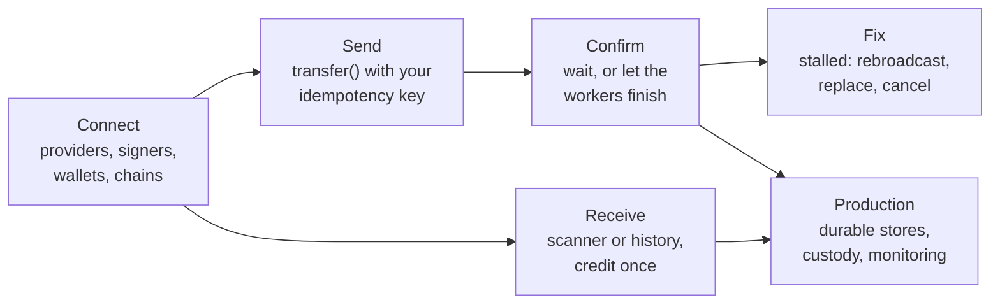

# Build

Practical guides, one task each, with code you can adapt. They assume you have run the
[Quick start](../start/quick-start.md); the terms they use are in
[Core concepts](../reference/concepts.md), and the reasons behind each rule are in the
[Developer tour](../tour/index.md).

## What do you want to do?

| I want to… | Go to |
| --- | --- |
| Copy a working snippet for a common task | [Examples](./examples.md) |
| Configure Ethereum, Bitcoin, Tron, Solana, TON or Avalanche | [Connect to a real network](./connect.md) |
| Send a withdrawal or payout, with the right fee | [Send a transfer](./send.md) |
| Know when a payment is really done | [Wait for confirmation](./confirmations.md) |
| Unstick a payment, or understand `stalled` | [Fix a stuck transfer](./stalled.md) |
| Sign with a hardware wallet, a PSBT or a custody service | [Cold and asynchronous signing](./cold-signing.md) |
| Detect and credit customer deposits | [Receive deposits](./receive.md) |
| Run background workers and recover after a crash | [Run workers and recover](./workers.md) |
| Manage keys, custody signers, policy and secrets | [Keys, signers and secrets](./keys.md) |
| Test my payment code without a network | [Test with the fake chain](./testing.md) |
| Check everything before real money moves | [Go to production](./production.md) |

## A service, end to end

Most services built on crypto-aio follow the same outline, and each step has a guide:

When a guide says a family behaves differently, the details are in
[Networks](../reference/networks/index.md), and every error code's safe action is in
[Errors](../reference/errors.md).
