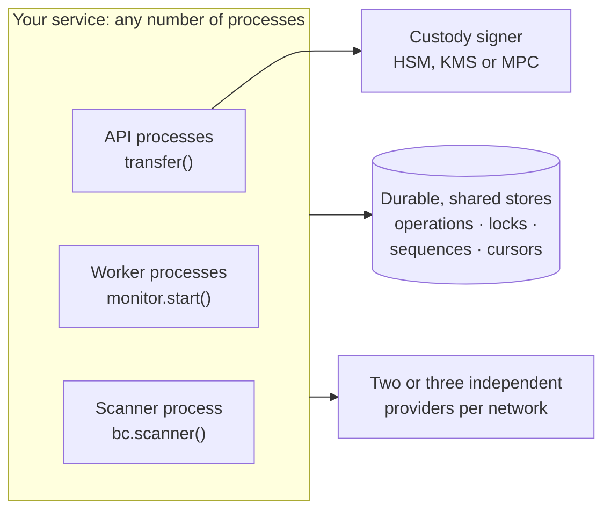

# Go to production

Everything in the other guides works on a laptop. Production adds what a laptop never
tests: several processes, restarts, a lying or lagging endpoint, a key that must never leak,
and money that must never move twice. [Production architecture](../tour/production.md)
shows how the pieces fit together; this page is the checklist to walk through before real
money moves.

## Production checklist

- [ ] One `new CryptoAio({ namespace })` per tenant. Scopes are not tenant boundaries.
- [ ] `lifecycle.requireIdempotencyKey: true`, with keys taken from durable business records.
- [ ] Durable, shared stores (operations, locks, sequences, cursors) that pass the contract
      suites. The memory stores are for tests and single processes.
- [ ] `sensitive` fields encrypted at rest, with a retention policy.
- [ ] Custody signers (`callbackSigner`) for significant balances. No `exportable` keys. No
      keys in config files or source control. Every credential in a `Secret`.
- [ ] An idempotent, short `beforeSign` hook in front of your own policy engine.
- [ ] Two or three independent providers per network, so proofs are cross-checked: with
      two, an outage of one leaves the other deciding alone, so use three for production
      proofs. No `public` preset in production.
- [ ] Tron: memos are public forever and cost a fee; never put personal data in one. Use the
      `trongrid` preset with a key on mainnet (keyless TronGrid fails there), next to a
      second, independent provider.
- [ ] `await bc.ready()` at startup, to fail fast on a missing SDK or a misconfigured provider.
- [ ] `aio.operations.recover()` at startup, then `aio.monitor.start()` workers. Alerts on
      `operation.stalled`, `nonce.gap`, `recovery.skipped` and `provider.misconfigured`.
- [ ] Complete withdrawals only on `final` with `proven` evidence. Credit deposits, which
      are `observed` in every family, only once read `final`, and automatically (or above
      your risk threshold) only once an independent provider reads the same transfer final
      ([Crediting deposits](./receive.md#crediting-deposits)). Dedupe deposits on the
      transfer id. On Bitcoin, skip a transfer whose `to` is among its `from` addresses
      (change, a cancel's refund), and never use a scanned deposit address as a change
      address.
- [ ] `await aio.close()` on shutdown.
- [ ] EVM: `maxFeePerGas` set to your fee policy (1,000 gwei per gas by default).
- [ ] Bitcoin: your own Esplora, with two or three independent endpoints as the `provider`;
      `lifecycle.broadcastFanout` of 2 or more; `nonWitnessUtxo` left on for hardware
      signers; and `allowExternalChangeAddress` only for a verified address.
- [ ] Solana: two or three independent keyed or self-hosted providers; `maxComputeUnitPrice`
      set to your fee policy; a store that keeps each Attempt's `ordering` whole; after a
      refusal, retry only with `rebroadcast` or the same idempotency key; credit SPL
      deposits by the owner wallet (`transfer.to`).
- [ ] TON: two or three independent toncenter-compatible pairs (`provider` and `indexer`),
      archival where they serve proofs, with a key on toncenter, never the `public` preset;
      wallets whose keys nothing else holds; a store that keeps each Attempt's `ordering`
      (`TonSeqnoOrdering`, `validFrom` included) exactly; a server clock in sync (builds
      refused for chain-time skew mean fix the clock); and jetton deposits credited only
      from the arrival in the owner's jetton wallet's history, never from the owner's
      notification, deduped on that transfer id, not on the trace id; the independent read
      that confirms a TON deposit uses another provider **and** indexer pair.
