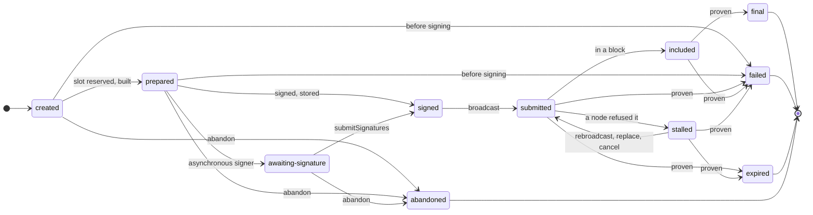

# Fix a stuck transfer

Most transfers go from `submitted` to `final` without any help. This guide is for the rest:
transfers a node refused, that wait for a signature, or that need a higher fee. First, the
whole lifecycle of an Operation:



`final`, `failed`, `expired` and `abandoned` are terminal. After signing, an Operation reaches
`final`, `failed` or `expired` only on proven evidence, from `submitted`, `stalled` or
`included`. The same lifecycle as text:

```text
created -> prepared -> [awaiting-signature] -> signed -> submitted -> included -> final
   |           |                |                           |    ^
   +-----------+----------------+--> abandoned              v    |  (rebroadcast, replace,
   +-> failed (before signing: validation, funds, policy) stalled-+   cancel, proof)
submitted | stalled | included --> failed | expired | final   (only on proven evidence)
```

An Operation is **`stalled`** when a node refused its signed transaction for a reason that
can change, such as `INSUFFICIENT_FUNDS`, `FEE_TOO_LOW` or `NONCE_TOO_HIGH`. `transfer`
throws that error, with `context.operationId`. The Operation keeps its nonce and its signed
bytes, because the transaction may still be valid later or may already be included.
Workers keep observing it, and `aio.on('operation.stalled', …)` tells you. What to do:

| Action | When | Capability |
| --- | --- | --- |
| `bc.rebroadcast(id)` | You fixed the cause (for example topped up the wallet); resends the same bytes | none |
| `bc.replace(id, { fee })` | The fee was too low; a new Attempt with the same nonce and a higher fee | `replace-fee`, synchronous signer |
| `bc.cancel(id, { fee? })` | You want to stop the payment; a conflicting self-transfer, `outcome: 'cancelled'` only if it wins at finality | `cancel`, synchronous signer |
| `bc.abandon(id)` | **Not** for `stalled`. Only for `created`, `prepared` or `awaiting-signature` | none |

`replace` is idempotent per fee spec: repeating the same `fee` returns the same replacement.
To bump again, pass a higher explicit override. A repeated `cancel` returns a pending cancel
unchanged. Only a cancel that a node refused or dropped is bumped, one step per call. Passing
`fee` builds a new cancel, but only while no cancel is on chain. `cancel` can lose the race:
if the original is already mined, it throws `NONCE_CONFLICT`, and the outcome stays
`executed`. Replace and cancel never happen automatically.

On EVM, a replacement or cancel reuses the nonce and must raise both the fee cap and the tip
(the gas price on `evm-legacy`) by the network's `replacement.minBumpPercent` (10), or it
throws `FEE_TOO_LOW`. A speed re-estimates the fee, which on a quiet network is often not
10% higher; on Polygon mainnet all three speeds often sit at the 25 gwei tip floor. So pass
an explicit override that raises each price by at least 10%. A cancel is a zero-value
transfer to yourself, at the smallest valid bump unless you pass `fee`. Arbitrum has no
mempool, so it supports neither (`UNSUPPORTED_CAPABILITY`).

A node's rejection is a claim, and every family checks it against the bytes it sent before
it ends anything: on EVM networks, "invalid sender", "invalid chain id", "rlp: …" and "tip
above fee cap" stand only when the signed bytes, read by the library itself, really carry a
bad signature, another chain id, a broken encoding or a tip above the cap. Otherwise the
answer is a refusal ("the node claimed the transaction is invalid"): the Operation stalls
instead of failing, so an endpoint that lies and relays the bytes later can never make you
pay twice. Retry a stalled transfer only with `rebroadcast` or the same idempotency key.

On Bitcoin, a replacement or cancel (BIP125) spends every input of the transaction it
replaces, and must pay the old fee plus 1 sat/vB of its own size, at a higher rate, or it
throws `FEE_TOO_LOW`. A cancel pays everything, minus its fee, back to the sending address.
When the original is already mined, a replacement or cancel throws `TX_REFUSED` (its inputs
are spent) until the workers see that block, and `INVALID_TRANSITION` once the Operation is
`included`; either way nothing new can land, and the outcome stays `executed`. A signed
transfer that a node refused stays `stalled` with its inputs held, and `abandon` refuses it,
because its bytes may already be relayed. Never retry it as a new transfer (a new
idempotency key): the new Operation spends other coins, and both can confirm. Repeat the
call with the same key, or `rebroadcast`, `replace` or `cancel` it; see
[Bitcoin networks](../reference/networks/bitcoin.md) for how it resolves.

On expiry- and seqno-based chains (Tron, Solana and TON today; `fakeexpiry` and
`fakeseqno` in the testing kit), `bc.rebuild(id)` re-issues an Operation after its expiry is
**proven** (`expired`, error `TX_EXPIRED`). It adds a `rebuild` Attempt and reopens the
Operation. Other chains throw `UNSUPPORTED_CAPABILITY`. Replace, cancel and rebuild sign a
new Attempt on the spot, so they need a synchronous signer: a signer that answers `pending`
fails them with `SIGNING_FAILED`.

**On Tron, a refusal means: do not pay again; the Operation is still live.** Tron has no
replace and no cancel (`UNSUPPORTED_CAPABILITY`). A Tron Operation is `stalled` with
`TX_REFUSED`, `TX_EXPIRED` or `INSUFFICIENT_FUNDS` when a node refused its signed bytes, and
those bytes may still land. `TX_REFUSED` also covers a node that claims the bytes can never
be valid when the library cannot confirm that claim from the bytes it sent: a lying or buggy
endpoint may have relayed them anyway, or may keep them to relay later. A liar and a genuine
refusal look the same, so repeat a call only with the **same** idempotency key, never a new
one. A `TX_EXPIRED` refusal is likewise one node's view at its own head, not proof. Fix the
cause and `bc.rebroadcast(id)` within the expiration window, or let the workers watch it:
the Operation ends `final` if the transaction lands, or `expired` once its expiry is proven,
and only then does `bc.rebuild(id)` sign a new Attempt.

**On Solana, a refusal means: do not pay again; the Operation is still live.** Solana has
no replace and no cancel (`UNSUPPORTED_CAPABILITY`). A Solana Operation is `stalled` with
`TX_REFUSED` or `INSUFFICIENT_FUNDS` when a node refused its signed bytes, and those bytes
may still land until the window of their blockhash has passed. The usual case is
`blockhash not found` on the first broadcast, from an endpoint that lags behind the one
that served the blockhash. `TX_REFUSED` also covers a node that claims the signature is
invalid when the library's own check of the bytes it sent finds every signature valid: a
lying endpoint may have relayed them anyway. The workers never resend a `stalled` transfer,
so after any refusal, even a false one, retry only with `bc.rebroadcast(id)` while the
blockhash is valid, or by repeating the call with the **same** idempotency key, never a new
one. The workers keep watching it: the Operation ends `final` if the transaction lands, or
`expired` once its expiry is proven, and only then does `bc.rebuild(id)` sign a new
Attempt. Proving the expiry reads every block of the window, which the `public` preset
does only slowly, over many passes ([Solana networks](../reference/networks/solana.md)).

**On TON, a refused or unanswered send means: do not pay again.** TON has no replace and no
cancel (`UNSUPPORTED_CAPABILITY`), and a wallet sends one transfer at a time: another one
fails with `SEQUENCE_BUSY` until the first is `included` or has ended. toncenter answers
every refused message with HTTP 500, which the library reads as "maybe sent", so the
transfer surfaces as ambiguous; another endpoint's definitive refusal leaves it `stalled`.
Either way the message may still land within its 60-second lifetime. The workers watch it
until it is proven `final` or `failed`, or `expired` once its lifetime has passed, and only
then does `bc.rebuild(id)` sign it again, at the wallet's next seqno.

## Next steps

- [Errors](../reference/errors.md): every code, and whether a new idempotency key is safe.
- [Retries, ambiguity and recovery](../tour/recovery.md): why a refusal is not a failure.
- Each family's own rules: [Networks](../reference/networks/index.md).
