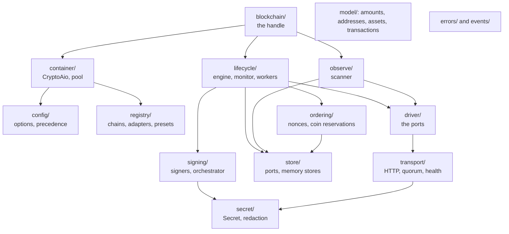

# Source map

A map of the repository for readers who want to go below the API: what each directory holds,
which file to open first, and in what order to read for a given question. The
[Developer tour](../tour/index.md) explains the design these files implement.

## The tree

```text
src/
  index.ts            the composition root: the public API, and the built-in family plugins
  native.ts           crypto-aio/native: the escape hatch to a handle's SDK client
  core/               the SDK-free core (never imports adapters/, testing/ or an SDK)
  adapters/           one directory per chain family; only these import SDKs, lazily
  testing/            crypto-aio/testing: the fake family, fake time, fakes and contract suites
test/                 unit, architecture, documentation, end-to-end and integration tests
docs/                 this site (VitePress); docs/superpowers/ holds the design records
scripts/pack-check.mjs  loads every entry point from the packed tarball
```

## The core, subsystem by subsystem



| Directory | What it does | Open first |
| --- | --- | --- |
| `core/blockchain/` | The `Blockchain` handle: every public method, delegating to the engine, monitor, scanner and driver | `handle.ts` |
| `core/container/` | `CryptoAio`, scopes, `configure()`, and the pool that shares drivers and transports | `container.ts`, `pool.ts` |
| `core/config/` | Option types, the environment source, resolution and merging | `types.ts`, `resolve.ts` |
| `core/registry/` | Catalogs filled by plugins: chains, assets, adapters, presets, schemes | `plugin.ts` |
| `core/driver/` | The ports every family implements, with a per-method contract | `types.ts` |
| `core/lifecycle/` | Transfers end to end: the engine, verdicts, waiting, workers, recovery | `engine.ts`, then `monitor.ts` |
| `core/ordering/` | Nonce and seqno allocation under the address lease; UTXO reservations | `sequence.ts` |
| `core/observe/` | The scanner: cursors, delivery, acks, reorg rollback | `scanner.ts` |
| `core/signing/` | Local and callback signers, HD derivation, the orchestrator that runs hooks and verifies | `orchestrator.ts` |
| `core/store/` | The four store ports, the in-memory stores, data classification | `types.ts` |
| `core/transport/` | The HTTP transport: endpoint health, identity, retries, rate limits, breakers, quorum | `http-transport.ts` |
| `core/model/` | Value types: `Amount`, `Address`, assets, fees, intents, transactions, capabilities | `amount.ts`, `transaction.ts` |
| `core/secret/` | `Secret`, URL and deep redaction | `secret.ts` |
| `core/errors/`, `core/events/` | Error classes and codes; the event bus and the redacting logger | `codes.ts`, `types.ts` |
| `core/assets/`, `core/util/` | Asset resolution; bytes, clocks, tagged JSON | |

The core's largest parts are the lifecycle (about 4,400 lines) and the transport (about 2,500):
that is where the safety properties live.

## A family adapter

Every directory under `src/adapters/` has the same anatomy, so reading one family teaches you the
others:

| File | Role |
| --- | --- |
| `plugin.ts` | The SDK-free plugin: chains, assets, presets and the adapter manifest |
| `chains.ts`, `network.ts` | Chain and network data; the family's capabilities and handle options |
| `presets.ts` | Provider presets: `(chain, network, apiKey)` to endpoints |
| `driver.ts` | The `DriverFactory`: builds the driver from its parts; the only importer of the SDK |
| `reader.ts`, `builder.ts`, `fees.ts`, `proofs.ts`, `decode.ts` | The ports: reads, building, fees, proofs, decoding blocks and transfers |
| `errors.ts` | Classifying the node's errors and refusals |
| `types.ts` | The SDK-free public types: `…Ext`, `…FeeOverride`, `…FeeDetails` |
| `index.ts` | The `crypto-aio/<family>` entry: constants and the native client type |

Start with the fake family (`src/testing/fake-plugin.ts` and `fake-driver.ts`, a few hundred
lines), then the EVM family. [Write a chain family plugin](./plugins.md) is the contract.

## Reading orders

**How does a transfer work?** `core/blockchain/handle.ts` (`transfer`) → `core/lifecycle/engine.ts`
(`transfer`, then the broadcast classification) → `core/ordering/sequence.ts` →
`core/signing/orchestrator.ts` → `core/lifecycle/monitor.ts` → `core/lifecycle/evaluate.ts`.

**How is a payment proven final?** `core/driver/types.ts` (`ProofSource`) →
`core/transport/http-transport.ts` (quorum reads) → `core/lifecycle/evaluate.ts` → one family's
`proofs.ts`.

**How are deposits found?** `core/observe/scanner.ts` → `core/driver/types.ts` (`BlockSource`) →
one family's `reader.ts` and `decode.ts`.

**How are secrets kept out of logs?** `core/secret/` → the redaction in
`core/transport/http-transport.ts` → `core/events/logger.ts` → `test/architecture/secret-echo.test.ts`.

## The tests

| Directory | What it tests |
| --- | --- |
| `test/core/` | The core, subsystem by subsystem, on the fake family and fake time; no network |
| `test/adapters/<family>/` | Each driver against scripted nodes (`FakeFetch`) |
| `test/architecture/` | The dependency rule, packaging, registry typing, and that secrets never echo |
| `test/docs/` | These pages: links, navigation, the tutorial, the quick start, runnable snippets, the API and capability pages |
| `test/e2e/` | The public API through the package entry points |
| `test/integration/` | Read-only checks against live testnets, only with `CRYPTO_AIO_INTEGRATION=1` |

The commands a contributor runs:

```sh
pnpm install
pnpm check          # lint, typecheck and the unit tests
pnpm test:coverage  # the tests with the coverage thresholds CI enforces
pnpm doc            # the TypeDoc type reference, into docs/api/
pnpm docs:dev       # this site, with live reload, at http://localhost:5173/crypto-aio/
pnpm test:pack      # build, pack, and load every entry point from the tarball
CRYPTO_AIO_INTEGRATION=1 pnpm test test/integration   # live, read-only
```
