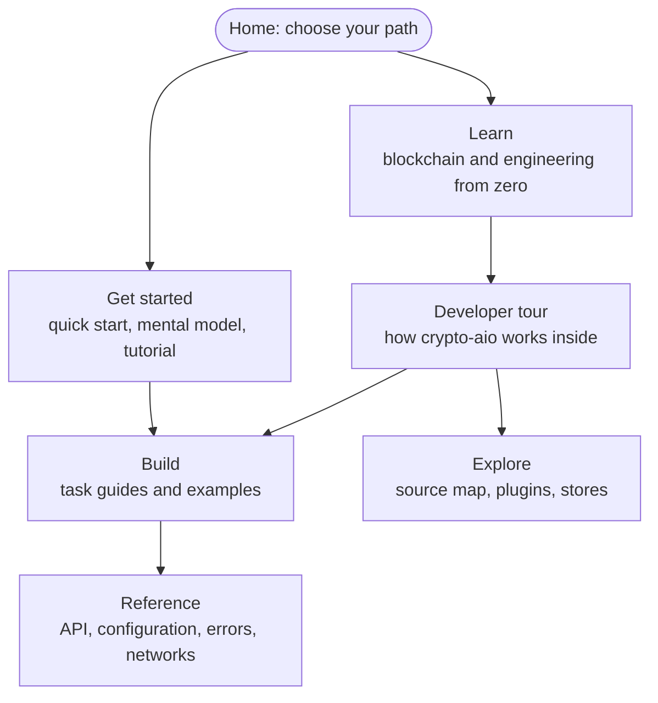

## Why crypto-aio

Moving money on a blockchain looks easy: build a transaction, sign it, send it. The hard part
is everything around it. A reply gets lost and you do not know whether you paid. A process
crashes between signing and sending. A node tells you a payment landed, and a minute later
the block it was in is gone. crypto-aio handles those cases for you, with the same API on
every chain it supports.

<div class="home-cards">

<div class="home-card">
<p class="home-card-title">One shape for every chain</p>

`getBalance`, `estimateFee`, `transfer`, `waitForConfirmation`, `scanner` and `history` work the
same way on Ethereum, Bitcoin, Tron, Solana, TON and the rest. What a chain cannot do is a
named [capability](reference/capabilities.md), never a silent difference.

</div>

<div class="home-card">
<p class="home-card-title">Pay exactly once</p>

Every transfer carries your own idempotency key. Repeat the call after a timeout, a crash or a
lost reply, and you get the same transfer back, never a second payment.
[How](tour/recovery.md)

</div>

<div class="home-card">
<p class="home-card-title">Crash-safe by design</p>

A signed transaction is stored before it is sent. After a restart, the library sends those
exact bytes again; it never signs a second, different payment.
[How](tour/transfer.md)

</div>

<div class="home-card">
<p class="home-card-title">Proof, not hearsay</p>

A transfer is final only on finalized chain data that several independent endpoints agree on,
never on one node's word. [How](tour/evidence.md)

</div>

<div class="home-card">
<p class="home-card-title">Deposits that survive reorgs</p>

Durable scanners deliver blocks at least once, roll back when the chain reorganizes, and never
guess past a reorg deeper than they can see. [How](tour/receiving.md)

</div>

<div class="home-card">
<p class="home-card-title">Keys stay with signers</p>

Private keys live only in signers: in memory, or behind your HSM, KMS or MPC custody. Logs,
errors and events never carry a secret. [How](tour/keys.md)

</div>

</div>

> [!TIP]
> Looking for one term, such as **UTXO**, **nonce** or `IDEMPOTENCY_CONFLICT`? Press
> <kbd>Ctrl</kbd> + <kbd>K</kbd> (or <kbd>⌘</kbd> + <kbd>K</kbd>) to search every page, or
> open the [Glossary](reference/glossary.md).

## Supported networks

<ul class="chain-list">
  <li>Ethereum</li><li>BNB Smart Chain</li><li>Polygon</li><li>Avalanche C-Chain</li>
  <li>Arbitrum</li><li>Optimism</li><li>Base</li><li>Bitcoin</li><li>Tron</li>
  <li>Solana</li><li>TON</li><li>Avalanche X-Chain</li><li>Avalanche P-Chain</li>
</ul>

Each family works through the SDK you already know (ethers or web3, bitcoinjs-lib, tronweb,
`@solana/web3.js`, `@ton/ton`, `@avalabs/avalanchejs`), installed only if you use it. Any other
EVM chain is a few lines of data. See [Networks](reference/networks/index.md) for what each
network supports.

## A first look

```ts
import { Blockchain, configure, localSigner, secret } from 'crypto-aio';

configure({
  providers: {
    alchemy: { preset: 'alchemy', apiKey: secret(process.env.ALCHEMY_KEY ?? '') },
    infura: { preset: 'infura', apiKey: secret(process.env.INFURA_KEY ?? '') },
  },
  signers: { hot: localSigner({ id: 'hot', secp256k1: secret(process.env.HOT_KEY ?? '') }) },
  wallets: { treasury: { signer: 'hot' } },
  chains: { ethereum: { network: 'sepolia', provider: ['alchemy', 'infura'], wallet: 'treasury' } },
  lifecycle: { requireIdempotencyKey: true },
});

const eth = Blockchain.create({ chain: 'ethereum' });
const sub = await eth.transfer(
  { to: '0x3535353535353535353535353535353535353535', amount: '0.01' },
  { idempotencyKey: 'withdrawal-42' }, // your own id: repeating the call never pays twice
);
const { status } = await sub.wait({ finality: 'final' });
console.log(status.state, status.evidence); // 'final' 'proven'
```

No key at hand? The [Quick start](start/quick-start.md) runs the same flow on an in-memory
chain that needs no network.

## How these pages fit together

These pages are one connected set, with several ways in. Pick the path that matches you; you
can switch paths at any time.



| Section | Kind of page | Read it when you want to… |
| --- | --- | --- |
| [Get started](start/index.md) | Short and practical | Install the package and see it work |
| [Learn](learn/index.md) | Lessons, from first principles | Understand blockchains and the engineering of payments |
| [Developer tour](tour/index.md) | A guided walk through the system | Understand how crypto-aio is built, and why |
| [Build](build/index.md) | Task guides and examples | Get a specific job done |
| [Reference](reference/index.md) | Exact and complete | Check a signature, a default, an error code or a network |
| [Explore](explore/index.md) | Internals and extension | Read the source, add a chain, write a store |
