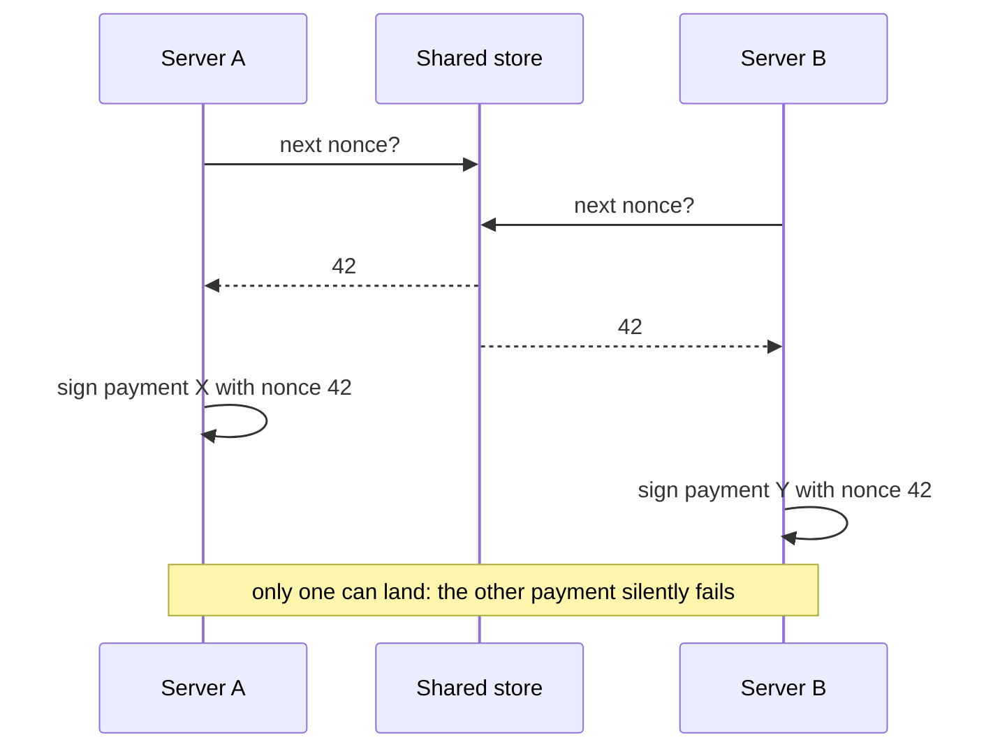
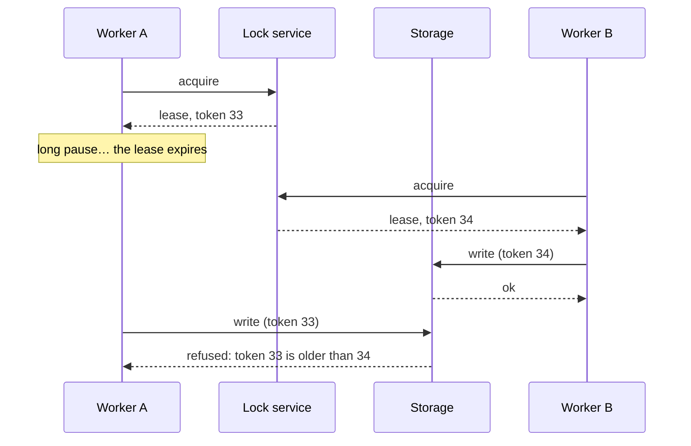

# Concurrency: locks, leases and fencing

> [!TIP]
> **The short version.** When several processes work at once, two of them can read the same
> value and act on it, a **race condition**: two payments get the same nonce, or one payment is
> processed twice. A **lock** lets one process work at a time. Across machines, a lock must
> expire, or a dead holder blocks everyone, so it becomes a **lease**. But a holder that pauses
> can wake up after its lease expired and still act. A **fencing token**, a number that grows
> with every new lease, lets the storage refuse the late writer.

**Builds on:** [Persistence and crash recovery](./persistence.md) and
[Accounts, UTXOs and transaction order](../foundations/ordering.md).

## The race

Two servers handle withdrawals from the same EVM hot wallet. Each needs the wallet's next
nonce. Both read it at the same moment:



Each server did nothing wrong on its own. The bug is in the **interleaving**: read, then act,
with another process acting in between. Such bugs hide in testing, where requests rarely
overlap, and appear in production, under load.

## Locks

The classic fix is **mutual exclusion**: a **lock** that only one process can hold. Server A
takes the lock for "the nonce of wallet 0xabc", reads 42, reserves it, and releases the lock.
Server B waits, then reads 43. Inside one program, a mutex does this. Across many machines, the
lock must live in shared storage, a database or Redis, as a **distributed lock**.

## Leases: locks that expire

A distributed lock has a new problem: the holder can die while holding it. A crashed process
never releases anything, so a plain lock would block every other server forever. So distributed
locks **expire**: a holder gets the lock for, say, 30 seconds, a **lease**, and must **renew** it
to keep it longer. If it dies, the lease runs out and another process can take over.

## Fencing: when a paused holder wakes up

Expiry creates a subtler problem. A process can pause without dying: a long garbage-collection
pause, a swapped-out VM, a network hiccup. If it pauses past its lease, another process takes
over, and then the first one wakes up and continues, **believing it still holds the lease**.
Now two processes act at once, exactly what the lock was for.

The process cannot reliably notice its own pause, so the protection must come from the
storage. Each new lease gets a **fencing token**, a number that increases with every
acquisition. Every write carries the writer's token, and the storage refuses a token older than
the newest it has seen:



The same idea works without locks, too: each record carries a **version**, and an update that
expects version 7 fails if the record is at 8 (lesson 12's optimistic concurrency).

<details markdown="1">
<summary>Under the hood: why time is not enough</summary>

It is tempting to have the paused process check "is my lease still valid?" before each write.
It cannot work: the pause can happen between the check and the write. Clocks on different
machines also drift apart. Fencing works because the decision is made where the write lands,
in one place, by comparing numbers rather than clocks. This argument is well known from
distributed-systems engineering (see Martin Kleppmann's writing on distributed locking).

</details>

## Why a developer cares

- **Every shared value is a race,** unless something orders the access: nonces, coin
  selection, a payment's state, a scanner's position.
- **Distributed locks must expire, and expiry needs fencing.** A lock without fencing is a lock
  that works until the day it doesn't.
- **Your stores implement the fence.** If you write your own storage for a payment system, the
  "refuse the old token" rule is part of its contract, not an optional extra.

## In crypto-aio

crypto-aio holds an **address lease** while it chooses an ordering slot (a nonce) and signs,
so concurrent transfers from one wallet get consecutive nonces (lesson 7 showed it). Background
workers **claim** Operations with expiring claims, each with a token. Both go through the
`LockManager` and the `OperationStore`, and a write with an older token or version is refused
with `FENCING` or `VERSION_CONFLICT`. A lease is easy to watch on fake time:

<!-- runnable -->
```ts
import { MemoryLockManager } from 'crypto-aio';
import { FakeClock } from 'crypto-aio/testing';

const clock = new FakeClock();
const locks = new MemoryLockManager(clock);

const a = await locks.acquire('send:0xabc', 'worker-a', 30_000); // A holds the lease
console.log(a?.token); // 1n
console.log(await locks.acquire('send:0xabc', 'worker-b', 30_000)); // null

await clock.advance(31_000); // A pauses longer than its lease
const b = await locks.acquire('send:0xabc', 'worker-b', 30_000); // B takes over
console.log(b?.token); // 2n
console.log(a && (await locks.renew(a, 30_000))); // null
```

Worker A's renewal fails, and any write it attempts with token 1 is refused by a store that
follows the contract. The library's contract suites (`crypto-aio/testing`) test exactly this
"stale worker" case against your own stores ([Write a durable
store](../../explore/stores.md)). [Nonces, leases and many processes](../../tour/ordering.md)
shows where the library takes each lease.

## Check yourself

1. Two servers each read nonce 42 and sign. What happens on chain?
2. Why must a distributed lock expire?
3. A worker's lease expired during a pause; another worker took over. The first one now writes
   with its old token. Who stops it?

<details markdown="1">
<summary>Answers</summary>

1. Only one of the two transactions can use nonce 42; the other is invalid, so one payment
   never happens (or, if both were fee-bumped replacements, the wrong one may win).
2. Its holder can crash without releasing it; without expiry, everyone would wait forever.
3. The storage: it refuses a write whose fencing token is older than the newest one it has
   seen. The worker itself cannot reliably know it was paused.

</details>

## Key terms

- **Race condition:** a bug that depends on how concurrent steps interleave.
- **Lock (mutex), distributed lock:** one holder at a time; in shared storage across machines.
- **Lease:** a lock that expires unless renewed.
- **Fencing token:** a number that grows with each lease; storage refuses older ones.
- **Claim:** a worker's expiring lease on one piece of work.

## What's next

Your processes now agree with each other. But they all depend on answers from servers you do
not control. What if a server is wrong, or lies? [Trust: one server's word is not
proof](./trust.md).
