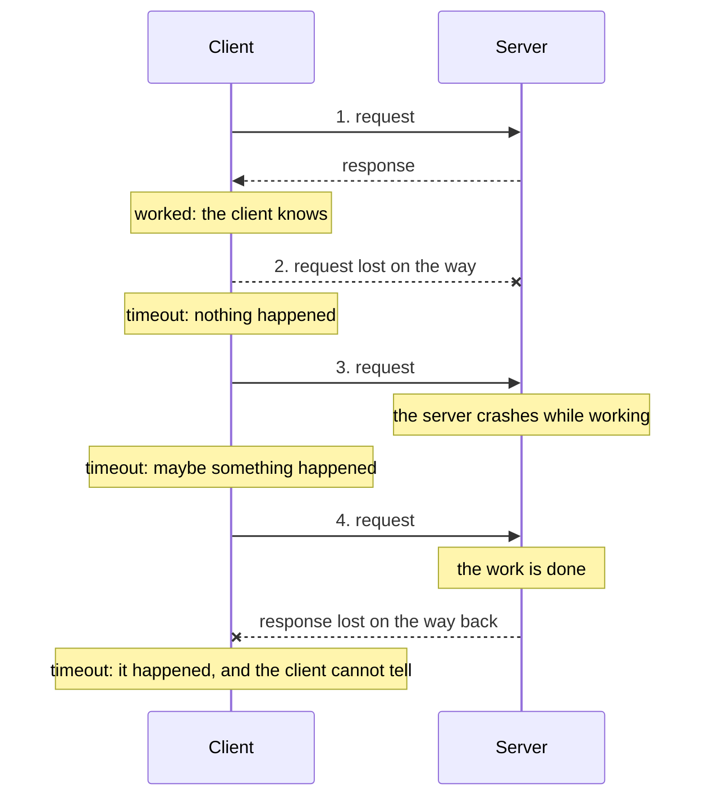

# When networks fail: timeouts, retries and ambiguity

> [!TIP]
> **The short version.** A request over a network can end three ways: it worked, it
> definitely failed, or **you cannot know**. A timeout, a dropped connection or a lost reply
> all look the same from your side, even when the server did the work. Retrying a read is
> harmless. Retrying a payment blindly can pay twice. Good systems retry carefully (with
> backoff), stop hammering broken servers (circuit breakers), and treat "unknown" as its own
> outcome: **ambiguous**.

**Builds on:** [Nodes, RPC and providers](../foundations/nodes.md) and
[Transactions](../foundations/transactions.md).

## The letter that never got an answer

You mail a check to pay a bill and never hear back. Did the letter get lost on the way? Did
it arrive, get cashed, and the receipt get lost on the way back? From your mailbox, both look
exactly the same: silence. If you mail a second check "to be safe", you may pay twice. If you
don't, you may not pay at all.

Every network request has the same problem. Here are four ways a request can go, and what
the client sees:



Cases 2, 3 and 4 look identical to the client: it waited, and nothing came back. Only in case
4 did the work happen, and the client has no way to tell which case it is in.

## Three outcomes, not two

So a request has three outcomes, not two:

| Outcome | Example | Safe next step |
| --- | --- | --- |
| **Success** | `200` with the result | Use it |
| **Definite failure** | The server answered "invalid signature" or "insufficient funds" | Fix the cause; the request did nothing |
| **Ambiguous** | A timeout, a dropped connection, a `504` from a gateway, a crash after sending | Find out what happened before doing anything that could repeat it |

The third outcome is the dangerous one, and the most common mistake in payment code is to
treat it as the second: "it timed out, so it failed, so let's pay again".

<details>
<summary>Under the hood: the Two Generals' Problem</summary>

Computer science has a name for this: the **Two Generals' Problem**. Two generals must agree on
a time to attack, and can only communicate by messengers who may be captured. The general who
sends a message never knows it arrived unless a reply comes back, and the replier never knows
the reply arrived, and so on forever. It is proven that no protocol over an unreliable channel
can guarantee that both sides know the outcome. Systems therefore don't try to make the
uncertainty go away; they make actions safe to repeat (lesson 11) and record what they did
(lesson 12).

</details>

## Retrying well

For a request that is safe to repeat, such as reading a balance, retrying is the right answer
to most failures. Done naively, it makes things worse: if a server is overloaded, a thousand
clients retrying instantly keep it overloaded. Three techniques help:

- **Timeouts.** Never wait forever. Give each request a deadline, so a hung server cannot hang
  your program.
- **Exponential backoff with jitter.** Wait before retrying, and double the wait each time
  (200 ms, 400 ms, 800 ms, …), up to a cap, with some randomness, so that clients do not all
  retry in step. Stop after a few attempts.
- **Circuit breakers.** After several failures in a row, stop sending to that server for a
  while (the circuit is "open"), and try another one. After a pause, let one request through
  to see whether it recovered.

And honor what servers tell you: a `429` with `Retry-After: 2` means wait two seconds.

## Which requests may be retried?

Not every request can simply be repeated:

- **Reads** (balance, block height, a transaction's status) change nothing. Retry freely.
- **Broadcasting signed bytes** is special. Sending the same signed transaction twice is
  harmless, as lesson 5 showed: the chain applies it at most once. But a failed broadcast is
  **ambiguous**: the bytes may have reached the network. The next step must never be "sign a
  new one".
- **Anything that creates a new payment** must not be retried blindly. It needs idempotency,
  the next lesson.

## Why a developer cares

- **A timeout is not a failure.** Code that treats it as one will, one day, pay twice.
- **Retries need limits and spacing,** or they turn a small outage into a big one.
- **Every error should say whether it is ambiguous,** so the caller knows whether "try again"
  is safe.

## In crypto-aio

Every request goes through the library's transport, which applies a timeout (15 s by default),
retries with exponential backoff (3 attempts, from 200 ms up to 5 s, by default), honors
`Retry-After`, and keeps a circuit breaker per endpoint. Every request is tagged with how it
may be retried: reads are `safe`, a broadcast is `ambiguous-on-failure`.

Every error carries two flags: `retryable` (trying again later may work) and `ambiguous` (the
outcome is unknown). Here a node accepts a transfer but its reply is lost:

<!-- runnable -->
```ts
import { isCryptoAioError } from 'crypto-aio';
import { createFakeEnv } from 'crypto-aio/testing';

const env = await createFakeEnv({ transport: { maxAttempts: 1 } });
// The node accepts the next broadcast, but the reply is lost (HTTP 504).
env.chain.configureEndpoint('main', { acceptThenFail: true });

const error = await env
  .run(env.bc.transfer({ to: env.stranger(), amount: 3n }, { idempotencyKey: 'withdrawal-9' }))
  .catch((e: unknown) => e);
if (!isCryptoAioError(error)) throw error;
console.log(error.ambiguous); // true
const operation = await env.run(env.bc.getOperation(String(error.context.operationId)));
console.log(operation?.state, operation?.ambiguous); // submitted true
```

The library knows it may have paid: the Operation is `submitted`, marked ambiguous, and its
signed bytes are stored. The safe next step, repeating the call with the same key, is the
subject of the next lesson. [Errors](../../reference/errors.md) lists the safe action for every
code, and [Configuration](../../reference/configuration.md) the transport's settings.

## Check yourself

1. A request times out. List the three things that might have happened at the server.
2. Is it safe to retry "get balance" after a timeout? "Broadcast these signed bytes"? "Pay Bob
   5"?
3. Why add random jitter to backoff delays?

<details>
<summary>Answers</summary>

1. The request never arrived; it arrived and the server failed partway; or it was fully done
   and the reply was lost.
2. Yes; yes, the same bytes land at most once (but the outcome stays unknown until checked);
   no, not without an idempotency key, since it may pay twice.
3. So that many clients that failed together don't all retry at the same instant and overload
   the server again.

</details>

## Key terms

- **Timeout:** the deadline after which a client stops waiting.
- **Ambiguous failure:** a failure after which the client cannot know whether the action happened.
- **Retry, exponential backoff, jitter:** trying again, waiting longer each time, with randomness.
- **Circuit breaker:** stops calling a failing server for a while.
- **Retryable:** a failure where trying again later may succeed.

## What's next

An ambiguous payment has to be retried in a way that can never pay twice. The idea that makes
that possible: [Idempotency](./idempotency.md).
