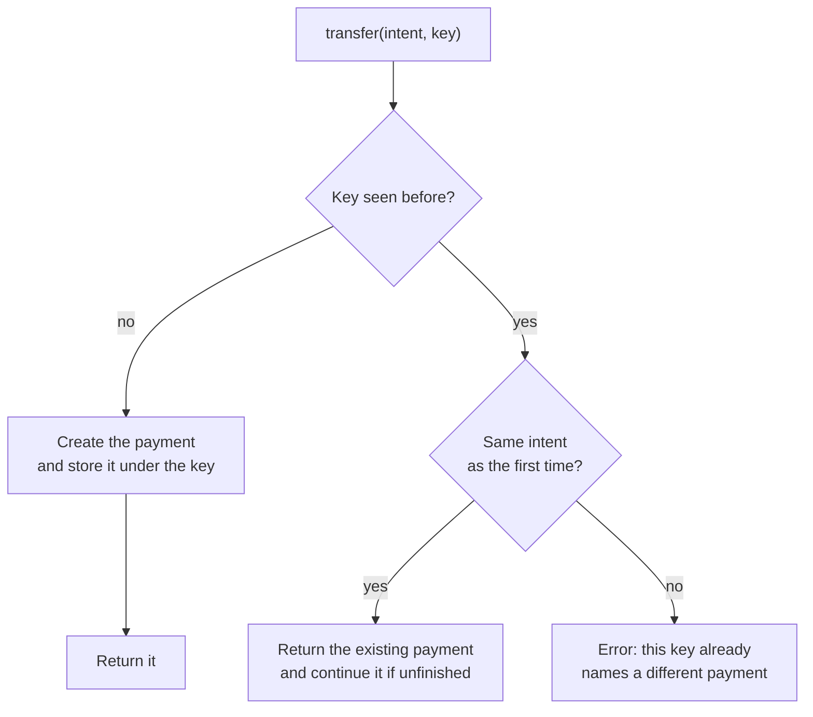

# Idempotency: pay once, however often you ask

> [!TIP]
> **The short version.** An operation is **idempotent** if doing it twice has the same effect
> as doing it once. Payments are not idempotent by nature, so payment systems make them so: the
> caller attaches an **idempotency key**, its own unique id for the payment, and the system
> remembers every key. A repeat with the same key returns the original result instead of paying
> again; the same key with a different payment is an error. With idempotency, "retry until you
> get an answer" becomes safe.

**Builds on:** [When networks fail](./failure.md), which ended with a payment that may or may
not have happened.

## Twice is the same as once

Some actions are naturally idempotent:

- Pressing an elevator's call button five times calls one elevator.
- "Set the thermostat to 21 °C" leaves it at 21 °C however often you say it.
- "Mark order 42 as shipped" leaves it shipped.

Others are not:

- "Raise the temperature by 1 °C", said five times, is five degrees.
- "Add 5 to Bob's balance", or "pay Bob 5", said twice, is 10.

The difference is whether the instruction names a **result** ("it should be 21") or an
**increment** ("one more"). Payments are increments. That is why the ambiguous failure of the
last lesson is so dangerous: the natural fix, "try again", repeats an increment.

## Idempotency keys

The standard fix, used by payment companies for decades, is to give every payment a name
before it happens:

1. The caller creates a unique **idempotency key** for the business action, such as the id of
   the withdrawal row in its own database.
2. It sends the key with the request.
3. The system stores the key with the payment it creates. If a request arrives with a key it
   has seen, it does not create anything: it returns what it did the first time.



Now the retry problem is solved. After a timeout, the caller simply repeats the request with
the same key. If the first attempt never arrived, the payment is created now. If it arrived,
the system returns the existing payment. Either way, Bob is paid exactly once.

## Where the key comes from

The key must survive whatever made you retry, including a crash of your own process. So it
cannot be generated at the moment you call; it must come from durable state you already
have:

- **Good:** the primary key of the `withdrawals` row, written to your database before the
  payment is requested. After a restart you find the row, and with it the same key.
- **Bad:** a random UUID generated right before the call, or the current timestamp. After a
  restart, a new key means a new payment.

## Same key, different request

What if a request reuses a key with different details: the same key, but 0.002 instead of
0.001? That is almost always a bug (two withdrawals sharing an id), and silently returning the
first payment would hide it. So the system also stores a **fingerprint** of the original
request, a hash of its normalized contents, and refuses a mismatch with an error.

"Normalized" matters: `amount: '0.001'` and `amount: 100_000n` can be the same amount, written
two ways. Comparing the meaning, not the text, keeps innocent retries from being refused.

<details>
<summary>Under the hood: exactly-once is an illusion, effectively-once is not</summary>

Distributed systems cannot guarantee that a message is **delivered** exactly once: the Two
Generals' Problem forbids it. What they can guarantee is that its **effect** happens once:
deliver at least once (retry until acknowledged), and make the receiver idempotent (ignore
repeats). "At-least-once delivery plus idempotent processing" is the recipe behind payment
APIs, message queues and databases, and behind crypto-aio. You will see it again in deposit
scanning, where blocks are delivered at least once, and you deduplicate on a transfer id.

</details>

## Why a developer cares

- **Every payment needs a key from your own records,** stored before you ask for the payment.
- **Retry with the same key, always.** A new key after an ambiguous failure is how payments
  happen twice.
- **A key conflict is a bug report.** Investigate it; don't work around it with a new key.

## In crypto-aio

Every transfer accepts an `idempotencyKey`, and the payment it creates, the **Operation**, is
unique per namespace and key. Set `lifecycle.requireIdempotencyKey: true` in production, so
that forgetting the key is an error rather than a random key. The library compares requests
by their **`intentHash`**, a hash of the normalized intent: chain, network, asset, outputs in
base units, sender, memo and fee.

<!-- runnable -->
```ts
import { isCryptoAioError } from 'crypto-aio';
import { createFakeEnv } from 'crypto-aio/testing';

const env = await createFakeEnv();
const to = env.stranger();
const key = { idempotencyKey: 'payout-77' }; // your withdrawal's own id

const first = await env.run(env.bc.transfer({ to, amount: '0.001' }, key));
const again = await env.run(env.bc.transfer({ to, amount: 100_000n }, key)); // same amount
console.log(again.operationId === first.operationId); // true
console.log(env.chain.sendCount(first.attempt?.id ?? '')); // 1

const other = await env.run(env.bc.transfer({ to, amount: '0.002' }, key)).catch((e) => e);
console.log(isCryptoAioError(other) ? other.code : other); // IDEMPOTENCY_CONFLICT
```

And here is the ambiguous payment of the last lesson, retried the right way:

<!-- runnable -->
```ts
import { createFakeEnv } from 'crypto-aio/testing';

const env = await createFakeEnv({ transport: { maxAttempts: 1 } });
let signatures = 0;
env.aio.on('signer.requested', () => signatures++);
env.chain.configureEndpoint('main', { acceptThenFail: true }); // the reply will be lost

const intent = { to: env.stranger(), amount: 3n };
const key = { idempotencyKey: 'withdrawal-9' };
await env.run(env.bc.transfer(intent, key)).catch(() => undefined); // ambiguous
const retried = await env.run(env.bc.transfer(intent, key)); // the same key
console.log(retried.ambiguous, signatures); // false 1
```

The retry found the stored Operation, resent its **already signed** bytes, and got a clear
answer: still one signature, one payment. [Retries, ambiguity and
recovery](../../tour/recovery.md) follows this path inside the library.

## Check yourself

1. Is "set Bob's balance to 25" idempotent? "Add 5 to Bob's balance"?
2. Your service generates `crypto.randomUUID()` as the key just before calling `transfer`.
   What goes wrong after a crash?
3. A retry fails with `IDEMPOTENCY_CONFLICT`. Should you retry with a new key?

<details>
<summary>Answers</summary>

1. Yes; no.
2. After the restart, the retry generates a new key, so the library sees a new payment, and the
   first may already have landed: a double payment. Take the key from a durable record instead.
3. No. The key already names a different payment: find out why two requests share it.

</details>

## Key terms

- **Idempotent:** having the same effect however many times it is done.
- **Idempotency key:** the caller's unique id for one business action.
- **Request fingerprint (`intentHash`):** a hash of the normalized request, to detect a key
  reused for something else.
- **At-least-once delivery:** retrying until acknowledged, so a message may arrive twice.

## What's next

An idempotency key only helps if the system remembers it, and everything else about the
payment, through a crash. [Persistence and crash recovery](./persistence.md).
