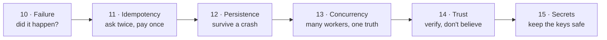

# Part 2: Engineering for money

Part 1 explained how value moves on a blockchain. This part explains why moving it **reliably**
is hard, and how the engineering world solves each difficulty. None of these ideas is specific
to crypto: they are how banks, payment companies and databases have always kept money
correct. On a blockchain they matter even more, because nothing can be undone.

| # | Lesson | The problem it solves |
| --- | --- | --- |
| 10 | [When networks fail](./failure.md) | A request timed out. Did the payment happen or not? |
| 11 | [Idempotency](./idempotency.md) | How do you retry safely, when retrying might pay twice? |
| 12 | [Persistence and crash recovery](./persistence.md) | The process died halfway through a payment. Now what? |
| 13 | [Concurrency: locks, leases and fencing](./concurrency.md) | Ten workers share the work. How do they not collide? |
| 14 | [Trust: one server's word is not proof](./trust.md) | A server says the payment failed. Is it telling the truth? |
| 15 | [Secrets and key custody](./secrets.md) | Where do private keys live, and how do secrets leak? |

Each lesson ends by showing how crypto-aio applies the idea. After lesson 15, the
[Developer tour](../../tour/index.md) puts them all together, inside the library.
