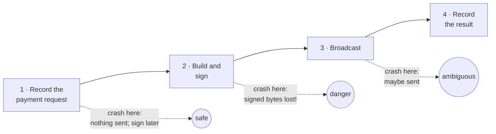

# Persistence and crash recovery

> [!TIP]
> **The short version.** A process can die at any instant, and everything in its memory dies
> with it. A payment system survives this by writing each step to durable storage **before**
> acting on it, a technique called **write-ahead logging**, and by giving every payment a
> stored **state**. After a restart, it reads the states back and finishes each payment from
> where it stopped, never repeating a step that cannot be repeated. For blockchains, the step
> that matters most is: **store the signed bytes before you broadcast them.**

**Builds on:** [Idempotency](./idempotency.md) and
[Transactions](../foundations/transactions.md).

## Memory forgets

A running program keeps its work in memory. Memory is fast, and it is erased the moment the
process stops: a deploy, a crash, an out-of-memory kill, a power cut. Only **durable storage**,
a database or a disk, survives. So the question for any multi-step operation is: if the
process dies between two steps, what does the next process find, and what does it do?

## Where can a payment crash?

Walk through a payment's steps, and imagine the process dying after each one:



- **After step 1:** nothing was signed or sent. The next process can continue: build, sign,
  send.
- **After step 2, if the signature was not stored:** the next process does not know a signed
  transaction exists. It signs again, and the new transaction can differ (another fee,
  other coins). If the first one was ever broadcast, or gets broadcast, both can land. **This
  is the double payment.**
- **After step 3:** the bytes may be on the network. Lesson 10 called this ambiguous.

The cure for step 2 is to change the order: **persist the signed transaction before
broadcasting it**. Then a crash anywhere after signing leaves the signed bytes on disk, and the
next process sends **those bytes** again, which is always safe (lesson 5).

## Write-ahead logging

This is an old and general idea. Databases write every change to a **write-ahead log** before
applying it, so that after a crash they can replay or undo it. Pilots read a checklist before
acting, not after. The rule is the same: **record your intention durably, then act.** A
recovery process can then always tell what was in flight.

## States make recovery precise

Recording "something happened" is not enough; recovery needs to know exactly **how far** each
payment got. So each payment carries a **state**, saved on every step: `created`, `prepared`,
`signed`, `submitted`, and so on, until a final state. A small table of rules then says what
recovery does for each state:

| Stored state | What recovery knows | What it does |
| --- | --- | --- |
| Nothing signed yet | No transaction exists | Leave it for the caller to repeat, or abandon it |
| Signed, not broadcast | Exact bytes exist, maybe never sent | Send those bytes again |
| Broadcast, outcome unknown | The bytes may be on the network | Send those bytes again; check the chain |
| Included or final | The chain has it | Keep watching until it is final |

Notice what recovery never does: sign. Everything after signing is a resend of stored bytes.

<details>
<summary>Under the hood: versions protect stored state</summary>

Several processes may update the same stored payment. To stop one from overwriting another's
newer update, each record carries a **version** number. An update says "change this record
**if it is still at version 7**", and the database refuses it otherwise. This is **optimistic
concurrency control**, or compare-and-set, and lesson 13 builds on it.

</details>

## Why a developer cares

- **Crashes are routine,** not exotic: every deploy is one. Payment code must be correct when
  killed at any line.
- **The order of writes is a safety property.** "Sign, broadcast, then save" loses money; "sign,
  save, then broadcast" does not.
- **In-memory state is not state.** A payment system's stores must be durable and shared by
  every process.

## In crypto-aio

crypto-aio stores every payment as an **Operation** with a state, and every signed transaction
as an **Attempt**, in its `OperationStore`, and it stores each signed Attempt **before** it
broadcasts it. At startup, `aio.operations.recover()` reads the stored states and resends what
needs resending. Recovery never signs, so it does not even need the signer.

The testing kit can crash the process at any write. Here the process dies right after the
signed Attempt is stored, before the broadcast:

<!-- runnable -->
```ts
import { MemoryOperationStore } from 'crypto-aio';
import { CrashError, FaultyOperationStore, createFakeEnv } from 'crypto-aio/testing';

const operations = new FaultyOperationStore(new MemoryOperationStore());
const env = await createFakeEnv({ stores: { operations } });
let signatures = 0;
env.aio.on('signer.requested', () => signatures++);
const to = env.stranger();

operations.crashOn({ method: 'appendAttempt', timing: 'after' }); // die after storing it
const crash = await env
  .run(env.bc.transfer({ to, amount: 7n }, { idempotencyKey: 'crash-1' }))
  .catch((e: unknown) => e);
console.log(crash instanceof CrashError); // true

const restarted = await env.restart({ killPrevious: true }); // a new process, same stores
restarted.aio.on('signer.requested', () => signatures++);
const [stored] = await restarted.run(restarted.aio.operations.list());
console.log(stored?.state); // signed
const report = await restarted.run(restarted.aio.operations.recover());
console.log(report.rebroadcast, report.failed); // 1 0
restarted.chain.mine();
console.log(restarted.chain.balance(to), signatures); // 7n 1
```

Signed once, paid once. The memory stores used here lose everything when the process exits,
so production needs durable stores of your own ([Write a durable
store](../../explore/stores.md)). [Run workers and recover](../../build/workers.md) shows
recovery in a real service.

## Check yourself

1. Why must the signed transaction be stored **before** it is broadcast?
2. After a restart, a payment is stored as `prepared`: built, never signed. Should recovery
   sign and send it?
3. Why is it safe for recovery to resend stored signed bytes many times?

<details>
<summary>Answers</summary>

1. If the process dies after broadcasting but before storing, the next process does not know
   the transaction exists, signs a new one, and both may land.
2. Not on its own: nothing was signed, so nothing is in flight. The caller repeats the
   transfer with the same idempotency key (which signs it), or abandons it. Recovery only
   finishes what was already signed.
3. The same signed bytes are the same transaction; the chain applies it at most once.

</details>

## Key terms

- **Durable storage:** storage that survives a process stopping: a database, a disk.
- **Write-ahead logging:** recording an intended change before applying it.
- **State machine:** a fixed set of states and the allowed moves between them.
- **Recovery:** finishing in-flight work after a restart, from stored state.
- **Optimistic concurrency (versions):** "update only if unchanged since I read it".

## What's next

One process can now crash safely. Real services run many processes at once, all touching
the same payments and the same accounts. [Concurrency: locks, leases and
fencing](./concurrency.md).
