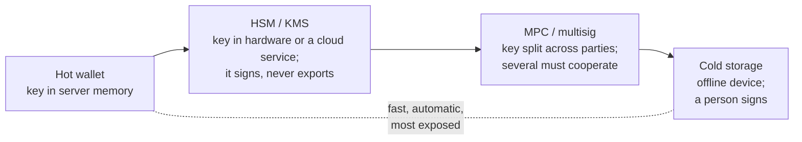

# Secrets and key custody

> [!TIP]
> **The short version.** A payment system holds two kinds of secrets: **private keys**, which
> are the money itself, and **credentials** such as API keys. Secrets rarely leak through
> clever attacks; they leak through logs, error messages, config files and crash reports. Keep
> every secret in a type that refuses to print itself, never let one reach a log, and keep
> private keys in as few places as possible: ideally in **custody** systems (HSM, KMS, MPC) that
> sign without ever revealing the key, behind a **policy** that approves each payment.

**Builds on:** [Hashes, keys and signatures](../foundations/cryptography.md) and
[Wallets, keys and addresses](../foundations/wallets.md).

## What counts as a secret

| Secret | If it leaks… |
| --- | --- |
| A private key, seed or mnemonic | The funds it controls can be taken, instantly and irreversibly |
| A provider API key, or an endpoint URL that contains one | Someone uses, and bills, your account; or reads which addresses you watch |
| Database credentials | Your payment records can be read or changed |

Private keys are in a class of their own. A leaked password can be changed; a leaked key's funds
are gone the moment someone signs with it.

## How secrets actually leak

Most leaks are accidents, in places nobody thinks of as "output":

- **Logs.** `logger.info('calling', url)` logs an API key that sits in the URL path.
- **Error messages.** A library error quotes the request URL, the server's answer echoes the key,
  and the error is logged, or sent to an error tracker.
- **Serialization.** An object holding a key is passed to `JSON.stringify`, or printed in a debug
  dump, or stored in a cache.
- **Source control.** A `.env` file is committed, and lives in the repository's history forever,
  even after it is deleted.
- **Telemetry.** Metrics, traces and analytics events carry more fields than intended.

The defense is to make the safe path the default:

1. **Wrap secrets in a type that redacts itself.** If printing, logging or serializing the
   value shows `[REDACTED]`, an accident leaks nothing. Only an explicit `reveal()` gets the
   value, and only where it is needed.
2. **Redact at the edges.** Scrub URLs, headers and error messages before they reach a log.
3. **Keep secrets out of code and config files.** Load them at startup from a secret manager
   or the environment, never from the repository.
4. **Give telemetry only operational data:** ids, states, codes and timings, not addresses,
   amounts or URLs.

## Where keys live: custody



- **Hot wallet.** The key is in the server's memory (loaded from a secret store at startup).
  Fast and fully automatic; a server breach can take everything in it. Keep its balance small.
- **HSM and KMS.** A hardware security module, or a cloud key management service, holds the key
  and signs on request. The key never leaves it, so a breached server can request signatures
  while the breach lasts, but cannot steal the key.
- **MPC and multisig.** The key is split across several parties (multi-party computation), or a
  payment needs several keys (multisig). No single machine or person can sign alone.
- **Cold storage.** Keys on offline devices; a person approves and signs. Safe, slow, and
  manual: for reserves, not daily payouts.

Large services combine them: a small hot wallet for routine withdrawals, refilled from custody
that requires approval, with most funds in cold storage.

## Policy before signing

Whoever can request a signature can move money. So a payment system puts a **policy** check
in front of signing: withdrawal limits, allow-lists, rate limits, human approval above a
threshold. The check must run **before** the signature, on the exact payment being signed,
because after signing it is too late.

<details>
<summary>Under the hood: deterministic keys and the export trap</summary>

Some libraries can export a private key "for backup". Every export is a new copy of the money,
in a new place, with its own leak risks. Production signers should be created non-exportable,
so that the only way to use the key is to ask the signer to sign. Backups belong to the
custody system's own process (a sealed mnemonic, an HSM backup ceremony), not to the
application.

</details>

## Why a developer cares

- **A logged secret is a leaked secret.** Assume logs, traces and error reports are read by
  many people and kept for years.
- **Your application should not need the key,** only the ability to request signatures from
  something that has it.
- **The policy hook is your last line.** Limits and approvals must sit between your code and
  the signer.

## In crypto-aio

crypto-aio wraps every credential in a **`Secret`**: `String()`, `JSON.stringify` and
`util.inspect` print `[REDACTED]`, and only `reveal()` returns the value. The transport names
endpoints by label, never by URL, and scrubs secrets from errors; events carry operational data
only.

<!-- runnable -->
```ts
import { localSigner, redactUrl, secret } from 'crypto-aio';

const apiKey = secret('my-api-key'); // in real code: secret(process.env.PROVIDER_KEY ?? '')
console.log(String(apiKey)); // [REDACTED]
console.log(JSON.stringify({ apiKey })); // {"apiKey":"[REDACTED]"}
console.log(apiKey.reveal().length); // 10
console.log(redactUrl('https://eth.example.com/v2/YOUR-API-KEY-GOES-HERE')); // https://eth.example.com/v2/[REDACTED]

const { signer } = localSigner.generate({ curves: ['secp256k1'] }); // not exportable
const exported = await signer.exportKey?.('secp256k1').catch((e) => e.code);
console.log(exported); // KEY_NOT_EXPORTABLE
```

Private keys live only inside **signers**: `localSigner` keeps them in memory (a hot wallet),
and `callbackSigner` puts any custody system behind three callbacks, including custody that
answers "pending" and signs later, after a human approval. The `beforeSign` hook is the policy
seam: it sees every payment before it is signed, and can veto it. [Keys, signers and
secrets](../../build/keys.md) covers all three, and [Keys, signers and
policy](../../tour/keys.md) explains the design.

## Check yourself

1. Your logger prints every outgoing request URL. What leaks?
2. Why is an HSM safer than a key in server memory, even though a breached server can still
   ask the HSM to sign?
3. Where should withdrawal limits be enforced: before or after signing?

<details>
<summary>Answers</summary>

1. Every API key embedded in a URL path or query string, to everyone who can read the logs.
2. A breach can request signatures only while it lasts, and a policy can still refuse them;
   the key itself cannot be copied and used later, from anywhere.
3. Before: once a transaction is signed, it can be broadcast by anyone who has the bytes.

</details>

## Key terms

- **Secret:** any value whose disclosure causes harm: keys, mnemonics, API keys, credentials.
- **Redaction:** replacing a secret with a placeholder before output.
- **Custody:** how and where private keys are held and used.
- **HSM, KMS:** hardware or a cloud service that signs without exporting keys.
- **MPC, multisig:** signing that needs several parties or keys.
- **Signing policy:** rules that approve or veto a payment before it is signed.

## What's next

That completes the engineering foundations: failure, idempotency, persistence, concurrency,
trust and secrets. Part 3 opens crypto-aio and shows how it puts every one of them to work,
starting with [The big picture](../../tour/architecture.md).
