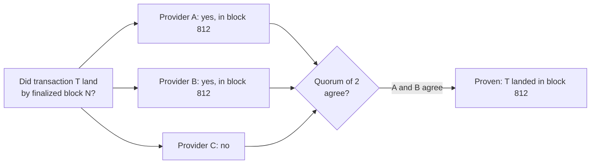

# Trust: one server's word is not proof

> [!TIP]
> **The short version.** Everything your code knows about a blockchain comes from servers
> someone else runs, and a server can be behind, pointed at the wrong network, buggy, or
> dishonest. So treat a single answer as an **observation**, not a fact. Decide anything that
> moves money only on **proof**: finalized data that several independent servers agree on,
> checked against what you can verify yourself. And remember that "not found" is not proof
> that something does not exist.

**Builds on:** [Nodes, RPC and providers](../foundations/nodes.md) and
[Blocks, confirmations and finality](../foundations/blocks.md).

## You never see the chain itself

A blockchain removes the need to trust a bank. But your code does not run a node of its own;
it asks providers. Unless you are careful, you have simply moved your trust from a bank to
whichever server answered your last request. That server can mislead you in several ways:

| Problem | Example | What it costs |
| --- | --- | --- |
| **Lagging** | It is 50 blocks behind and says your transaction "does not exist" | You decide a payment failed, and pay again |
| **Misconfigured** | Its URL points at a testnet node | You read balances and blocks of the wrong ledger |
| **Inconsistent** | A load balancer sends each request to a different node, each at a different height | Answers contradict each other |
| **Dishonest** | A compromised provider reports a deposit that never happened | You credit money that does not exist |

The two costliest mistakes run in opposite directions. Believing a false "failed" makes you
**pay twice**. Believing a false "succeeded", for a deposit, makes you **credit money you never
received**.

## Verify instead of trusting

Systems that handle money use a handful of techniques, all of them old ideas from distributed
systems:

1. **Check identity.** Before trusting a server, ask it which network it serves (the chain id,
   or the hash of the genesis block) and refuse it if the answer is wrong.
2. **Check freshness.** Compare each server's latest block with the others'. One far behind is
   **lagging**: its "not found" means "not yet", and it decides nothing.
3. **Check what you can compute yourself.** A transaction's id is the hash of its bytes; a
   signature verifies or it doesn't. When a server claims "your transaction is invalid", check
   the bytes you sent before believing it.
4. **Ask several independent servers, and require agreement.** A **quorum** read asks, say,
   two or three providers run by different companies, and accepts an answer only when enough of
   them agree. One liar can then block a decision, but not make one.
5. **Decide only on final data.** An answer about a block that can still be reorganized can
   change. Proof is made of finalized blocks.



## Absence is not proof

"I can't find it" is the most dangerous answer in a payment system. A node may not have seen
the transaction yet, may have pruned old data, may index only recent history, or may be lying.
None of these mean "it never happened", and treating them as such is how the same payment gets
sent twice.

A system can prove a transaction's absence only when the chain gives it a way to: for example,
a transaction with an **expiry** (lesson 7) that is missing from **every** block of its validity
window, read from finalized blocks and agreed by a quorum. Without such a rule, "not found"
proves nothing, ever, and the honest answer is "undecided".

<details markdown="1">
<summary>Under the hood: safety versus liveness</summary>

Distributed systems distinguish **safety** (nothing bad ever happens, such as a double payment)
from **liveness** (something good eventually happens, such as a verdict). Requiring proof
trades liveness for safety: when providers disagree or lag, the system waits instead of
deciding. For money, that is the right trade. A payment stuck as "undecided" for an hour is an
inconvenience; a payment wrongly marked "failed" and sent again is a loss.

</details>

## Why a developer cares

- **Use two or three independent providers** in production. With one, its operator alone
  decides every verdict.
- **Never treat "not found" as "failed".**
- **Deposits are where lies pay.** Credit only final deposits, and before an automated or large
  credit, read the deposit again through an independent provider.

## In crypto-aio

crypto-aio labels every status with its **evidence**: `observed` (one endpoint's current view,
which can change) or `proven` (finalized chain data read under the **proof quorum**: by default,
two endpoints must agree). After signing, an Operation becomes `final`, `failed` or `expired`
only on proven evidence. "Dropped" and "refused" are never final. Before trusting an endpoint,
the transport checks its identity and its height:

<!-- runnable -->
```ts
import { createFakeEnv } from 'crypto-aio/testing';

const env = await createFakeEnv({
  endpoints: ['a', 'b', { name: 'slow', lag: 10 }, { name: 'wrong', identity: 'fake-mainnet' }],
});
env.chain.mine(20);
const status = await env.run(env.bc.getNetworkStatus());
for (const endpoint of status.endpoints) console.log(endpoint.id, endpoint.state);
// Prints:
// fake/a healthy
// fake/b healthy
// fake/slow lagging
// fake/wrong disabled

const sub = await env.run(env.bc.transfer({ to: env.stranger(), amount: 5n }));
env.chain.mine();
const seen = await env.run(env.bc.waitForConfirmation(sub.operationId, { confirmations: 1 }));
console.log(seen.status.state, seen.status.evidence); // included observed
env.chain.mine(5);
const done = await env.run(sub.wait({ finality: 'final' }));
console.log(done.status.state, done.status.evidence); // final proven
```

The endpoint 10 blocks behind is `lagging` and decides nothing; the one serving another network
is `disabled` (and a `provider.misconfigured` event fired). The transfer was `included` on one
endpoint's word, and `final` only on proof. Deposits are read, not proven, so the library
reports them as `observed` and [Receive deposits](../../build/receive.md#crediting-deposits)
explains how to credit them safely. [Evidence, proofs and finality](../../tour/evidence.md) goes
deeper into the transport.

## Check yourself

1. A provider says your withdrawal's transaction "was not found". What do you conclude?
2. Why ask providers run by **different** companies for a quorum?
3. You have one provider. What is your proof quorum, effectively?
4. Which is worse for an exchange: a withdrawal stuck "undecided" for an hour, or one wrongly
   marked "failed"?

<details markdown="1">
<summary>Answers</summary>

1. Nothing. It may be lagging, pruned, or lying. Only a proven absence (on chains that allow
   one) or a proven inclusion is a result.
2. So one company's outage, bug or compromise cannot produce a wrong answer on its own.
3. One: its operator alone decides. The library then proves with a quorum of 1, so configure
   two or three providers in production.
4. Wrongly "failed": the natural reaction is to pay again, and then the customer is paid twice.

</details>

## Key terms

- **Lagging endpoint:** one too far behind the best known height to decide anything.
- **Identity check:** confirming an endpoint serves the expected network.
- **Quorum read:** an answer accepted only when enough independent endpoints agree.
- **Observed / proven:** one endpoint's current view / finalized data agreed by a quorum.
- **Safety / liveness:** never deciding wrongly / eventually deciding.

## What's next

The last engineering lesson is about the one thing that, once lost, cannot be recovered by any
amount of careful engineering: [Secrets and key custody](./secrets.md).
