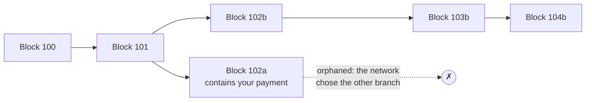

# Blocks, confirmations and finality

> [!TIP]
> **The short version.** Transactions are added to the ledger in **blocks**. For a short
> while, the network can replace its newest blocks with others, a **reorg**, and a payment in a
> replaced block can vanish or move. Each block built on top of a payment's block is a
> **confirmation** and makes a reorg less likely. A payment is **final** when the chain's rules
> say it can never be undone. Until then, it is only "included".

**Builds on:** [Transactions](./transactions.md), which ended with a payment in a block.

## Blocks and the chain

A **block** is a batch of transactions plus a **header**: its height (its position in the
chain), a timestamp, and the hash of the previous block's header. That last field links each
block to its parent, all the way back to the first block, the **genesis block**. The newest
block is the **head** or **tip** of the chain.

Who gets to add the next block is decided by the chain's **consensus** protocol:

- **Proof of work** (Bitcoin): computers called miners race to solve a costly puzzle; the
  winner adds the next block, about every 10 minutes.
- **Proof of stake** (Ethereum, most others): validators lock up coins as a deposit and take
  turns proposing blocks; misbehaving costs them the deposit. Ethereum adds a block every 12
  seconds, Tron every 3, Solana several per second.

## Forks and reorgs

Agreement among thousands of computers is not instant. Two block producers can each add a
different block at the same height, a **fork**. For a moment, part of the network sees one
branch and part sees the other. The consensus rules then pick one branch, and every node
switches to it. Switching discards the blocks of the losing branch: a **reorganization**, or
**reorg**.



A transaction in an orphaned block is not lost forever. It goes back to the mempool and is
usually included again, in another block at another height. But it might not be: if a
conflicting transaction landed in the winning branch, yours is now invalid. This is exactly
how a **double-spend attack** works: pay a merchant, wait until the merchant ships, then get a
conflicting payment into a branch that wins a reorg.

## Confirmations

A payment's **confirmations** are the blocks that sit on top of its block, counting its own
block as the first. A payment in the head block has 1 confirmation; after five more blocks, it
has 6. Each confirmation makes a reorg that removes it less likely, because the network would
have to replace more and more blocks.

## Finality

**Finality** is the point at which a payment can never be undone. Chains reach it in two
different ways:

- **Probabilistic finality.** On a proof-of-work chain like Bitcoin, a deep reorg is never
  impossible, only extremely unlikely. By convention, 6 confirmations (about an hour) count
  as settled for large amounts.
- **Deterministic finality.** Most modern chains run a finality mechanism on top of block
  production. Once it marks a block **finalized**, no valid reorg can remove it.

| Chain | When a block is final |
| --- | --- |
| Bitcoin | Probabilistic; deep enough by convention (crypto-aio waits for 6 confirmations) |
| Ethereum and most EVM chains | When the `finalized` checkpoint passes it, about 13 minutes on Ethereum |
| Tron | When it is **solidified**, about 19 blocks (a minute) below the head |
| Solana | At the **finalized** commitment level |
| TON | When a masterchain block includes it |
| Avalanche (all three chains) | As soon as it is accepted: accepted blocks are never reverted |

The [network pages](../../reference/networks/index.md) give each network's exact rule.

<details>
<summary>Under the hood: "included" is not "succeeded" either</summary>

A transaction can be included in a block and still **fail**. A token contract can refuse a
call, or run out of the gas the transaction paid for. The failure is recorded in the ledger,
the fee is spent, and no value moves. So a final verdict needs two answers: is the
transaction final, and did it do what it was meant to do? On EVM chains the second answer is
in the transaction's **receipt** (its status, and the `Transfer` event a token logs).

</details>

## Why a developer cares

- **Withdrawals:** "included" is a progress update, not a result. Mark a payout complete only
  when it is final.
- **Deposits:** credit a customer only for final deposits, or accept the risk explicitly.
  Crediting on 1 confirmation is how exchanges get double-spent.
- **Scanning:** code that reads blocks to find deposits must notice reorgs and undo what it
  learned from discarded blocks.

## In crypto-aio

Every status the library returns says how far along a transaction is, and how sure the
library is of it:

- `state`: for example `mempool`, `included` or `final`.
- `confirmations`: how many blocks deep it is.
- `finality`: `none`, `probabilistic` (included, but could still be reorganized) or `final`.
- `evidence`: `observed` (one endpoint's current view) or `proven` (finalized data, checked
  by several endpoints). Lesson 14 explains why the difference matters.

Watch a payment move through all of it, through a reorg, on the fake chain:

<!-- runnable -->
```ts
import { createFakeEnv } from 'crypto-aio/testing';

const env = await createFakeEnv();
const sub = await env.run(env.bc.transfer({ to: env.stranger(), amount: 5n }));
const id = sub.attempt?.id ?? '';

env.chain.mine(); // block 1 includes the payment
const first = await env.run(env.bc.getTransactionStatus(id));
console.log(first.state, first.finality, first.confirmations); // included probabilistic 1

env.chain.reorg(1); // block 1 is replaced by another block 1, and a block 2
const after = await env.run(env.bc.getTransactionStatus(id));
console.log(after.blockHash === first.blockHash); // false
console.log(after.state, after.confirmations); // included 2

env.chain.mine(5); // the fake chain finalizes blocks 3 below its head
const done = await env.run(sub.wait({ finality: 'final' }));
console.log(done.status.state, done.status.evidence); // final proven
```

For your own transfers, `waitForConfirmation(id, { finality: 'final' })` (or `sub.wait(…)`)
resolves only on a final, proven status; `{ confirmations: n }` waits for depth instead. For deposits, the scanner's
`mode: 'final'` delivers only finalized blocks, and in `head` mode it emits a **rollback** event
when a reorg discards blocks it delivered ([Receive deposits](../../build/receive.md)).

## Check yourself

1. Your payment has 1 confirmation. Can it still disappear?
2. What happens to a transaction in an orphaned block?
3. Why is "included" not enough to mark a withdrawal complete?
4. A transaction is final, but the token contract refused the call. Did value move?

<details>
<summary>Answers</summary>

1. Yes: a reorg can replace its block. Deeper blocks, and finality, make that ever less likely
   or impossible.
2. It returns to the mempool and usually lands again in another block, unless a conflicting
   transaction made it invalid.
3. A reorg can still remove it, or move it, and it may even have failed. Only `final` (with
   proof) is a result.
4. No. The failure is final too: the fee was paid and no tokens moved.

</details>

## Key terms

- **Block header, height, head:** a block's metadata, its position, the newest block.
- **Genesis block:** the first block of a chain.
- **Consensus (proof of work, proof of stake):** how a network decides who adds blocks.
- **Fork, reorg:** competing branches; switching branches and discarding blocks.
- **Confirmations:** blocks on top of a transaction's block, its own included.
- **Probabilistic / deterministic finality:** "very unlikely to change" / "cannot change".
- **Receipt:** an EVM transaction's result: success or failure, and the events it logged.

## What's next

A reorg can bring back an old transaction, and a retry can send one twice. What stops a chain
from applying the same payment twice, and two payments in the wrong order?
[Accounts, UTXOs and transaction order](./ordering.md).
