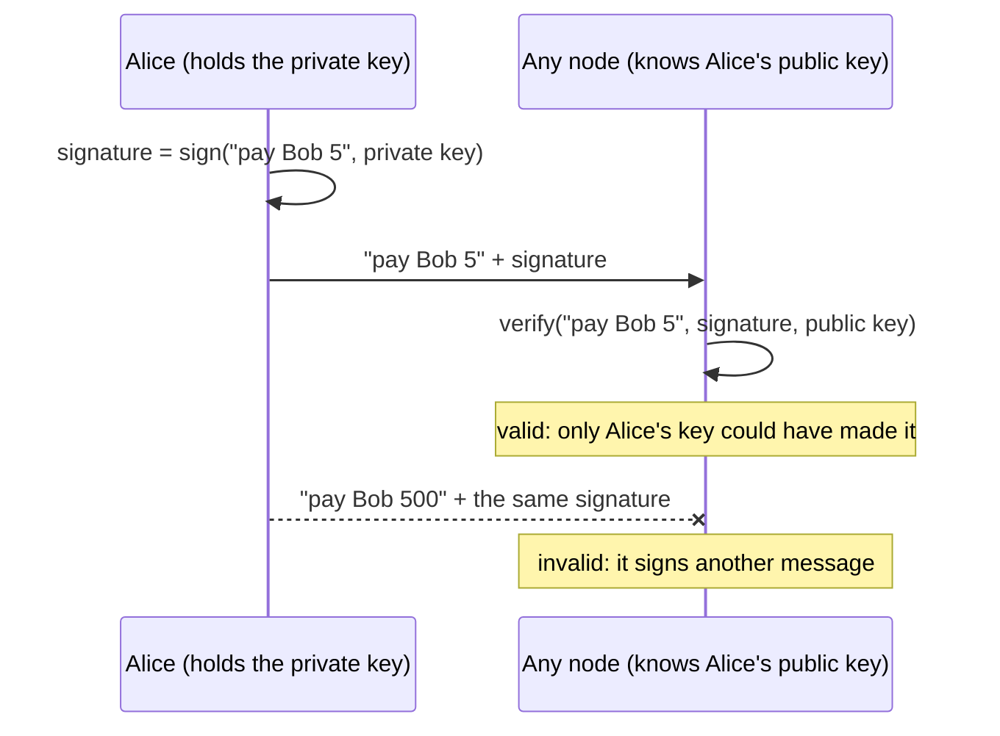

# Hashes, keys and signatures

> [!TIP]
> **The short version.** A **hash** is a fingerprint of data: tiny, unique, and impossible to
> run backwards. A **key pair** is a secret private key and a public key made from it. A
> **signature** is proof, which anyone can check with the public key, that the holder of the
> private key approved one exact message. Blockchains use hashes to name and link things, and
> signatures to decide who may spend.

**Builds on:** [Money, ledgers and blockchains](./ledgers.md), which ended with a question:
how can every node check who approved a payment, with nobody to ask?

## Hashes: fingerprints for data

A **hash function** takes any data (a word, a file, a whole block of payments) and returns a
short, fixed-size value, its **hash** or **digest**. SHA-256, used by Bitcoin and many others,
always returns 32 bytes, written as 64 hexadecimal characters. Try it with Node's built-in
`crypto` module:

<!-- runnable -->
```ts
import { createHash } from 'node:crypto';

const sha256 = (text: string) => createHash('sha256').update(text).digest('hex');
console.log(sha256('hello')); // 2cf24dba5fb0a30e26e83b2ac5b9e29e1b161e5c1fa7425e73043362938b9824
console.log(sha256('hello') === sha256('hello')); // true
// One letter changed, and the hash is nothing alike:
console.log(sha256('hellO').slice(0, 16)); // 04a6f55face2f46b
```

A good hash function has three properties, and each one matters for blockchains:

| Property | Means | Used for |
| --- | --- | --- |
| **Deterministic** | The same input always gives the same hash | Anyone can recompute and check it |
| **Avalanche effect** | Change one letter and the hash changes completely | Any tampering is obvious |
| **One-way** | You cannot get the input back from the hash, or find another input with the same hash | A hash can stand for its data |

So a hash works as a **name** for data that nobody can fake. A transaction's id is the hash of
its bytes, the **transaction hash**. Each block stores the hash of the block before it, which
is what chains blocks together: change one old payment and its block's hash changes, which
breaks the link from the next block, and the next, all the way to the newest.

## Key pairs: a secret and its public partner

**Public-key cryptography** works with a pair of keys:

- The **private key** is a secret: on most chains, a random 32-byte number. Whoever knows it
  controls the money it guards.
- The **public key** is computed from the private key. The computation is easy one way and
  impossible the other: anyone can have your public key, and nobody can work out the private
  key from it.

A useful picture is a wax seal. The private key is your unique stamp, which you never lend
out. The public key is a photo of the stamp's pattern, which you hand to everyone. Anyone can
compare a seal on a letter with the photo, but nobody can make the stamp from the photo.

## Signatures: approving one exact message

A **digital signature** is what the stamp leaves. With the private key you **sign** a message,
such as "pay Bob 5", and get a signature: a few dozen bytes. Anyone with your public key can
**verify** that the signature was made by your private key, for exactly that message. Change a
single character of the message and the signature no longer verifies.



You can do this yourself, again with Node's own `crypto`:

<!-- runnable -->
```ts
import { generateKeyPairSync, sign, verify } from 'node:crypto';

const { privateKey, publicKey } = generateKeyPairSync('ed25519');
const message = Buffer.from('pay Bob 5');
const signature = sign(null, message, privateKey);

console.log(signature.length); // 64
console.log(verify(null, message, publicKey, signature)); // true
console.log(verify(null, Buffer.from('pay Bob 500'), publicKey, signature)); // false
```

This is the answer to the question from lesson 1. A blockchain payment is a message signed with
the owner's private key. Every node verifies the signature with the owner's public key. Nobody
needs to be trusted, and nobody needs to be asked.

<details markdown="1">
<summary>Under the hood: curves and signature schemes</summary>

The math behind keys and signatures comes in a few standard flavors, named after the
**elliptic curve** they use:

- **secp256k1** is used by Bitcoin, Ethereum and every EVM chain, Tron and the Avalanche
  X-Chain and P-Chain. Signatures on it are made with **ECDSA**, or with **Schnorr** in
  Bitcoin's newer Taproot addresses.
- **ed25519** is used by Solana and TON, with the **EdDSA** scheme (the example above).

A **signature scheme** is the exact recipe: which curve, which algorithm, and which bytes are
signed. Chains differ in what they sign: Ethereum signs the hash of the encoded transaction,
Solana signs the transaction's message bytes, TON signs the hash of a wallet request. A
signing system must use exactly the scheme the chain expects.

</details>

## Why a developer cares

- **The private key is the money.** Anyone who learns it can sign payments, instantly and
  irreversibly. There is no "forgot my password" on a blockchain. Where keys live, and how
  they could leak, is a lesson of its own: [Secrets and key custody](../engineering/secrets.md).
- **Signatures are checked by the network, not by you.** If your code signs the wrong
  message, the network accepts it. If it signs with the wrong scheme, the network refuses it.
- **Hashes are ids.** You will track payments by their transaction hash, and you must never
  assume two different payments can share one.

## In crypto-aio

crypto-aio keeps private keys inside **signers**, and nowhere else. A signer exposes public
keys and signs requests; the rest of the library never sees a key. `localSigner.generate`
creates new keys in memory:

<!-- runnable -->
```ts
import { BUILTIN_SCHEMES, localSigner } from 'crypto-aio';

const { signer, publicKeys } = localSigner.generate({ curves: ['secp256k1'], id: 'demo' });
console.log(signer.id); // demo
console.log(publicKeys.secp256k1?.length); // 33
console.log(BUILTIN_SCHEMES.map((scheme) => scheme.id).join(', ')); // secp256k1-ecdsa, secp256k1-schnorr, ed25519
```

When a transfer needs a signature, the library sends the signer a **signing request**: the
scheme (`secp256k1-ecdsa`, `secp256k1-schnorr` or `ed25519`), the exact payload to sign, and
the public key that must sign it. Before it uses a signature, the library verifies it against
that public key, the same check every node will make. A signature that does not verify fails
with `SIGNATURE_MISMATCH` and is never sent. [Keys, signers and
secrets](../../build/keys.md) covers signers in full.

## Check yourself

1. You change one letter of a document. What happens to its SHA-256 hash?
2. Your public key is printed on a website. Is your money at risk?
3. Someone copies your signature from a payment of 5 and attaches it to a payment of 500.
   What do nodes do?
4. Why does a block store the hash of the previous block?

<details markdown="1">
<summary>Answers</summary>

1. It changes completely and unpredictably (the avalanche effect).
2. No. The public key is meant to be shared; the private key cannot be computed from it.
3. They refuse it: the signature verifies only for the exact message it was made for.
4. It links the blocks into a chain, so changing any old block breaks every link after it,
   and every node notices.

</details>

## Key terms

- **Hash (digest):** a fixed-size fingerprint of data; deterministic and one-way.
- **Transaction hash:** the hash of a signed transaction's bytes, used as its id.
- **Private key:** the secret that controls funds.
- **Public key:** computed from the private key; shareable; used to verify signatures.
- **Signature:** proof that a private key approved one exact message.
- **Elliptic curve:** the math family of a key pair: secp256k1 or ed25519 here.
- **Signature scheme:** the exact recipe for signing on a chain, such as `secp256k1-ecdsa`.

## What's next

If a key pair controls money, what is a "wallet", and what is the address people send money
to? [Wallets, keys and addresses](./wallets.md).
