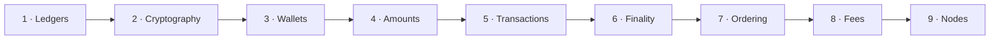

# Part 1: Blockchain foundations

Nine lessons that take you from "what is money, to a computer?" to how your program talks to a
blockchain. No prior knowledge of cryptocurrency, cryptography or networking is assumed.

| # | Lesson | The question it answers |
| --- | --- | --- |
| 1 | [Money, ledgers and blockchains](./ledgers.md) | What problem does a blockchain solve, and for whom? |
| 2 | [Hashes, keys and signatures](./cryptography.md) | How can anyone check who approved a payment, without trusting anyone? |
| 3 | [Wallets, keys and addresses](./wallets.md) | What does a wallet really hold, and where do addresses come from? |
| 4 | [Coins, tokens and exact amounts](./assets.md) | What is being moved, and how do you count it without losing a cent? |
| 5 | [Transactions](./transactions.md) | How does "pay Bob" become something the network accepts? |
| 6 | [Blocks, confirmations and finality](./blocks.md) | When is a payment really, irreversibly done? |
| 7 | [Accounts, UTXOs and transaction order](./ordering.md) | How does a chain stop the same payment from happening twice? |
| 8 | [Fees and fee markets](./fees.md) | Who gets paid to process a payment, and how much? |
| 9 | [Nodes, RPC and providers](./nodes.md) | How does your code actually reach a blockchain? |

When you finish, [Part 2: Engineering for money](../engineering/index.md) turns to the
engineering problems that come with moving money over an unreliable network.
