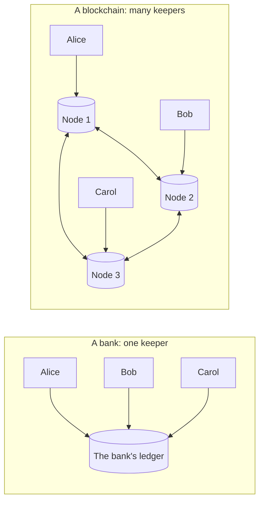

# Money, ledgers and blockchains

> [!TIP]
> **The short version.** Digital money is a list of who owns what: a **ledger**. Normally one
> company keeps that list and everyone trusts it. A **blockchain** is a ledger that thousands
> of independent computers keep together, following public rules, so that nobody has to
> trust a single keeper, and nobody can quietly change history.

**Builds on:** nothing. This is where the path starts.

## Money is a list

Think about the money in your bank account. There is no pile of coins with your name on it.
There is a row in the bank's database: your account number, and a number next to it. When
you pay a friend, the bank subtracts from your row and adds to theirs. Money, in a computer,
is a **ledger**: a list of accounts and balances, plus the history of every change.

| Account | Balance |
| --- | --- |
| Alice | 50 |
| Bob | 20 |

"Alice pays Bob 5" is an **entry** in that ledger. Afterwards Alice has 45 and Bob 25. That is
all a payment is: a change to a shared list that everyone agrees on.

## Why not just copy it?

Most digital things can be copied for free. Send someone a photo and you both have it. If
money were a file, Alice could send the same "5 coins" file to Bob and to Carol, and spend it
twice. This is the **double-spend problem**, and it is the reason digital money needs a
ledger at all: the ledger decides which payment happened first, and refuses the second.

## Who keeps the ledger?

For most of history the answer was a trusted keeper: a bank, a card network, a payment
company. That works well, with costs:

- **You must trust the keeper.** It can make mistakes, freeze accounts, reverse payments, or
  disappear.
- **Keepers do not trust each other.** A payment between two banks in different countries
  passes through several ledgers that each reconcile against the others, which is why it
  takes days.
- **Someone has to be allowed in.** Not everyone can open an account with the keeper.

A blockchain asks a different question: what if there were no keeper at all?



## How a blockchain keeps a ledger without a keeper

A blockchain network is a group of computers, called **nodes**, that each keep a full copy of
the ledger. Anyone can run one. They follow the same public rules, written into the software
they run:

1. **Only the owner can spend.** Every payment must carry a digital signature that only the
   owner of the money can produce (lesson 2 shows how that works).
2. **Every node checks every payment.** A node that receives a payment checks the signature
   and the balance itself. It trusts nobody's word.
3. **Payments are grouped into blocks.** Every few seconds or minutes, one node proposes a
   batch of new payments, a **block**. The others check it and add it to their copy.
4. **Blocks are chained.** Each block includes a fingerprint of the block before it. Changing
   an old payment would change that block's fingerprint, and break every block after it. That
   is the "chain" in blockchain, and it is what makes the history tamper-evident.
5. **The network agrees on one history.** A **consensus** protocol decides which proposed
   block comes next, so all nodes end up with the same ledger, even though nobody is in
   charge (lesson 6 shows what happens when they briefly disagree).

The double-spend problem is solved the same way a bank solves it, by ordering: once a
payment is in the agreed history, a second payment of the same money is invalid, and every
node refuses it.

<details markdown="1">
<summary>Under the hood: what "decentralized" costs</summary>

Removing the keeper is not free. Every node must check every payment, so a blockchain
processes far fewer payments per second than a bank's database. Agreement between strangers
takes time, so a payment is not final the moment it is sent (lesson 6). And with no keeper,
there is nobody to call: a payment sent to the wrong address cannot be reversed by anyone.
Different blockchains make different trade-offs between these costs, which is one reason
there are so many of them.

</details>

## Many chains, a few families

There are many blockchains, and each is its own ledger with its own coin: Bitcoin (BTC),
Ethereum (ETH), Tron (TRX), Solana (SOL), TON (Gram) and Avalanche (AVAX) are some of the
largest. Money on one chain stays on that chain: bitcoin cannot be sent to an Ethereum
address.

Many chains share a design. Ethereum's design, the **EVM** (Ethereum Virtual Machine), is
reused by BNB Smart Chain, Polygon, Arbitrum, Optimism, Base and the Avalanche C-Chain: their
addresses, transactions and tools look the same. A group of chains built on one design is a
**chain family**, and code written for one member mostly works for the others.

Each chain also runs several separate networks:

- **Mainnet** is the real one, with real money.
- **Testnets** (such as Ethereum's Sepolia, Bitcoin's testnet4, Solana's devnet) run the same
  software with worthless coins, handed out free by "faucets". You develop and test there.

## Why a developer cares

Integrating with a blockchain means integrating with a system that nobody owns:

- **There is no undo.** A wrong payment stays wrong. Your code has to be right before it
  sends, not after.
- **There is no support desk.** When something is unclear, such as "did my payment go
  through?", your code has to find out from the network itself.
- **Every chain differs in the details.** Addresses, fees, how payments are ordered, and when
  a payment is final all vary by family, and a payment system must get every one of them
  right.

The rest of this path covers each of these, one at a time.

## In crypto-aio

crypto-aio names exactly the three choices this lesson introduced. A **chain** is a blockchain
(`'ethereum'`, `'bitcoin'`, `'tron'`, `'solana'`, `'ton'`, `'avalanche-x'`, …), a **network** is
one of its deployments (`'mainnet'`, `'sepolia'`, `'testnet4'`, …), and the **library** is the
SDK that speaks to it. A handle is bound to one of each:

<!-- runnable -->
```ts
import { CryptoAio } from 'crypto-aio';

const aio = new CryptoAio();
const btc = aio.blockchain({ chain: 'bitcoin', network: 'testnet4' }); // a Bitcoin testnet
const fuji = aio.blockchain({ chain: 'avalanche', network: 'fuji' }); // an EVM testnet
console.log(btc.chain, btc.network, btc.library); // bitcoin testnet4 bitcoinjs-lib
console.log(fuji.chain, fuji.network, fuji.library); // avalanche fuji ethers
```

With no provider configured, these two handles fall back to free public endpoints: fine for
learning, never for production. Creating a handle sends nothing over the network, and the
SDK is loaded only on first use.

The same methods (`getBalance`, `transfer`, `waitForConfirmation`, …) then work on every chain.
Chains of one family share a driver: every EVM chain is served by the one EVM driver.
[Networks](../../reference/networks/index.md) lists every chain and network crypto-aio supports.

## Check yourself

1. Why can't digital money simply be a file you send to someone?
2. In a blockchain, who decides whether a payment is valid?
3. Alice sends coins to a mistyped but valid address. Who can reverse the payment?
4. You are testing a new payment feature. Mainnet or testnet?

<details markdown="1">
<summary>Answers</summary>

1. Files can be copied, so the same money could be spent twice (the double-spend problem).
   A ledger, which records who owns what and in what order, prevents it.
2. Every node, independently, by the same public rules: a valid signature and enough funds.
3. Nobody. There is no keeper who could. That is why payment code must be correct before it
   sends.
4. A testnet: same software, worthless coins.

</details>

## Key terms

- **Ledger:** a record of accounts, balances and the history of every change.
- **Double spend:** spending the same money twice; the problem a ledger exists to prevent.
- **Blockchain:** a ledger kept by many independent nodes, grouped into hash-linked blocks.
- **Node:** a computer running a blockchain's software and keeping a copy of its ledger.
- **Block:** a batch of payments added to the ledger together.
- **Consensus:** the protocol by which nodes agree on one history.
- **Chain family:** chains that share a design, such as the EVM family.
- **Mainnet / testnet:** the network with real money / a network for testing, with free coins.

## What's next

Every rule above depends on one thing: that a node can check who approved a payment, with
no keeper to ask. The next lesson shows how, with three pieces of cryptography:
[Hashes, keys and signatures](./cryptography.md).
