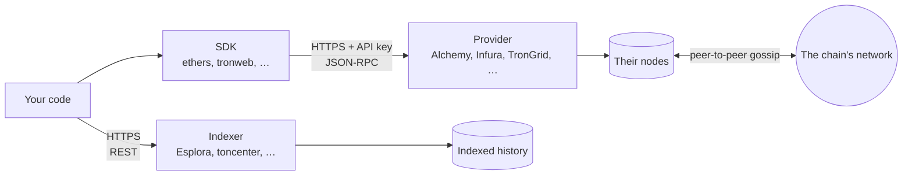

# Nodes, RPC and providers

> [!TIP]
> **The short version.** Your code never touches "the blockchain" directly. It sends requests
> over HTTP to a **node**, a server that keeps a copy of the chain, usually in a format called
> **JSON-RPC**. Most teams rent node access from a **provider** with an API key; questions a
> node cannot answer quickly, such as "every payment to this address", go to an **indexer**.
> Every one of these servers can be slow, down, behind, or wrong.

**Builds on:** [Transactions](./transactions.md) and
[Blocks, confirmations and finality](./blocks.md).

## A short networking primer

When your program asks a server something over the internet, it sends an **HTTP request** to a
**URL** and gets an **HTTP response** back. The response carries a **status code** that says
how it went, and a **body**, usually **JSON** text. A few status codes come up constantly:

| Status | Means | What to do |
| --- | --- | --- |
| `200` OK | The server answered | Read the body (it can still describe an error) |
| `429` Too Many Requests | You hit the server's **rate limit** | Wait (the `Retry-After` header says how long), then retry |
| `500` Internal Server Error | The server failed | Retry later, or elsewhere |
| `502`, `503`, `504` | A gateway or the server is unavailable, or timed out | Retry later, or elsewhere |

Requests take time (**latency**): tens to hundreds of milliseconds. Sometimes a response never
comes, and the client gives up after a **timeout**. Lesson 10 is about what that means.

## Nodes

A **node** runs the chain's software, keeps a copy of the ledger, checks every new block, and
gossips with other nodes. Running one yourself is possible, but it takes disk space,
bandwidth and care. Nodes come in kinds:

- A **full node** checks everything and keeps the current state, plus recent history.
- An **archive node** also keeps the state at every past block: "what was this balance a year
  ago?". Some questions can only be answered by one.

## RPC: asking a node a question

A node offers an API for programs: a set of named methods you can call remotely, a **remote
procedure call** (RPC) interface. EVM chains, Solana and others use **JSON-RPC**: you send a
JSON object naming a method and its parameters, and get a JSON object back.

```json
{ "jsonrpc": "2.0", "id": 1, "method": "eth_blockNumber", "params": [] }
```

```json
{ "jsonrpc": "2.0", "id": 1, "result": "0x1406f40" }
```

That is "what is the latest block?", and the answer, block 21,000,000 in hexadecimal. Other
methods read balances (`eth_getBalance`), read transactions (`eth_getTransactionReceipt`), and
broadcast signed bytes (`eth_sendRawTransaction`). Some services use plain REST URLs instead,
such as Bitcoin's Esplora (`GET /address/<address>/utxo`) or TON's toncenter.

**SDKs** such as ethers, web3.js, bitcoinjs-lib, tronweb and `@solana/web3.js` wrap these calls
in friendly functions, and build and encode transactions for you.

## Providers and indexers



- A **provider** runs nodes for you and sells access: Alchemy, Infura and Ankr for EVM chains
  and Solana, TronGrid for Tron, toncenter for TON, and many more. You get an endpoint URL and
  an **API key**, often inside the URL itself, which makes the URL a secret.
- An **indexer** reads the chain and builds databases for questions nodes answer badly, such
  as "list every transaction of this address". Bitcoin wallets, TON and the Avalanche X-Chain
  and P-Chain lean on one.
- **Public endpoints** are free and rate-limited, fine for trying things out and never for
  production.

## Everything can go wrong

The servers between you and the chain are ordinary servers, run by someone else:

- **Down or slow.** Requests fail or time out.
- **Rate-limited.** A busy service answers `429` until you slow down.
- **Behind.** A node that is syncing, or overloaded, can be many blocks behind the head, and
  report old data as current.
- **Misconfigured.** A URL that points at a testnet node when you meant mainnet gives you
  answers about the wrong ledger, with no error at all.
- **Inconsistent or dishonest.** Two providers can disagree, and a compromised or buggy one
  can simply say something false.

A payment system has to survive all of these, which is what Part 2 of this path is about.

## Why a developer cares

- **Every read and every broadcast crosses a network,** so every one can fail.
- **API keys are secrets,** and endpoint URLs often contain them. Logging a URL can leak a key.
- **One endpoint is a single point of failure, and of trust.** Production systems use several
  independent providers.

## In crypto-aio

A crypto-aio **provider** is a named set of endpoints: a preset (`alchemy`, `trongrid`, `mempool`,
…) plus an API key, or your own URLs. A handle can list several providers for failover and
cross-checking, and an `indexer` where its family needs one. Under every driver sits the
library's own HTTP layer, the **transport**: it applies timeouts, retries, rate limits and a
circuit breaker per endpoint, and before it trusts an endpoint it checks which network the
endpoint serves and how far behind it is.

This example builds a pretend node that answers two JSON-RPC methods, and shows what the
library asks it:

<!-- runnable -->
```ts
import { CryptoAio } from 'crypto-aio';
import { FakeClock, FakeFetch, drive, fakePlugin, rpcResult } from 'crypto-aio/testing';

// A pretend node at https://node.test, answering two JSON-RPC methods.
const node = new FakeFetch().route('https://node.test', (request) => {
  const { method } = request.json<{ method: string }>();
  if (method === 'fake_identity') return rpcResult(request, 'fake-local'); // which network
  if (method === 'fake_blockNumber') return rpcResult(request, '42'); // the latest block
  throw new Error('unknown method');
});
const clock = new FakeClock(); // the example runs on fake time
const aio = new CryptoAio({
  env: false,
  clock,
  plugins: [fakePlugin()],
  transport: { fetch: node.fetch },
  providers: { mynode: { endpoints: [{ name: 'main', url: 'https://node.test' }] } },
  chains: { fakechain: { provider: 'mynode' } },
});

const bc = aio.blockchain({ chain: 'fakechain' });
console.log(await drive(clock, bc.getBlockHeight()));
for (const call of node.calls) console.log(call.method, call.body);
// Prints:
// 42n
// POST {"jsonrpc":"2.0","id":2,"method":"fake_identity","params":[]}
// POST {"jsonrpc":"2.0","id":3,"method":"fake_blockNumber","params":[]}
// POST {"jsonrpc":"2.0","id":1,"method":"fake_blockNumber","params":[]}
await aio.close();
```

Before answering your question (request 1), the transport checked the endpoint: request 2
asked which network it serves, and request 3 how high its chain is. An endpoint that answers
for another network is refused with `PROVIDER_MISCONFIGURED`, and one too far behind is
treated as lagging. `bc.getNetworkStatus()` shows each endpoint's state, and
`bc.ready()` runs these checks at startup. [Connect to a real network](../../build/connect.md)
configures providers for each family.

## Check yourself

1. Your provider answers `429`. What does it mean, and what should a client do?
2. Why is an endpoint URL like `https://eth-mainnet.example.com/v2/abc123…` a secret?
3. A node reports block 1,000 while others report 1,050. Should you trust its "not found" for
   a transaction in block 1,020?
4. When do you need an indexer rather than a node?

<details markdown="1">
<summary>Answers</summary>

1. You hit its rate limit. Wait as long as `Retry-After` says, then retry, ideally slower.
2. The API key is part of the URL; anyone with it can use, and bill, your account.
3. No: it is 50 blocks behind and has not seen block 1,020 yet. A lagging node's "not found"
   means nothing.
4. For questions about history across many blocks, such as every transaction of an address,
   which a node cannot answer efficiently.

</details>

## Key terms

- **HTTP request, response, status code:** how a client and a server talk.
- **Latency, timeout:** how long an answer takes; when the client stops waiting.
- **Rate limit (`429`):** a cap on how many requests a client may send.
- **Node (full, archive):** a server with a copy of the chain; an archive node keeps all past state.
- **RPC, JSON-RPC:** calling a server's named methods; the JSON format for it.
- **Provider:** a company that runs nodes and sells access with an API key.
- **Indexer:** a service that answers history questions from its own database.
- **SDK:** a library that wraps a chain's API and transaction formats.

## What's next

That completes the foundations: you know what moves, how it is signed, ordered, paid for and
confirmed, and how your code reaches the chain. Part 2 is about the hard part: building
something reliable on top of servers that fail. It starts with the most dangerous failure of
all: [When networks fail](../engineering/failure.md).
