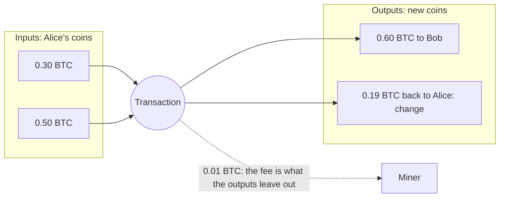

# Accounts, UTXOs and transaction order

> [!TIP]
> **The short version.** Chains keep balances in one of two ways: **accounts** (a balance per
> address, like a bank) or **UTXOs** (separate coins, like banknotes). Either way, a signed
> payment is public, so the chain needs a rule that stops it from being applied twice. There
> are four such rules: a **nonce** (a counter), **inputs** (a coin spends once), an **expiry**
> (a deadline) and a **seqno** (a wallet's counter). Each one shapes how a payment system must
> send, retry and replace payments.

**Builds on:** [Transactions](./transactions.md) and
[Blocks, confirmations and finality](./blocks.md).

## Two ways to keep a ledger

**The account model** (Ethereum and the EVM chains, Tron, Solana, TON) keeps a balance per
address, like the bank ledger of lesson 1. "Alice pays Bob 5" subtracts 5 from Alice's
balance and adds 5 to Bob's.

**The UTXO model** (Bitcoin, the Avalanche X-Chain and P-Chain) keeps no balances at all. It
keeps a set of **coins**: outputs of earlier transactions that nobody has spent yet, the
**unspent transaction outputs**, or UTXOs. A transaction spends whole coins as its **inputs**
and creates new coins as its **outputs**, like paying with banknotes and getting change:



An address's "balance" is the sum of the coins it can spend. Choosing which coins to spend is
**coin selection**, and the fee depends on it: every input makes the transaction bigger.

## The replay problem

A signed transaction is public: every node sees it. Without a rule against it, anyone could
broadcast Alice's "pay Bob 5" again tomorrow, and the chain would pay Bob again. And when Alice
sends two payments at once, the chain needs to know which comes first, in case she cannot
afford both. Every chain answers both problems with one of four rules.

### 1. Nonce: a counter per account (EVM)

Each account has a **nonce**, the number of transactions it has sent. A transaction must carry
exactly the next nonce: the 43rd transaction from an address carries nonce 42 (they start at
0). The chain accepts nonce 42 once, and nonce 43 only after nonce 42.

- A replay is impossible: nonce 42 is already used.
- Order is exact: transactions from one account land in nonce order.
- But a **gap** blocks everything: if nonce 42 never lands, 43, 44 and 45 wait forever.
- A stuck transaction can be **replaced**: a new transaction with the same nonce and a higher
  fee. Whichever lands first uses the nonce, and the other becomes invalid.

### 2. Inputs: a coin spends once (UTXO)

On a UTXO chain the coins themselves are the rule. A coin can be spent once, so a replayed
transaction is invalid: its inputs are gone. Two transactions that spend the same coin
**conflict**, and at most one can land. Payments that spend different coins have no order at
all, and can land in any order.

### 3. Expiry: a deadline (Tron, Solana)

Some chains make every transaction name a recent block, and accept it only for a short window
after that block: about a minute by default on Tron, and about 150 blocks (a minute) on
Solana. The chain remembers every transaction of the window, so a replay inside it is a
duplicate, and after the window the transaction can never land.

That last property is valuable: once the window has passed, and the transaction is in no
block, you **know** it never landed, and can safely sign a new one.

### 4. Seqno: a counter in the wallet (TON)

On TON, a wallet is itself a small smart contract, and it keeps its own counter, the
**seqno**. A message to the wallet must carry the current seqno, and also a time after which it
is invalid. The wallet runs one message per seqno, so a wallet sends one transfer at a time,
in order.

| Rule | Families | A replay is stopped by | A stuck payment |
| --- | --- | --- | --- |
| Nonce | EVM | The used counter | Blocks later payments; can be replaced or cancelled |
| Inputs | Bitcoin, Avalanche X and P | The spent coins | Bitcoin: can be replaced or cancelled. Avalanche: the first of two conflicting transactions wins |
| Expiry | Tron, Solana | The window's memory, then the deadline | Ends when the window passes; then re-issue |
| Seqno | TON | The wallet's counter, plus a deadline | Ends at the deadline; then re-issue |

<details markdown="1">
<summary>Under the hood: why "cancel" is a race</summary>

You cannot delete a transaction from the network. "Cancelling" one means sending a
conflicting transaction that uses the same slot, the same nonce or the same coins, typically
a zero-value payment to yourself with a higher fee, and hoping it lands first. If the
original is already in a block, the cancel loses, and the payment happens anyway. Only the
final chain decides which one won.

</details>

## Why a developer cares

These rules turn into concrete engineering problems:

- **Concurrency.** Two servers sending from one EVM address at the same moment must never use
  the same nonce, or one payment fails, and must never skip one, or every later payment waits.
  Two UTXO payments must not pick the same coins.
- **Stuck payments.** A low-fee transaction can block an account (nonce) or hold coins
  (inputs). Fixing it means replacing it, in the same slot, never sending a second payment.
- **Knowing a payment is dead.** Only expiry and seqno chains give a deadline after which a
  payment provably cannot land. Elsewhere, "it disappeared" proves nothing.

## In crypto-aio

crypto-aio calls whatever orders a wallet's transactions its **ordering slot**: a nonce, a
seqno, a set of inputs, or an expiry. Every handle reports its chain's ordering, and every
Operation reserves its slot when it is prepared; a replacement reuses the same slot. While a
slot is being chosen and signed, the library holds a short lock on the sending address, an
**address lease**, so concurrent transfers get distinct, consecutive nonces:

<!-- runnable -->
```ts
import { createFakeEnv } from 'crypto-aio/testing';

const env = await createFakeEnv(); // 'fakechain' uses nonces, like an EVM chain
const nonces: string[] = [];
env.aio.on('nonce.allocated', (event) => nonces.push(event.value));

const payments = [1n, 2n, 3n].map((amount, i) =>
  env.bc.transfer({ to: env.stranger(), amount }, { idempotencyKey: `batch-${i}` }),
);
await env.run(Promise.all(payments), 10); // three at once
console.log([...nonces].sort().join(', ')); // 0, 1, 2
env.chain.mine();
console.log(env.chain.nonce(env.address)); // 3n
```

The fake family has one chain per rule: `createFakeEnv({ ordering: 'expiry' })` gives
`fakeexpiry`, and `'seqno'` gives `fakeseqno`, so you can test each behavior. Replace and cancel
need the `replace-fee` and `cancel` capabilities, and `rebuild` re-issues a payment on an expiry
or seqno chain once its expiry is **proven** ([Fix a stuck transfer](../../build/stalled.md)).
[Nonces, leases and many processes](../../tour/ordering.md) shows how this works across
several servers.

## Check yourself

1. An EVM address has transactions with nonces 7, 8 and 9 pending, and 7 is stuck with a low
   fee. What happens to 8 and 9? How do you fix it?
2. Two Bitcoin transactions spend the same coin. How many can land?
3. A Solana transfer was never seen in any block, and its window passed a while ago. Can it
   still land?
4. What is the safe way to "cancel" a pending EVM payment?

<details markdown="1">
<summary>Answers</summary>

1. They wait: nonces land in order. Replace nonce 7 with the same payment at a higher fee (same
   nonce), and 8 and 9 follow.
2. At most one: they conflict.
3. No. After its window, an expiry-based transaction can never land, so it is safe to sign a
   new one, once you have checked every block of the window (lesson 14 is about checking).
4. Send a conflicting transaction in the same nonce with a higher fee, usually a zero-value
   transfer to yourself, and wait for the final chain to say which one won.

</details>

## Key terms

- **Account model / UTXO model:** balances per address / a set of unspent coins.
- **UTXO, input, output, change:** an unspent coin; a coin being spent; a coin being created;
  the output that returns the remainder to the sender.
- **Coin selection:** choosing which coins a UTXO transaction spends.
- **Nonce:** an account's transaction counter (EVM).
- **Expiry:** a deadline after which a transaction can never land (Tron, Solana).
- **Seqno:** a wallet contract's counter (TON).
- **Replace, cancel:** a new transaction in the same slot, with a higher fee, that wins the race.

## What's next

Replacing a stuck payment means paying a higher fee. What are fees, who sets them, and how
much is enough? [Fees and fee markets](./fees.md).
