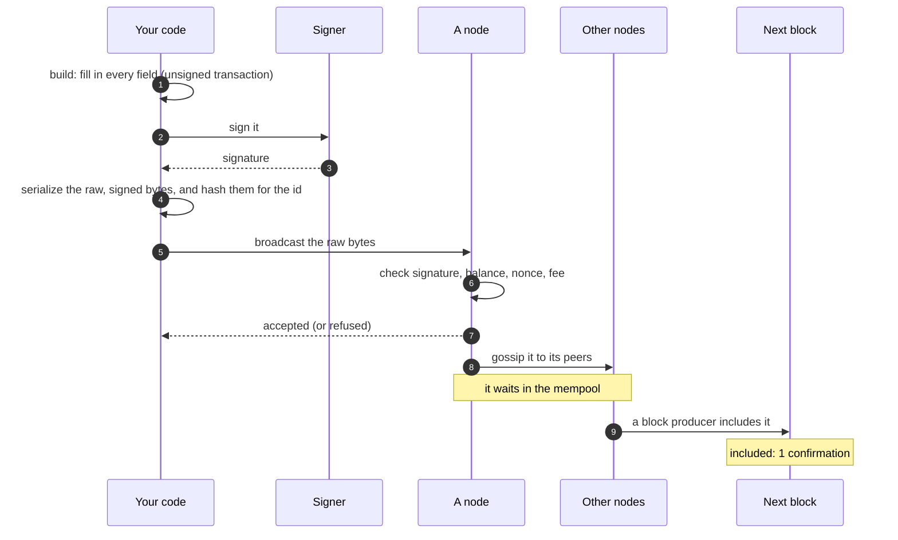

# Transactions: from "pay Bob" to signed bytes

> [!TIP]
> **The short version.** A **transaction** is a precise, signed instruction to change the
> ledger. You **build** it from what you want to happen, **sign** it, and **broadcast** its
> bytes to a node, which passes it to the network. It waits in the **mempool** until a block
> includes it. Sending the same signed bytes again is harmless; signing a second transaction
> for the same payment is how money gets paid twice.

**Builds on:** [Coins, tokens and exact amounts](./assets.md) and
[Hashes, keys and signatures](./cryptography.md).

## What you want versus what you sign

"Pay Bob 25 USDC" is an **intent**: what you want to happen. A blockchain cannot act on an
intent. It acts on a **transaction**: an exact data structure in the chain's own format, with
every detail filled in, and a signature over all of it. For an Ethereum token payment, that
means:

| Field | Example | Why it is there |
| --- | --- | --- |
| Chain id | `1` (Ethereum mainnet) | So the transaction cannot be replayed on another chain |
| Nonce | `42` | The sender's transaction counter, so it cannot be replayed on this chain (lesson 7) |
| To | the USDC contract | A token payment is a call to the token's contract |
| Data | `transfer(Bob, 25000000)` | The call: Bob's address and the amount in base units |
| Fee fields | gas limit, max fee | What the sender will pay to be included (lesson 8) |
| Signature | 65 bytes | Proof the sender approved every field above |

Bitcoin's transactions look completely different (lesson 7 shows them), and so do Solana's
and TON's. But in every family the same steps turn an intent into a payment.

## The journey of a transaction



1. **Build.** Fill in every field: look up the nonce, estimate the fee, encode the token call.
   The result is an **unsigned transaction**.
2. **Sign.** The signer signs the exact bytes the chain expects. Signing is local: nothing
   has been sent yet.
3. **Serialize.** The signed transaction becomes a string of bytes, the **raw transaction**.
   On most chains, its hash is the **transaction hash**: the payment's id, known before it is
   ever sent.
4. **Broadcast.** The raw bytes go to a node, usually over HTTP. The node checks them, then
   **gossips** them to its peers.
5. **Wait in the mempool.** Valid transactions that are not in a block yet sit in each node's
   **mempool** (memory pool), a waiting room. Block producers pick from it, usually the
   highest fees first.
6. **Inclusion.** A block includes the transaction. Now the payment is in the ledger, but
   not necessarily for good. That is lesson 6.

## Same bytes, or new bytes?

This is the most important idea in this lesson, and much of crypto-aio rests on it.

**The same signed bytes are the same transaction.** If you broadcast them twice, or to three
nodes at once, the network sees one transaction with one hash, and the ledger applies it at
most once. Resending is always safe.

**A newly signed transaction is a different transaction,** even for the same intent. It may
have a different fee, a different nonce or different inputs, so a different hash. If the first
one also lands, Bob is paid twice.

So when something goes wrong after signing, such as a timeout or a crash, the safe move is
always to **send the bytes you already signed again**, and never to sign a fresh transaction
"to be sure". That only works if you kept the signed bytes, which is
[lesson 12](../engineering/persistence.md).

<details>
<summary>Under the hood: memos, contract calls and transaction ids</summary>

- **Memos.** Some chains let a transaction carry a short note: Tron, Solana (through its memo
  program), TON (a text comment) and the Avalanche X-Chain. Exchanges use memos to tell which
  customer a deposit to a shared address belongs to. A memo is public, forever.
- **Contract calls.** A token payment is a call to a contract, and a call can fail even when
  the transaction is included: the contract can refuse it. The fee is paid anyway. Lesson 6
  covers how to tell a successful payment from a failed call.
- **Ids.** Not every chain's id is a simple hash known before sending. On TON a transaction id
  exists only once the network has run your message, so the library tracks the message's
  hash until then.

</details>

## Why a developer cares

- **You cannot unsend.** Once the bytes reach one node, they may spread and land even if that
  node's answer never reaches you.
- **"Sent" is not "done".** A broadcast that was accepted can still be dropped from the mempool
  or reorganized out of a block.
- **Keep the signed bytes.** They are your only safe way to retry.

## In crypto-aio

What you pass to `transfer` is the intent: a `TransferIntent` with `to`, `amount`, and
optionally `asset`, `fee`, `memo` or several `outputs`. The library builds, signs, stores and
broadcasts the transaction for you. It calls your payment an **Operation**, and each signed
transaction for it an **Attempt**. You can watch the steps go by:

<!-- runnable -->
```ts
import { createFakeEnv } from 'crypto-aio/testing';

const env = await createFakeEnv();
const states: string[] = [];
env.aio.on('operation.state', (event) => states.push(event.to));

const sub = await env.run(
  env.bc.transfer(
    { to: env.stranger(), amount: '0.001', memo: 'invoice 7' },
    { idempotencyKey: 'pay-bob-1' },
  ),
);
console.log(states.join(' → ')); // created → prepared → signed → submitted
console.log(sub.attempt?.idKind); // tx-hash
console.log(env.chain.inMempool(sub.attempt?.id ?? '')); // true

env.chain.mine(); // the fake chain's next block
const tx = await env.run(env.bc.getTransaction(sub.attempt?.id ?? ''));
console.log(tx?.status.state, tx?.status.confirmations); // included 1
console.log(tx?.transfers[0]?.memo); // invoice 7
```

`prepared` means built, `signed` means signed **and stored**, `submitted` means broadcast. The
transaction hash (`sub.attempt.id`) is known before the broadcast. To sign somewhere else, such
as on a hardware wallet, `prepareTransfer` stops after building and returns the signing
requests ([Cold and asynchronous signing](../../build/cold-signing.md)).
[The life of a transfer](../../tour/transfer.md) follows every step inside the library.

## Check yourself

1. What is the difference between an intent and a transaction?
2. Your broadcast request timed out. Is it safe to broadcast the same raw bytes again? To
   build and sign a new transaction?
3. A node answered "accepted". Has Bob been paid?

<details>
<summary>Answers</summary>

1. The intent is what you want ("pay Bob 25 USDC"); the transaction is the exact, signed data
   structure that the chain executes.
2. Resending the same bytes is safe: it is the same transaction and lands at most once.
   Signing a new one is not: if the first also landed, Bob is paid twice.
3. Not yet. The transaction is in a mempool; it still has to be included in a block, and
   that block has to become final (lesson 6).

</details>

## Key terms

- **Intent:** what you want to happen, before it is a transaction.
- **Unsigned transaction:** a fully built transaction, waiting for its signature.
- **Raw transaction:** the signed transaction's bytes, ready to broadcast.
- **Transaction hash:** the id of a transaction, usually the hash of its signed bytes.
- **Broadcast:** sending a raw transaction to a node for the network.
- **Mempool:** where valid transactions wait until a block includes them.
- **Memo:** a public note attached to a transaction, on chains that allow one.

## What's next

A block included the payment. Is it done? Not always: blocks can be undone.
[Blocks, confirmations and finality](./blocks.md).
