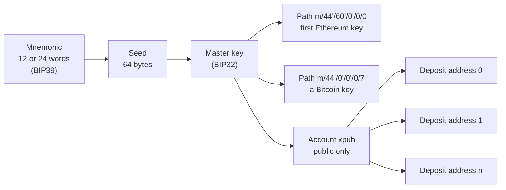

# Wallets, keys and addresses

> [!TIP]
> **The short version.** A wallet does not hold coins; the ledger does. A wallet holds
> **keys**. An **address** is a short, shareable name computed from a public key, in a format
> each chain defines. One secret, a **mnemonic** of 12 or 24 words, can produce millions of
> key pairs, and an **extended public key** (xpub) can produce their addresses without any
> private key at all.

**Builds on:** [Hashes, keys and signatures](./cryptography.md).

## A wallet is a keyring

The word "wallet" suggests a place where money sits. On a blockchain, money sits only in
the ledger, on every node. What you own is the ability to sign for it. A **wallet** is
whatever holds that ability: an app on a phone, a hardware device, a file on a server, or a
custody service. It holds private keys, and uses them to sign payments.

So "losing a wallet" means losing keys, and with them the ability to spend. "Someone stole my
wallet" means someone copied the keys. The coins never moved until the thief signed a payment.

## Addresses: where money is sent

People do not send money to a public key directly. They send it to an **address**, a shorter
string computed from the public key, usually with a hash. Each chain picks its own recipe and
format:

| Chain | Example address | How it is made, roughly |
| --- | --- | --- |
| Ethereum and EVM chains | `0x52908400098527886E0F7030069857D2E4169EE7` | The last 20 bytes of the public key's Keccak-256 hash, in hex; the mixed case is a checksum |
| Bitcoin | `bc1qw508d6qejxtdg4y5r3zarvary0c5xw7kv8f3t4` | A hash of the public key, in the bech32 format; several address types exist |
| Tron | `TJRabPrwbZy45sbavfcjinPJC18kjpRTv8` | Like Ethereum's, with a prefix byte, in base58check |
| Solana | `9WzDXwBbmkg8ZTbNMqUxvQRAyrZzDsGYdLVL9zYtAWWM` | The public key itself, in base58 |
| TON | `UQ…` or `EQ…` | The hash of the wallet's smart contract, which holds the key; the prefix says how the wallet behaves |
| Avalanche X-Chain | `X-avax1…` | A hash of the public key, in bech32, prefixed with the chain |

Two details matter for code:

- **Checksums.** Most formats include a few check characters, so a mistyped address is
  detected instead of silently sending money to a stranger.
- **Networks.** Many formats differ between mainnet and testnet (Bitcoin's `bc1…` and
  `tb1…`, for example), so a testnet address can be refused on mainnet before anything is
  signed.

Some addresses also have more than one spelling for the same account: upper- or lower-case
hex on EVM chains, or TON's bounceable and non-bounceable forms. Comparing two addresses as
plain strings is a classic bug.

## One secret, many keys

Managing thousands of separate private keys would be fragile. Wallets instead derive all
their keys from one secret:



- A **mnemonic** (or seed phrase) is a list of common words that encodes a random secret,
  easy to write down on paper. It is the master secret: whoever has it has every key.
- **Hierarchical deterministic (HD)** derivation turns that secret into a tree of key pairs.
  A **derivation path** such as `m/44'/60'/0'/0/0` picks one: by convention, the second
  number is the chain's coin type (0 for Bitcoin, 60 for Ethereum, 195 for Tron, 501 for
  Solana, 9000 for Avalanche).
- An **extended public key** (**xpub**) is a node of that tree without its private part. From
  it you can compute every child's **public** key, and so every child's address, but never
  sign anything.

That last property is what deposit systems are built on. A server that holds only an xpub can
give each customer a unique deposit address, and know which customer paid, without a single
private key on the server. The keys that can spend those deposits stay offline.

<details markdown="1">
<summary>Under the hood: what an xpub leaks</summary>

An xpub cannot sign, but it is not harmless. It reveals every address it derives, and so the
whole history and balance of those addresses. And for the usual (non-hardened) derivation, an
xpub together with **any one** child private key is enough to compute the parent private key,
and with it every sibling's. Treat an xpub as confidential, and never expose a child private
key of an account whose xpub is known. Bitcoin's extended keys also encode their network:
mainnet `xpub`, `ypub`, `zpub` and testnet `tpub`, `upub`, `vpub`.

Not every chain uses this exact scheme. ed25519 chains (Solana, TON) derive keys with SLIP-10,
which allows only hardened derivation, so no xpub. And TON wallet apps use their own
24-word mnemonic format, which is not BIP39.

</details>

## Hot, cold and watch-only

Where the keys live decides how fast you can pay, and how much you can lose:

- A **hot wallet** keeps its keys on an online server, so it can pay automatically, any time.
  If the server is breached, its funds are gone. Keep only what you need for daily payouts.
- A **cold wallet** keeps keys offline: a hardware wallet, an air-gapped machine, or a custody
  service with human approval. Slow, and much safer.
- A **watch-only wallet** has only public information (an address, a public key or an xpub).
  It can read balances, derive deposit addresses and even prepare unsigned payments, but never
  sign.

## Why a developer cares

- **Never treat addresses as plain strings.** Validate them for the right chain and network,
  and compare them in one canonical form.
- **Deposit addresses come from an xpub,** not from private keys generated on your server.
- **Keys are the asset.** The mnemonic of a hot wallet is the most sensitive secret your
  service has. [Secrets and key custody](../engineering/secrets.md) is about protecting it.

## In crypto-aio

A crypto-aio **wallet** is a named configuration that says which key sends: it names a
signer (a hot wallet), only a `publicKey` (watch-only), or an `xpub` (for deposit addresses).
An **`Address`** is bound to one chain, has a `canonical` form for comparing and storing and a
`display` form for people, and `equals()` compares the right way.

Deriving deposit addresses from an xpub works on the fake chain too. Its addresses look like
`fk1…`, its own made-up format:

<!-- runnable -->
```ts
import { HDKey } from '@scure/bip32'; // npm install @scure/bip32
import { createFakeEnv } from 'crypto-aio/testing';

// A toy seed for the example. A real xpub comes from your cold wallet or custody system.
const xpub = HDKey.fromMasterSeed(new Uint8Array(32).fill(7)).publicExtendedKey;
const env = await createFakeEnv({ wallets: { deposits: { xpub } } });

const alice = await env.run(env.bc.deriveAddress('deposits', 0)); // customer 0
const bob = await env.run(env.bc.deriveAddress('deposits', 1)); // customer 1
console.log(alice.canonical); // fk13d28a43a3c23b8b46fea74ff4669bcb9c3badee6
console.log(bob.canonical); // fk1bb7dcc4b530c6d720300fb398323e70da91f7470
console.log(alice.equals(bob)); // false
console.log(await env.run(env.bc.validateAddress('0xnot-a-fake-address'))); // false
```

On a real chain the same calls return that chain's format: `0x…` on Ethereum, `bc1…` on
Bitcoin. `bc.normalizeAddress(text)` validates input from a user and returns its canonical
`Address`, and `bc.walletAddress()` returns the address of the handle's own wallet.
[Core concepts](../../reference/concepts.md#wallet-signer-and-address) has the wallet options,
and [Keys, signers and secrets](../../build/keys.md) shows mnemonics and derivation paths.

## Check yourself

1. Your phone with a wallet app falls into a lake. Are the coins gone?
2. Why can a deposit server safely hold an xpub but not a mnemonic?
3. Two strings `0xABC…` and `0xabc…` name the same EVM address. How should your code compare
   addresses?

<details markdown="1">
<summary>Answers</summary>

1. Not if you kept the mnemonic: the coins are in the ledger, and the mnemonic re-creates
   every key on a new device. Without it, yes: nobody can sign for them again.
2. An xpub derives addresses but cannot sign, so a breach exposes privacy, not funds. A
   mnemonic signs for everything.
3. In one canonical form, for example `bc.normalizeAddress(text)` and then `canonical` or
   `equals()`, never as raw strings.

</details>

## Key terms

- **Wallet:** whatever holds the keys that can sign for an account.
- **Address:** a shareable name for an account, computed from a public key.
- **Checksum:** extra characters in an address that catch typos.
- **Mnemonic (seed phrase):** words that encode the master secret of an HD wallet.
- **HD wallet, derivation path:** a tree of keys from one secret; a path picks one key.
- **xpub (extended public key):** derives child addresses without private keys.
- **Hot, cold, watch-only:** keys online, keys offline, no keys at all.

## What's next

Addresses receive money. But what exactly is moving, and how do you count it without losing
a fraction? [Coins, tokens and exact amounts](./assets.md).
