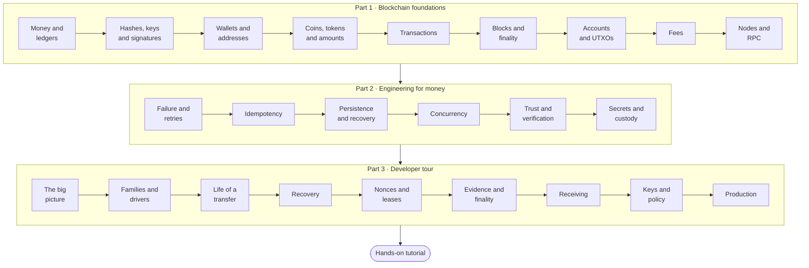
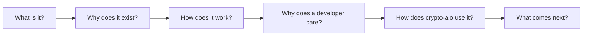

# Learn: blockchain from zero

This is a path for programmers who are new to cryptocurrency and blockchains, or new to the
engineering that keeps payments correct. It starts with what money and a ledger are, and ends
inside crypto-aio, using it with confidence. Every idea is introduced in plain words first,
with an everyday example, and only then given its real technical name and its real details.

You need to know how to program in some language. Reading TypeScript helps, but each code
sample is explained. You do not need to know anything about cryptography, networking or
distributed systems: those are part of the path.

## The map

**Part 1** explains what a blockchain is and how value moves on one. **Part 2** explains the
engineering problems every payment system must solve: failures, retries, crashes,
concurrency, trust and secrets. **Part 3**, the [Developer tour](../tour/index.md), shows how
crypto-aio solves each of them. The path ends with the [Hands-on tutorial](../start/tutorial.md),
where you run every idea yourself.

## How each lesson works

Every lesson follows the same chain of questions, so you always know where you are:

Along the way you will meet a few recurring elements:

> [!TIP]
> **The short version** opens each lesson: the whole idea in two or three sentences. If it
> already makes sense to you, skim the lesson or skip it.

Under the hood

Folded sections like this one hold deeper technical detail. They are worth reading, but the
lesson makes sense without them.

- **Check yourself** questions at the end of a lesson, with the answers folded away.
- **Key terms**, a short list of the words the lesson introduced. Each one is also in the
  [Glossary](../reference/glossary.md).
- **In crypto-aio**, the section that connects the idea to the library, with a small piece of
  code and links into the [Reference](../reference/index.md).

## The lessons

| | Lesson | You will understand |
| --- | --- | --- |
| **Part 1** | [Blockchain foundations](./foundations/index.md) | |
| 1 | [Money, ledgers and blockchains](./foundations/ledgers.md) | Why a shared ledger with no owner is useful, and hard |
| 2 | [Hashes, keys and signatures](./foundations/cryptography.md) | The three pieces of cryptography every blockchain is built from |
| 3 | [Wallets, keys and addresses](./foundations/wallets.md) | What a wallet really holds, and where addresses come from |
| 4 | [Coins, tokens and exact amounts](./foundations/assets.md) | Native coins, tokens, decimals, and why money is never a float |
| 5 | [Transactions](./foundations/transactions.md) | How "pay Bob" becomes signed bytes on a network |
| 6 | [Blocks, confirmations and finality](./foundations/blocks.md) | When a payment is really done, and what a reorg is |
| 7 | [Accounts, UTXOs and transaction order](./foundations/ordering.md) | Nonces, coins, expiry and seqnos: how each chain stops replays |
| 8 | [Fees and fee markets](./foundations/fees.md) | Gas, priority fees, sat/vB, and replacing a stuck payment |
| 9 | [Nodes, RPC and providers](./foundations/nodes.md) | How your program talks to a blockchain over the network |
| **Part 2** | [Engineering for money](./engineering/index.md) | |
| 10 | [When networks fail](./engineering/failure.md) | Timeouts, retries, and the reply that never came back |
| 11 | [Idempotency](./engineering/idempotency.md) | How to pay once, however many times you ask |
| 12 | [Persistence and crash recovery](./engineering/persistence.md) | Why you write things down before you act |
| 13 | [Concurrency: locks, leases and fencing](./engineering/concurrency.md) | How many workers share work without stepping on each other |
| 14 | [Trust: one server's word is not proof](./engineering/trust.md) | Quorums, and the difference between observed and proven |
| 15 | [Secrets and key custody](./engineering/secrets.md) | Where private keys should live, and how secrets leak |
| **Part 3** | [Developer tour](../tour/index.md) | How crypto-aio puts all of this together |

Each lesson takes about 10 to 20 minutes, and the whole path, tour included, an afternoon or
two. There is no need to do it in one sitting: each lesson opens by saying what it builds on.

## Shortcuts

You do not have to start at lesson 1. Jump in where your knowledge ends:

| If you already know… | Start at |
| --- | --- |
| What a blockchain is, but not how keys and signatures work | [Hashes, keys and signatures](./foundations/cryptography.md) |
| Keys, wallets and transactions, but not confirmations and reorgs | [Blocks, confirmations and finality](./foundations/blocks.md) |
| How blockchains work, but not backend reliability engineering | [Part 2: Engineering for money](./engineering/index.md) |
| Blockchains and backend engineering both | The [Developer tour](../tour/index.md), or the fast track: [crypto-aio in 10 minutes](../start/mental-model.md) |
| Only one term, such as UTXO or nonce | The [Glossary](../reference/glossary.md), or search with <kbd>Ctrl</kbd> + <kbd>K</kbd> |
