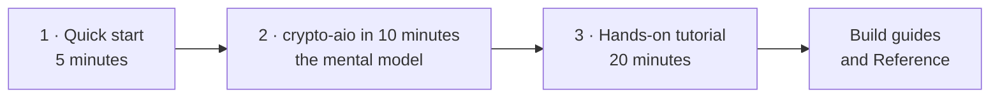

# Get started

Three short pages take you from `npm install` to a working mental model of crypto-aio. They
assume you can read TypeScript and know roughly what a blockchain transaction is. If you
don't yet, that is fine: start with the [learning path](../learn/index.md) instead, and come
back here when it sends you.

| Step | Page | You will |
| --- | --- | --- |
| 1 | [Quick start](./quick-start.md) | Install the package and send a transfer to proven finality on an in-memory chain, with no network and no keys |
| 2 | [crypto-aio in 10 minutes](./mental-model.md) | Learn the handful of ideas the whole API rests on: handles, Operations, Attempts, evidence and idempotency |
| 3 | [Hands-on tutorial](./tutorial.md) | Prove each idea to yourself in ten runnable steps: concurrency, lost replies, crashes, reorgs and secrets |

After that, go where your work is:

- **Connect a real chain:** [Connect to a real network](../build/connect.md).
- **Copy a working snippet:** [Examples](../build/examples.md).
- **Look up an exact detail:** [API at a glance](../reference/api.md),
  [Configuration](../reference/configuration.md) and [Errors](../reference/errors.md).
- **Understand the design in depth:** the [Developer tour](../tour/index.md).

> [!NOTE]
> These pages describe crypto-aio 0.1.0, the first release of this API, and the changes on
> `main` since then (the Avalanche X-Chain and P-Chain). The 0.0.x releases on npm are an older,
> unrelated API.
