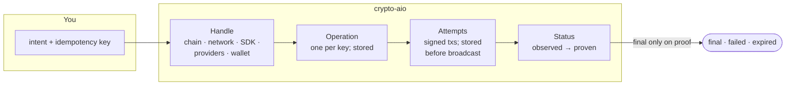

# crypto-aio in 10 minutes

This page is for developers who already know nonces, UTXOs, finality and RPC providers, and
want crypto-aio's model fast. Each idea has a link to the [Developer tour](../tour/index.md)
stop that explains it in depth. New to those terms? The [learning path](../learn/index.md)
starts from zero.

## The model on one page

## Eight ideas

**1. A handle is a frozen selection; a container is a tenant.** `aio.blockchain({ chain,
network, library, provider, wallet })` returns an immutable `Blockchain` handle; `with()` copies
it. The `CryptoAio` container owns configuration, stores, signers and a shared driver pool: use
one per tenant, each with its own `namespace`. [Stop 1](../tour/architecture.md).

**2. A transfer is an Operation, keyed by your idempotency key.** `transfer(intent, {
idempotencyKey })` creates one stored Operation per key. The same key with the same intent (in
any input form) returns it, wherever it stopped; with another intent it throws
`IDEMPOTENCY_CONFLICT`. Take keys from your own durable records, and set
`requireIdempotencyKey: true`. [Stop 3](../tour/transfer.md).

**3. Signed bytes are stored before they are sent.** Each signed transaction is an immutable
**Attempt**, written to the `OperationStore` before broadcast. Retries, workers and crash
recovery resend those bytes; nothing is ever signed twice for one payment. Replacements and
cancels are new Attempts in the same ordering slot. [Stop 3](../tour/transfer.md).

**4. Every status says what it rests on.** `evidence: 'observed'` is one endpoint's view;
`'proven'` is finalized data agreed by a quorum of endpoints (`proofQuorum`, 2 by default).
After signing, an Operation becomes `final`, `failed` or `expired` only on proof. Absence is
never proof. Deposits are always `observed`: you credit them by policy.
[Stop 6](../tour/evidence.md).

**5. Errors say whether anything may be in flight.** Every error is a `CryptoAioError` with a
`code`, `retryable` and **`ambiguous`**. Ambiguous means the transaction may have landed: retry
with the same key, never a new one. A node's refusal makes the Operation `stalled`, not
`failed`: fix the cause, then `rebroadcast`, `replace` or `cancel`.
[Stop 4](../tour/recovery.md).

**6. Ordering is coordinated through your stores.** Each Operation reserves a nonce, seqno,
coin set or expiry under a short address lease, and every racing write is fenced. Processes
that share the four stores (`OperationStore`, `LockManager`, `SequenceStore`, `CursorStore`)
coordinate safely. Only in-memory stores ship: bring durable ones and prove them with the
contract suites. [Stop 5](../tour/ordering.md).

**7. Chain differences are explicit.** What a handle cannot do is a missing capability
(`bc.supports('replace-fee')`), and calling it throws `UNSUPPORTED_CAPABILITY`.
Family extras are typed under `bc.ext.<family>`; the raw SDK client is `native(bc, 'ethers')`,
outside semver. [Stop 2](../tour/families.md).

**8. Keys live only in signers.** `localSigner` (memory) or `callbackSigner` (your HSM, KMS or
MPC, which may answer `pending` and sign later). `hooks.beforeSign` sees every signing round and
can veto it. Every credential is a `Secret`, redacted everywhere. [Stop 8](../tour/keys.md).

## From an SDK to crypto-aio

If you have written payment code against an SDK such as ethers, this is where each piece went:

| With an SDK you would… | With crypto-aio |
| --- | --- |
| `new JsonRpcProvider(url)`, or a `FallbackProvider` of several | `providers: { a: { preset: 'alchemy', apiKey }, b: { endpoints: [{ url }] } }` and `provider: ['a', 'b']`; proofs need a quorum of them |
| `new Wallet(privateKey, provider)` | `signers: { hot: localSigner({ secp256k1: secret(key) }) }`, `wallets: { treasury: { signer: 'hot' } }` |
| `provider.getBalance(address)` and `formatEther` | `bc.getBalance(address)` returns an exact `Amount`; `amount.format()` |
| `parseEther('0.01')`, `parseUnits('25', 6)` | `amount: '0.01'` (decimal string, the asset's decimals) or `amount: 10_000_000_000_000_000n` (base units) |
| `wallet.sendTransaction({ to, value })` | `bc.transfer({ to, amount }, { idempotencyKey })` |
| `new Contract(usdc, abi, wallet).transfer(to, units)` | `bc.transfer({ asset: 'USDC', to, amount: '25' }, { idempotencyKey })` |
| Track nonces yourself, or hope `pending` is right | Ordering slots under an address lease, from any number of processes |
| `tx.wait(1)` | `bc.waitForConfirmation(id, { confirmations: 1 })` |
| Poll the `finalized` tag yourself | `sub.wait({ finality: 'final' })`, resolved on proven evidence |
| Resend with a higher fee and the same nonce | `bc.replace(id, { fee })`, or `bc.cancel(id)` |
| `provider.on('block')` with `getLogs`, and your own cursor | `bc.scanner({ cursorKey, filter, mode: 'final' })`: durable cursor, `ack()`, rollbacks |
| Catch an error and guess whether it was sent | `error.ambiguous`; the Operation's stored state |

And the same calls then work on Bitcoin, Tron, Solana, TON and the Avalanche X-Chain and
P-Chain.

## What it deliberately does not do

- **No durable stores.** You supply them, for your database; the contract suites define them.
- **No business policy.** Limits, approvals and accounting are yours; `beforeSign` is the seam.
- **No automatic replace or cancel.** Fee bumps are your decision.
- **No general contract calls.** Native coins and tokens (ERC-20, TRC-20, SPL, jettons) only.
- **No proven deposits.** Deposits are observed; [crediting them
  safely](../build/receive.md#crediting-deposits) is a documented policy.
- **Not a wallet UI or an indexer.** It is a backend library for Node.js 22 or later.

## The API at a glance

| You want to… | Call |
| --- | --- |
| Read | `getBalance`, `getBalances`, `getBlockHeight`, `getBlock`, `getTransaction`, `getNetworkStatus` |
| Work with addresses and assets | `validateAddress`, `normalizeAddress`, `walletAddress`, `deriveAddress`, `addressFromPublicKey`, `resolveAsset` |
| Send | `estimateFee`, `transfer`, `prepareTransfer`, `submitSignatures` |
| Follow and fix | `waitForConfirmation`, `watch`, `getTransactionStatus`, `getOperation`, `rebroadcast`, `replace`, `cancel`, `rebuild`, `abandon` |
| Receive | `scanner`, `history` |
| Run a service | `aio.operations.recover()`, `aio.monitor.start()`, `aio.on(…)`, `aio.close()` |

Every method is in [API at a glance](../reference/api.md), with links to the guides.

## Next

- **Run it:** the [Hands-on tutorial](./tutorial.md) proves each idea in ten steps.
- **Build:** [Connect to a real network](../build/connect.md) and [Examples](../build/examples.md).
- **Look up:** [Configuration](../reference/configuration.md) and [Errors](../reference/errors.md).
