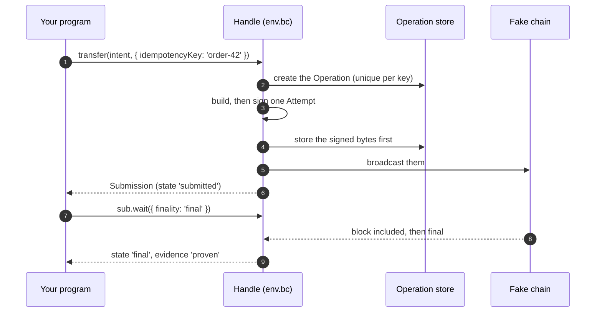

# Quick start

In about 5 minutes you install crypto-aio and send a payment that ends with **proof** that it
is final. It runs on an in-memory "fake" chain that ships with the library, so you need no
network, no account with a provider, no keys and no cryptocurrency.

> [!TIP]
> **New to blockchains?** You can follow this page without background knowledge: the folded
> "Explain it to me" notes define each term. For the full story, take the
> [learning path](../learn/index.md) afterwards.

## What you need

- **Node.js 22 or later.** Check with `node --version`. Solana needs 22.12 or later
  ([why](../reference/networks/solana.md)).
- A project folder with a `package.json` (`npm init -y` makes one).
- A way to run TypeScript. This page uses [`tsx`](https://www.npmjs.com/package/tsx), which
  runs a `.ts` file directly. Plain JavaScript works too: crypto-aio is built as CommonJS, so
  `const { CryptoAio } = require('crypto-aio')` works.

## Install

```sh
npm install crypto-aio
npm install --save-dev tsx   # only to run this page's TypeScript
```

That is everything this page needs. To talk to a real chain later, you add the SDK of that
chain next to the package, and only that one:

| Family | Install | Notes |
| --- | --- | --- |
| EVM: Ethereum, BNB Smart Chain, Polygon, Avalanche C-Chain, Arbitrum, Optimism, Base | `npm install ethers` | Or `web3`, with `library: 'web3'` on the handle; ethers is the default |
| Bitcoin | `npm install bitcoinjs-lib` | |
| Tron | `npm install tronweb` | |
| Solana | `npm install @solana/web3.js` | Node.js 22.12 or later |
| TON | `npm install @ton/ton @ton/core @ton/crypto` | |
| Avalanche X-Chain and P-Chain | `npm install @avalabs/avalanchejs` | |

A handle whose SDK is missing fails with `DEPENDENCY_MISSING` and names the exact install
command. The package has these entry points:

```ts
import { Blockchain, CryptoAio, configure, secret } from 'crypto-aio'; // the library
import { evmChainPlugin } from 'crypto-aio/evm'; // EVM extras and SDK client types
import 'crypto-aio/utxo'; // Bitcoin SDK client types (native(bc, 'bitcoinjs-lib'))
import { MAX_MEMO_BYTES } from 'crypto-aio/tron'; // Tron constants and the SDK client type
import { SOLANA_CAPABILITIES } from 'crypto-aio/solana'; // Solana extras and SDK client type
import 'crypto-aio/ton'; // TON constants and the SDK client type (native(bc, '@ton/ton'))
import 'crypto-aio/avalanche'; // Avalanche SDK client type (native(bc, '@avalabs/avalanchejs'))
import { createFakeEnv } from 'crypto-aio/testing'; // test kit and the fake chain
import { native } from 'crypto-aio/native'; // escape hatch to the SDK client
```

## Your first program (runs today, on the fake chain)

`createFakeEnv()` builds everything you need in memory:

- a fake chain;
- a container (`CryptoAio`) with the fake plugin, memory stores and a local signer;
- a handle (`env.bc`) for the chain `fakechain`, with a wallet funded with 0.01 FAKE.

The fake chain runs on fake time. Time moves only when the kit advances its clock, and
`env.run(promise)` does that until the promise settles. Blocks appear only when you call
`env.chain.mine()`.

<details markdown="1">
<summary>Explain it to me: chain, wallet, handle, block</summary>

- A **chain** (a blockchain) is a shared record of who owns what. Payments are added to it in
  batches called **blocks**. On a real chain, the network produces a block every few seconds
  or minutes; on the fake chain, a block appears when you call `env.chain.mine()`.
- A **wallet** is a named key that can approve payments. Here it already holds 0.01 FAKE, the
  fake chain's coin.
- A **handle** is the object you call methods on: one handle talks to one chain, through one
  SDK, with one wallet. The **container** is what creates handles and keeps their shared state.

[Lesson 1: Money, ledgers and blockchains](../learn/foundations/ledgers.md) explains all of
this from the start.

</details>

Save this as `first.ts`:

```ts
import { createFakeEnv, type FakeEnv } from 'crypto-aio/testing';

/** The fake chain moves only when you mine; this mines one block per second of fake time. */
async function mineWhile<T>(env: FakeEnv, promise: Promise<T>): Promise<T> {
  let done = false;
  const tracked = promise.finally(() => {
    done = true;
  });
  tracked.catch(() => undefined);
  for (let blocks = 0; blocks < 100 && !done; blocks++) {
    env.chain.mine();
    await env.clock.advance(1_000);
  }
  return tracked;
}

async function main(): Promise<void> {
  // 1. A fake chain, a container with one funded wallet, and a handle for 'fakechain'.
  const env = await createFakeEnv();
  const bc = env.bc;

  // 2. Address and balance.
  const me = await env.run(bc.walletAddress());
  const balance = await env.run(bc.getBalance(me.canonical));
  console.log(me.canonical, balance.amount.format()); // fk1… 0.01 FAKE

  // 3. Send. The idempotency key makes a retry safe.
  const sub = await env.run(
    bc.transfer({ to: env.stranger(), amount: '0.001' }, { idempotencyKey: 'order-42' }),
  );
  console.log(sub.state, sub.attempt?.id); // submitted <transaction hash>

  // 4. Wait for proven finality while the fake chain mines.
  const final = await mineWhile(env, sub.wait({ finality: 'final' }));
  console.log(final.status.state, final.status.evidence); // final proven

  // 5. Read the Operation back.
  const op = await env.run(bc.getOperation(sub.operationId));
  console.log(op?.state, op?.outcome, op?.attempts.length); // final executed 1
}

main().catch((error: unknown) => {
  console.error(error);
  process.exitCode = 1;
});
```

Run it:

```sh
npx tsx first.ts
```

You should see four lines: your address and balance, `submitted` with a transaction hash,
`final proven`, and `final executed 1`. `test/docs/quick-start.test.ts` runs this same program
on every change to the library, so this page cannot silently go out of date.

## What happened



- `amount: '0.001'` is a decimal string, so it means 0.001 FAKE. A `bigint` would mean base
  units. A JS `number` is rejected.
- `transfer` created an **Operation**, signed one **Attempt**, stored it, then broadcast it.
  Calling it again with the key `order-42` and the same intent returns the same Operation,
  so it never pays twice. The same key with another intent, such as a new `env.stranger()`
  address, throws `IDEMPOTENCY_CONFLICT`.
- `wait({ finality: 'final' })` resolved only on **proven** evidence. That means finalized
  chain data, read with a proof quorum: by default, two healthy endpoints must agree when two
  exist. The fake env has one endpoint.

<details markdown="1">
<summary>Explain it to me: Operation, Attempt, idempotency key, proven</summary>

- An **Operation** is your payment as a business fact: "pay this address 0.001 FAKE, for order
  42". It is stored, so it survives a crash.
- An **Attempt** is one signed transaction that tries to carry out the Operation. Usually there
  is exactly one; replacing a stuck payment adds another.
- The **idempotency key** (`'order-42'`) is your own id for the payment. Asking twice with the
  same key gives you the same payment back instead of paying twice. The
  [Idempotency lesson](../learn/engineering/idempotency.md) explains why every payment system
  needs this.
- **Proven** means the library read the result from finalized chain data, agreed on by
  several independent servers, rather than trusting what one server said. The
  [Trust lesson](../learn/engineering/trust.md) explains why that matters.

</details>

## Try it yourself

Small changes that show the library's guarantees. Run the program after each one:

1. **Ask twice.** Call `bc.transfer` a second time with the same intent and the same key.
   You get the same `operationId` back, and nothing new is sent.
2. **Change your mind.** Repeat the call with the key `'order-42'` and `amount: '0.002'`. It
   throws `IDEMPOTENCY_CONFLICT`: one key, one payment.
3. **Use a float.** Pass `amount: 0.001 as never`, a JavaScript number (TypeScript already
   refuses one; `as never` gets it past the compiler). It throws `INVALID_AMOUNT` before
   anything is stored: money is never a float.

## Read from a real chain

A first read from a real network needs no key and no signer. Install ethers, then:

```ts
import { Blockchain } from 'crypto-aio';

const fuji = Blockchain.create({ chain: 'avalanche', network: 'fuji', provider: 'public' });
console.log(await fuji.getBlockHeight()); // the Avalanche C-Chain testnet's latest block
```

`public` names free public endpoints, fine for trying things out and never for production.
From there, `transfer`, `waitForConfirmation` and `scanner` work as on the fake chain:
[Connect to a real network](../build/connect.md) shows the configuration for each family.

## Next steps

Pick the route that fits you:

- **I know blockchains and want the model fast:** [crypto-aio in 10 minutes](./mental-model.md),
  then the [Hands-on tutorial](./tutorial.md).
- **I want to build now:** [Connect to a real network](../build/connect.md),
  [Examples](../build/examples.md) and [Send a transfer](../build/send.md).
- **Much of this was new to me:** the [learning path](../learn/index.md) starts from zero and
  comes back to this program with every term explained.
- **I need exact details:** [API at a glance](../reference/api.md) and
  [Core concepts](../reference/concepts.md).
