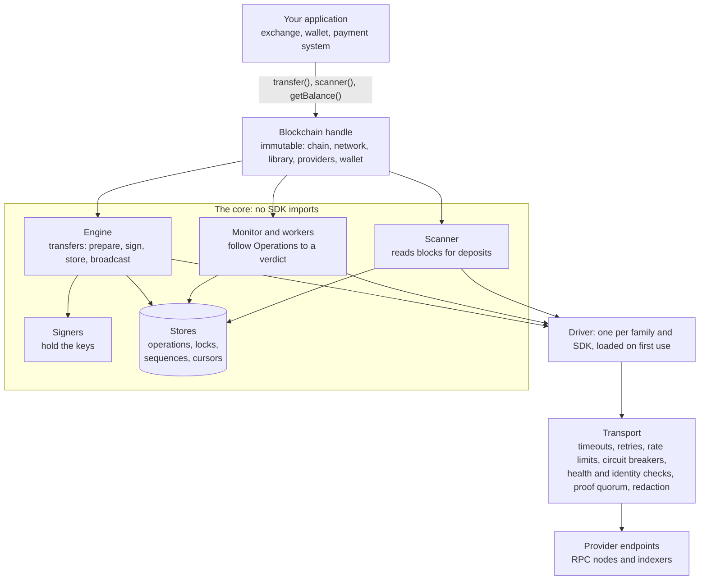
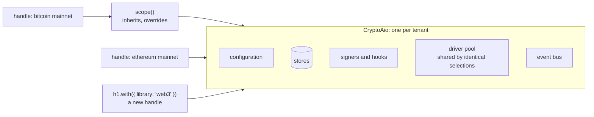
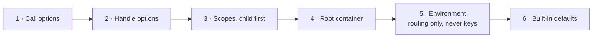
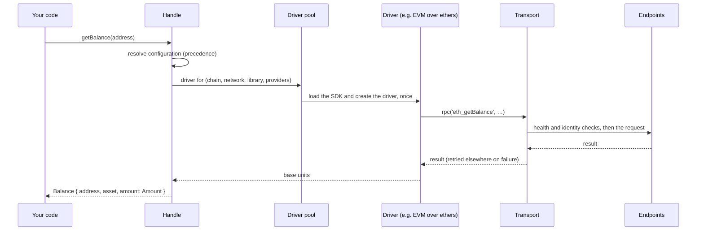

# The big picture

> [!TIP]
> **The short version.** Your code talks to an immutable **handle** (`Blockchain`), bound to one
> chain, network, SDK, provider set and wallet. Handles come from a **container** (`CryptoAio`),
> which owns the configuration, stores, signers and a pool of drivers. Under the handle, the
> **engine**, **monitor** and **scanner** implement payments, a **driver** speaks one chain
> family's language, and the **transport** carries every request to the providers. The core
> never imports a blockchain SDK.

**Builds on:** [Money, ledgers and blockchains](../learn/foundations/ledgers.md) and
[Nodes, RPC and providers](../learn/foundations/nodes.md).

## The problem the library solves

Every chain family has an SDK: ethers for EVM chains, bitcoinjs-lib, tronweb,
`@solana/web3.js`, `@ton/ton`, `@avalabs/avalanchejs`. Each SDK can build and send a
transaction. None of them is a payment system: none remembers what it sent across a crash,
refuses to pay twice, coordinates nonces across servers, or refuses to call a payment final on
one node's word. Every exchange and wallet ends up building that layer itself, once per chain.

crypto-aio is that layer, built once, with one API over every family it supports.

## The layers



Read it from the top:

- The **handle** is the API you call. It holds no state of its own: it resolves its
  configuration and delegates.
- The **engine** runs a transfer: it creates the Operation, reserves the ordering slot, builds,
  asks the signer, stores the signed bytes, and broadcasts.
- The **monitor** follows Operations after broadcast until a proven verdict; background
  **workers** run it for every Operation, so nobody has to wait on one.
- The **scanner** reads blocks for deposits, with a durable cursor.
- **Signers** are the only place keys live. **Stores** are the only place state lives.
- A **driver** translates between the core's neutral ports and one family's SDK and wire
  format. It is loaded the first time a handle of its family needs it.
- The **transport** is the core's own HTTP layer. Every driver sends every request through it,
  so retries, rate limits, health checks, quorum reads and secret redaction behave the same on
  every chain.

## The dependency rule

The core (`src/core/`) never imports a blockchain SDK, an adapter, or the testing kit. Only a
driver imports its SDK, and only when its manifest's `load()` runs. Two things enforce it: an
ESLint `no-restricted-imports` rule on `src/core/**`, and
`test/architecture/boundaries.test.ts`, which scans every import. The consequences reach you
directly:

- You install only the SDKs you use; a missing one fails with `DEPENDENCY_MISSING`, naming the
  install command, when a handle first needs it.
- Every safety property (idempotency, write-ahead signing, proofs, redaction) is written once,
  in the core, and holds for every family.

## Container, scope and handle



- The **container**, `CryptoAio`, owns configuration, stores, signers, hooks, plugins, the
  driver pool and the event bus. Two containers share nothing but the built-in chain data, so
  each tenant gets its own, with its own `namespace`. `configure()` sets up a default container
  behind `Blockchain.create()`.
- A **scope**, `aio.scope(overrides)`, inherits the container's configuration and overrides
  parts of it, sharing the container's pool and stores. It is convenient for regions or
  products, and it is not a tenant boundary.
- A **handle** is frozen. `bc.with({ … })` returns a new handle; the original never changes.
  Each Operation also stores a frozen copy of its context, so changing configuration later
  never changes a payment already in flight.

Handles are cheap: they share pooled drivers and transports, keyed by everything that makes them
different (chain, network, library, provider credentials). So create handles freely, and create
containers deliberately.

## Configuration precedence

Every setting can come from several places. The most specific wins:



```ts
import { CryptoAio, secret } from 'crypto-aio';

const tenant = new CryptoAio({
  namespace: 'tenant-a', // prefixes every store key
  providers: { node: { endpoints: [{ name: 'main', url: secret(process.env.RPC_URL ?? '') }] } },
  chains: { bsc: { network: 'testnet', provider: 'node' } },
});
const eu = tenant.scope({ chains: { bsc: { maxLagBlocks: 20 } } }); // shares pool and stores
const bsc = eu.blockchain({ chain: 'bsc' }); // testnet, through 'node'
const viaWeb3 = bsc.with({ library: 'web3' }); // a new handle; `bsc` is unchanged
```

The environment (`CRYPTO_AIO_<CHAIN>_RPC_URL`, `…_NETWORK`, `…_PROVIDER`, …) carries routing
only, and never keys or signers. [Configuration](../reference/configuration.md) lists every
option, and [Core concepts](../reference/concepts.md#configuration-precedence) the merge rules.

## One call, end to end

What happens when you call `bc.getBalance(address)`:



A transfer takes the same path, with the engine, the signer and the stores added. That is
stop 3.

## Where it lives

| Path | What is there |
| --- | --- |
| `src/index.ts` | The composition root: the public API, and the built-in family plugins |
| `src/core/container/` | `CryptoAio`, scopes, the default container, the driver pool |
| `src/core/blockchain/handle.ts` | The `Blockchain` handle |
| `src/core/config/` | Configuration types, environment source, precedence and merging |
| `test/architecture/boundaries.test.ts` | The dependency rule, enforced |

The [Source map](../explore/source-map.md) covers the whole tree.

## Check yourself

1. Why does the core never import an SDK?
2. A colleague uses `aio.scope()` to separate two customers' funds. What is wrong?
3. You call `bc.with({ confirmations: 12 })`. What happens to transfers already started from
   `bc`?

<details markdown="1">
<summary>Answers</summary>

1. So that you install only the SDKs you use, and so that every safety property is written
   once, in SDK-free code, for every family.
2. A scope shares its container's stores and pool; tenants need separate containers with
   distinct namespaces.
3. Nothing: `with()` returns a new handle, and each Operation keeps a frozen copy of its context.

</details>

## What's next

The handle looks the same on every chain, but chains differ deeply. How one API serves them all:
[Chains, families and drivers](./families.md).
