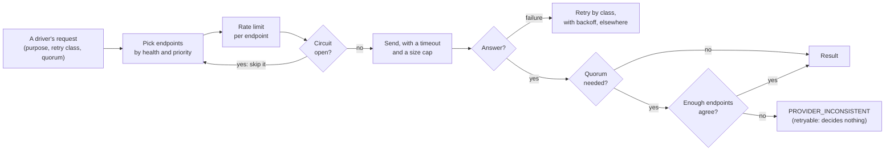

# Evidence, proofs and finality

> [!TIP]
> **The short version.** Every status crypto-aio reports says what it rests on: **observed**
> (one endpoint's current view) or **proven** (finalized chain data that a quorum of endpoints
> agree on). After signing, an Operation ends only on proven evidence. The **transport** makes
> that possible: it checks each endpoint's network and height, keeps lagging ones out of
> decisions, and runs proof reads as quorum reads, where disagreement decides nothing. A lying
> endpoint can delay a verdict, never fake one.

**Builds on:** [Blocks, confirmations and finality](../learn/foundations/blocks.md),
[Trust: one server's word is not proof](../learn/engineering/trust.md) and
[Retries, ambiguity and recovery](./recovery.md).

## Two kinds of evidence

Every `TxStatus` carries:

| Field | Values | Says |
| --- | --- | --- |
| `state` | `pending`, `included`, `final`, `failed`, `dropped`, `replaced`, `expired`, … | Where the transaction is |
| `finality` | `none`, `probabilistic`, `final` | Whether it could still be reorganized |
| `evidence` | `observed`, `proven` | What the status rests on |
| `confirmations`, `blockHeight`, `blockHash`, `reason` | | The details |

- **Observed** is what one endpoint says right now. It can change: a reorg, a lagging node, a
  node that dropped the transaction. Observed data moves an Operation forward (`included`), and
  never ends it.
- **Proven** is finalized chain data, read with a **quorum**: enough independent endpoints must
  return the same answer. Every terminal state after signing needs it.

There is one deliberate exception: when nodes **reject** every Attempt as never valid, and the
driver confirms that from the bytes it sent, the Operation fails with `TX_REJECTED` without chain
proof, because those bytes can never land. And there is one deliberate non-rule: **absence is
never proof**. `dropped` and `refused` are never terminal, and a reorg verdict needs the quorum
to serve a different block hash.

## The transport

Every request any driver makes goes through the core's transport. Before it trusts an endpoint
with a decision, it checks it:



- **Identity.** Each endpoint is asked which network it serves (a chain id, a genesis hash, the
  id of block 0). One that answers for another network is disabled, emits
  `provider.misconfigured`, and fails with `PROVIDER_MISCONFIGURED`.
- **Height.** Each endpoint's height is probed every `healthIntervalMs` (15 s). One more than
  `maxLagBlocks` behind the best verified height is **lagging**: the monitor and the scanner
  never decide anything from a view that far behind.
- **Retries by class.** Each request declares how it may be retried: `safe` (reads), or
  `ambiguous-on-failure` (broadcasts, whose failure may hide a success). Each also declares its
  purpose: `read`, `monitor`, `proof` or `broadcast`.
- **Limits.** Per-endpoint rate limits, a circuit breaker (after 5 failures, an endpoint rests
  30 s), a 15 s timeout, and a 64 MiB cap on any one answer, so one endpoint cannot exhaust the
  process's memory.

## Proof reads

A driver's `proofs` port asks the questions behind every verdict: is this transaction in a final
block, and did it succeed? Is this nonce used at a final height? What is the hash of the
finalized block at this height? Those reads run with `quorum: 'proof'`: `proofQuorum` endpoints
(2 by default) must return the same answer, or the read throws a retryable
`PROVIDER_INCONSISTENT`, and nothing is decided.

The quorum counts every endpoint not proven to serve another network, including lagging ones and
ones whose breaker is briefly open, so one endpoint never proves a fact alone while the others
are only momentarily away. After about three health intervals without an answer, an endpoint
stops counting. With two endpoints, losing one leaves the other proving alone, which is why
production wants three.

A proof may also answer "no" only on a **definitive** negative. "Not found", "pruned", "state
unavailable", an index still building: each throws a retryable `PROVIDER_UNAVAILABLE`, and decides
nothing.

## A lying endpoint, in practice

Here one of two endpoints lies about finalized data. The transfer is included, but it cannot be
proven final while the endpoints disagree. When the liar is fixed, the proof goes through:

<!-- runnable -->
```ts
import { createFakeEnv } from 'crypto-aio/testing';

const env = await createFakeEnv({ endpoints: ['a', { name: 'b', forkFinalized: true }] });
let disagreements = 0;
env.aio.on('provider.inconsistent', () => disagreements++);

const sub = await env.run(env.bc.transfer({ to: env.stranger(), amount: 5n }));
env.chain.mine(6);
const late = await env
  .run(sub.wait({ finality: 'final', timeoutMs: 20_000 }), 500)
  .catch((e: { code: string }) => e.code);
console.log(late); // TIMEOUT
const op = await env.run(env.bc.getOperation(sub.operationId));
console.log(op?.state, op?.attempts[0]?.status?.evidence, disagreements > 0); // included observed true

env.chain.configureEndpoint('b', { forkFinalized: false }); // the liar is fixed
const done = await env.run(sub.wait({ finality: 'final' }));
console.log(done.status.state, done.status.evidence); // final proven
```

The disagreement cost time, not money: the Operation stayed `included`, and the wait timed out
without changing anything. That is the trade the library makes everywhere: when in doubt, wait.

## Verdicts, family by family

What "proven" means depends on the chain's rules, and each driver implements its family's
proofs: an EVM nonce used at a final height and the receipt from that block; a Bitcoin input
spent at final depth; a Tron or Solana transaction absent from every block of its validity
window; a TON message trace completed in the masterchain. Token transfers are judged by what the
token contract logged, not only by the receipt's success.
[Wait for confirmation](../build/confirmations.md) gives every family's verdict rules.

## Where it lives

| Path | What is there |
| --- | --- |
| `src/core/transport/http-transport.ts` | Endpoint selection, health and identity probes, retries, quorum reads, redaction |
| `src/core/transport/circuit.ts`, `rate-limit.ts`, `backoff.ts`, `stale-view.ts` | The transport's building blocks |
| `src/core/lifecycle/evaluate.ts`, `observations.ts` | Turning observations and proofs into Attempt and Operation verdicts |
| `src/core/driver/types.ts` | The `ProofSource` port and its "definitive negative" rule |

## Check yourself

1. What can move an Operation from `submitted` to `included`? From `included` to `final`?
2. One of your three endpoints is 40 blocks behind. Can it make a proof fail? Make one succeed?
3. Why does a proof read throw instead of answering "no" when the data is pruned?

<details>
<summary>Answers</summary>

1. Observed data from one endpoint; only proven data, read under the quorum.
2. It counts toward the quorum's size, so its disagreement can hold a proof up, but it cannot
   prove anything alone, and the monitor never decides from its lagging view.
3. Missing data is not evidence of absence: answering "no" could prove a landed transaction
   failed, and invite a second payment.

</details>

## What's next

Sending is half of a payment system. How money arriving at your addresses is found, and credited,
safely: [How receiving works](./receiving.md).
