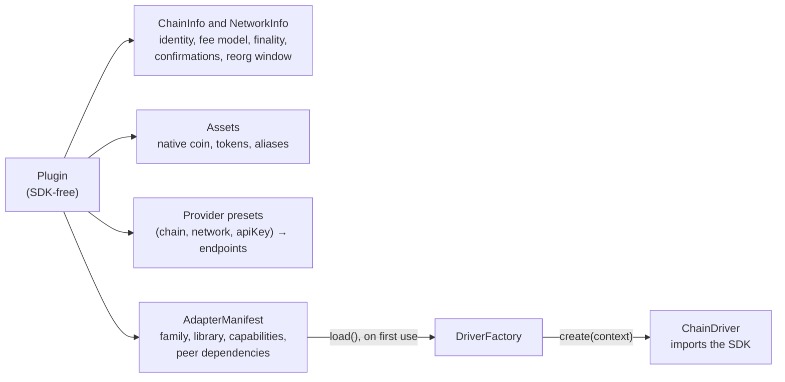

# Chains, families and drivers

> [!TIP]
> **The short version.** Every chain crypto-aio knows comes from a **plugin**: plain data that
> describes chains, networks, assets and provider presets, plus an **adapter manifest** whose
> `load()` brings in a **driver**. One driver serves a whole **family** (every EVM chain, for
> example). What a chain cannot do is never hidden: it is a missing **capability**, and calling
> it throws. Chain-specific extras live under `bc.ext.<family>`, and the raw SDK client is one
> call away with `native()`.

**Builds on:** [Accounts, UTXOs and transaction order](../learn/foundations/ordering.md),
[Fees and fee markets](../learn/foundations/fees.md) and [The big picture](./architecture.md).

## One API over very different chains

Part 1 of the learning path showed how much chains differ: accounts or coins, nonces or expiries,
gas or bytes, instant finality or an hour of confirmations. A common API can handle those
differences in two bad ways: hide them (and be wrong on some chains), or expose every one (and
not be common). crypto-aio does neither:

- Behavior that every chain has (balance, fee estimate, transfer, confirmation, scanning) has
  **one shape**, and each family implements it faithfully.
- Behavior that only some chains have is a named **capability** you can test for.
- Behavior unique to one family is in a **typed extension**, `bc.ext.<family>`.
- Anything else is in the SDK itself, through **`native()`**, outside the stable API.

## Plugins: chains as data

A plugin is SDK-free data plus lazy loaders:



The built-in families (EVM, UTXO, Tron, Solana, TON, Avalanche) are plugins like any other,
registered by the package's composition root. Because a network is data, a new EVM chain needs
no new code: a `ChainInfo` and one call to `evmChainPlugin` ([Add networks to a
family](../explore/custom-networks.md)). A wholly new family is a new plugin with its own
driver ([Write a chain family plugin](../explore/plugins.md)).

## Drivers: one family's translator

A driver implements the core's **ports**, small interfaces each with one job:

| Port | Its job |
| --- | --- |
| `address` | Validate, normalize and derive the family's addresses |
| `reader` | Balances, heights, blocks, transactions, and observing a transaction |
| `builder` | Estimate fees, check funds, build unsigned transactions, assemble signed ones |
| `broadcaster` | Send raw bytes; classify the answer as accepted, already known, refused or rejected |
| `proofs` | Read finalized state under the proof quorum, behind every `proven` verdict |
| `sequence` | Nonces or seqnos, for families that order by them |
| `replacement` | Replace and cancel, where the chain allows them |
| `blocks`, `history` | Block source for the scanner; address history from an indexer |
| `ext` | The family's typed extras |

A driver never signs, holds no keys, and keeps no per-tenant state, so the pool can share one
driver among every handle with the same chain, network, library and providers. All its I/O goes
through the transport it is given.

## Capabilities

A **capability** is a named feature a handle may have: `tokens`, `memo`, `batch-transfer`,
`replace-fee`, `cancel`, `block-scan`, `address-history`, `expiry` and a few more. A handle's
capabilities come from three places:

1. what the family's driver can do (its manifest);
2. what the network allows (Arbitrum has no mempool, so no `replace-fee` or `cancel`);
3. what the configured providers allow (Tron's address history needs an indexer).

<!-- runnable -->
```ts
import { CryptoAio, secret } from 'crypto-aio';

const node = { endpoints: [{ name: 'main', url: secret('https://node.example') }] };
const aio = new CryptoAio({ env: false, providers: { node } });
const eth = aio.blockchain({ chain: 'ethereum', provider: 'node' });
const arb = aio.blockchain({ chain: 'arbitrum', provider: 'node' });
const btc = aio.blockchain({ chain: 'bitcoin', provider: 'node' });
console.log(eth.supports('replace-fee'), arb.supports('replace-fee')); // true false
console.log(eth.supports('tokens'), btc.supports('tokens')); // true false
console.log(btc.supports('batch-transfer')); // true
```

Calling a method that needs a missing capability throws `UnsupportedCapabilityError`
(`UNSUPPORTED_CAPABILITY`) before anything is stored. Checking `bc.supports(…)` first lets
generic code adapt instead of failing. [Capabilities](../reference/capabilities.md) has the
full matrix.

## Extras and the escape hatch

Each family's extras are typed per chain: `bc.ext.evm.getNonce(address)`,
`bc.ext.tron.getResources(address)`, `bc.ext.solana.getTokenAccounts(owner)`,
`bc.ext.utxo.listUnspent(…)`, and so on. The type of `bc.ext` follows the handle's chain, so
`eth.ext.tron` does not compile.

For anything the library does not cover, `native(bc, 'ethers')` (from `crypto-aio/native`)
returns the SDK's own client, built for that handle only and wired to the handle's transport, so
it never sees a real URL or key. It is deliberately outside semver: the SDK's behavior is the
SDK's ([Keys, signers and secrets](../build/keys.md#the-native-escape-hatch-crypto-aionative)).

<details>
<summary>Under the hood: types from a registry</summary>

TypeScript learns which chains exist, and which family and networks each has, from interfaces
the plugins augment: `ChainRegistry` (chain → family and networks), `FamilyRegistry` (family →
library and `ext` type) and `NativeClientMap` (library → client type). That is why
`aio.blockchain({ chain: 'ethereum', network: 'sepolia' })` type-checks while `network: 'nile'`
does not, and why a plugin you write can make its own chain id a valid `ChainId`.

</details>

## Lazy loading

Creating a handle loads nothing. The first call that needs the driver runs the manifest's
`load()`, which requires the SDK. If the SDK is not installed, that call fails with
`DEPENDENCY_MISSING` and the exact `npm install` command. `await bc.ready()` forces the load,
and the provider's identity check, at startup, so a misconfiguration fails fast instead of on
the first payment.

## Where it lives

| Path | What is there |
| --- | --- |
| `src/core/registry/` | The catalogs: chains, assets, adapters, presets, schemes, plugins |
| `src/core/driver/types.ts` | Every driver port, with a per-method contract in its JSDoc |
| `src/core/model/capability.ts` | The known capabilities |
| `src/adapters/<family>/` | One directory per family: `plugin.ts` (data), `driver.ts` and its parts |
| `src/testing/fake-plugin.ts`, `fake-driver.ts` | The smallest complete family, a good first read |

## Check yourself

1. Why is a new EVM chain only data, while a new family needs code?
2. Your service runs on many chains and wants to attach a memo when it can. How?
3. Why does `native()` return a new client per handle instead of the driver's own?

<details>
<summary>Answers</summary>

1. Every EVM chain shares one transaction format and RPC API, so the EVM driver serves them all;
   only identities, fees and finality rules differ, and those are data. A new family has its own
   formats, so it needs its own driver.
2. Check `bc.supports('memo')` and include `memo` only when it is true.
3. So that changes you make to it cannot affect the pooled driver, other handles or other
   tenants.

</details>

## What's next

With a driver in hand, the engine can run a payment. Follow one from start to finish:
[The life of a transfer](./transfer.md).
