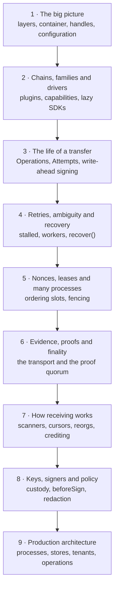

# Developer tour

The tour walks through crypto-aio the way you would walk through a building with its architect:
one room at a time, in an order where each room explains the next. Each stop answers one
question about how the library works, why it is designed that way, and where the code lives.

It is the third part of the [learning path](../learn/index.md), so each stop names the lessons
it builds on. If you already know blockchains and backend engineering, you can start here
directly; if you only need the shape of the API, [crypto-aio in 10
minutes](../start/mental-model.md) is shorter.

## The route

| Stop | The question | Builds on |
| --- | --- | --- |
| 1 · [The big picture](./architecture.md) | What are the parts, and how does a call flow through them? | [Ledgers](../learn/foundations/ledgers.md), [Nodes](../learn/foundations/nodes.md) |
| 2 · [Chains, families and drivers](./families.md) | How does one API serve chains that work so differently? | [Ordering](../learn/foundations/ordering.md), [Fees](../learn/foundations/fees.md) |
| 3 · [The life of a transfer](./transfer.md) | What exactly happens between `transfer()` and a final payment? | [Transactions](../learn/foundations/transactions.md), [Persistence](../learn/engineering/persistence.md) |
| 4 · [Retries, ambiguity and recovery](./recovery.md) | What happens when something fails halfway? | [Failure](../learn/engineering/failure.md), [Idempotency](../learn/engineering/idempotency.md) |
| 5 · [Nonces, leases and many processes](./ordering.md) | How do many processes send from one wallet without colliding? | [Ordering](../learn/foundations/ordering.md), [Concurrency](../learn/engineering/concurrency.md) |
| 6 · [Evidence, proofs and finality](./evidence.md) | When does the library decide a payment is done, and on whose word? | [Finality](../learn/foundations/blocks.md), [Trust](../learn/engineering/trust.md) |
| 7 · [How receiving works](./receiving.md) | How are deposits found, and credited safely, across reorgs? | [Finality](../learn/foundations/blocks.md), [Idempotency](../learn/engineering/idempotency.md) |
| 8 · [Keys, signers and policy](./keys.md) | Where do keys live, and what stands between a request and a signature? | [Cryptography](../learn/foundations/cryptography.md), [Secrets](../learn/engineering/secrets.md) |
| 9 · [Production architecture](./production.md) | What does a real deployment look like? | All of the above |

Each stop takes 10 to 20 minutes and ends with **Where it lives**, the source files to read
next. After the tour, the [Hands-on tutorial](../start/tutorial.md) lets you run every idea, and
the [Build guides](../build/index.md) turn them into a service.
