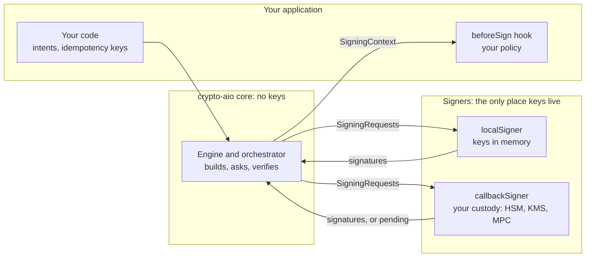

# Keys, signers and policy

> [!TIP]
> **The short version.** Private keys live only inside **signers**, behind a three-method port:
> public keys out, signatures out, nothing else. `localSigner` keeps keys in memory;
> `callbackSigner` puts any custody system (HSM, KMS, MPC) behind the same port, including
> custody that signs later. Before every signing round, your **`beforeSign` hook** sees exactly
> what is about to be signed and can veto it. Every signature is verified before use, and every
> secret is wrapped so that it cannot reach a log, an error, an event or a store.

**Builds on:** [Hashes, keys and signatures](../learn/foundations/cryptography.md),
[Secrets and key custody](../learn/engineering/secrets.md) and
[The life of a transfer](./transfer.md).

## The trust boundaries



The core never holds key material, and neither do the handle, events, logs or stores. A signer
receives only what it needs to sign; your hook receives only what it needs to decide.

## The signer port

```ts
interface Signer {
  readonly id: string;
  readonly schemes: readonly string[]; // e.g. ['secp256k1-ecdsa', 'secp256k1-schnorr']
  getPublicKey(scheme: string, keyRef?: KeyRef): Promise<Uint8Array>;
  sign(requests: readonly SigningRequest[], ctx: SigningContext): Promise<SigningResult>;
  cancelRequest?(ticket: string): Promise<void>; // custody tickets, for abandon()
  exportKey?(scheme: string, keyRef?: KeyRef): Promise<Secret<Uint8Array>>; // off by default
}
```

- A **`SigningRequest`** is `{ id, scheme, payload, payloadKind, publicKey, keyRef? }`: the exact
  bytes to sign (a digest or a message, as the chain requires), and which key must sign them.
- A **`SigningContext`** says why: the Operation id, namespace, chain, network, wallet and its
  `tier`, the purpose (`original`, `replacement`, `cancel`, `rebuild`), a readable `summary` of
  the outputs, the fee, and a hash of the unsigned transaction.
- The answer is `{ status: 'signed', signatures }`, or `{ status: 'pending', ticket }` for custody
  that answers later.

The orchestrator then **verifies** every signature against its request's public key before
anything is assembled. A custody bug, a wrong key or a tampered response fails with
`SIGNATURE_MISMATCH` and is never broadcast.

## Signing now, or later

A `pending` answer parks the Operation in `awaiting-signature`, with its ordering slot reserved,
and returns. When custody finishes, perhaps after a human approval hours later, you hand back the
signatures with `bc.submitSignatures(operationId, signatures)`, and the Operation resumes at the
verification step. `bc.abandon(operationId)` cancels it before anything is signed, and calls the
signer's `cancelRequest` for each pending ticket.

A wallet with no signer is watch-only. Given its `publicKey`, it can still prepare: `prepareTransfer`
builds and stores the unsigned transaction and returns its requests, for a hardware wallet or
an offline machine
([Cold and asynchronous signing](../build/cold-signing.md)).

`lifecycle.signTimeoutMs` (120 s) bounds the hook and the signer in every call. On timeout,
nothing is written: the Operation stays `prepared`, and a repeat asks again. Custody that needs
longer should answer `pending`.

## The policy seam

`hooks.beforeSign(ctx)` runs before each signing round, with the context above. Throw to veto:
the veto becomes `POLICY_REJECTED`, and on a first signing the Operation fails with its slot
released, nothing signed.

<!-- runnable -->
```ts
import { isCryptoAioError } from 'crypto-aio';
import { createFakeEnv } from 'crypto-aio/testing';

const env = await createFakeEnv({
  hooks: {
    beforeSign: (ctx) => {
      const total = ctx.summary.outputs.reduce((sum, out) => sum + BigInt(out.amount), 0n);
      if (total > 500_000n) throw new Error('above the hot wallet limit'); // base units
    },
  },
});

const small = await env.run(env.bc.transfer({ to: env.stranger(), amount: '0.001' }));
console.log(small.state); // submitted

const large = await env
  .run(env.bc.transfer({ to: env.stranger(), amount: '0.009' }))
  .catch((e: unknown) => e);
if (!isCryptoAioError(large)) throw new Error('expected a veto');
console.log(large.code); // POLICY_REJECTED
const vetoed = await env.run(env.bc.getOperation(String(large.context.operationId)));
console.log(vetoed?.state); // failed
```

The hook is a seam, not a policy engine: withdrawal limits, approvals, allow-lists and treasury
rules belong in your application, and the hook is where they plug in. It may run more than once
per Operation (a concurrent caller, a repeat, `submitSignatures`, a replacement), so key its
checks on `ctx.operationId`, and keep it short: it runs while the address lease is held.

## Secrets stay secret

- Every credential is a **`Secret`**: printing, `JSON.stringify` and `util.inspect` show
  `[REDACTED]`; only `reveal()` returns the value.
- The transport names endpoints by label (`<provider/endpoint>`), never by URL, and removes every
  configured credential from error messages, details and causes, in any letter case.
- **Events** carry operational data only: ids, states, codes, heights, timings, sizes. Never
  addresses, amounts, raw transactions, signatures or URLs.
- An error never repeats a name you typed that the library does not know (a wallet, a provider,
  an option key), so a secret pasted into the wrong field never reaches a message.
- **Stores** never receive key material, and `DATA_CLASSIFICATION` marks every stored field
  `sensitive`, `sensitive-until-broadcast` or `operational`, so a store can encrypt per field.

## Where it lives

| Path | What is there |
| --- | --- |
| `src/core/signing/types.ts` | `Signer`, `SigningRequest`, `SigningContext`, `SigningResult` |
| `src/core/signing/local.ts`, `callback.ts`, `hd.ts` | `localSigner`, `callbackSigner`, BIP32 and SLIP-10 derivation |
| `src/core/signing/orchestrator.ts`, `guard.ts` | Running the hook and signers, timeouts, verification |
| `src/core/secret/` | `Secret`, URL and deep redaction |
| `src/core/store/types.ts` | `DATA_CLASSIFICATION` |

## Check yourself

1. A custody service returns a signature made by the wrong key. What happens?
2. Your approval flow takes hours. How should the custody signer answer?
3. Why should a `beforeSign` hook be idempotent?

<details markdown="1">
<summary>Answers</summary>

1. The orchestrator's verification fails with `SIGNATURE_MISMATCH`; nothing is assembled or sent.
2. `{ status: 'pending', ticket }`; later, `submitSignatures` with the signatures, or `abandon`.
3. It can run several times for one Operation, so it must give the same answer each time, keyed
   on `ctx.operationId`.

</details>

## What's next

The last stop puts every part together into a running service:
[Production architecture](./production.md).
