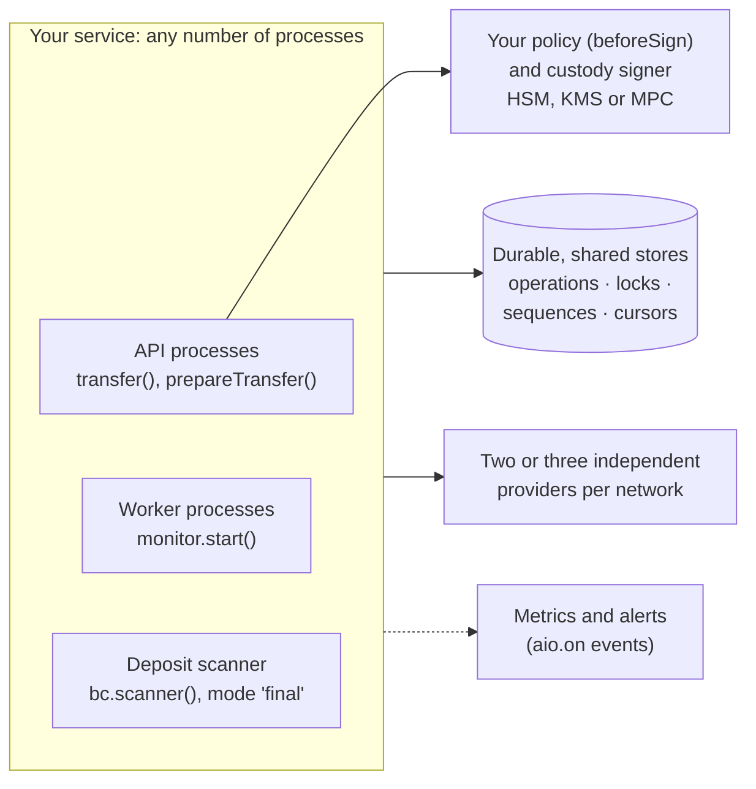

# Production architecture

> [!TIP]
> **The short version.** In production, crypto-aio runs inside several of your processes at
> once, API servers that call `transfer`, workers that finish Operations, scanners that read
> deposits, all sharing **durable stores** that implement the fencing rules. Keys sit behind a
> **custody signer** with a policy hook in front. Each network has **two or three independent
> providers**. Every process starts with `ready()` and `recover()`, runs workers, alerts on a
> handful of events, and closes cleanly.

**Builds on:** every earlier stop of the tour, and
[Concurrency: locks, leases and fencing](../learn/engineering/concurrency.md).

## The shape of a deployment



Each part is something the earlier stops explained:

| Part | Why it is there | Stop |
| --- | --- | --- |
| Several API processes | Throughput and availability; leases keep their nonces apart | [5](./ordering.md) |
| Worker processes | Every Operation reaches a verdict, even if its caller is gone | [4](./recovery.md) |
| A scanner in `final` mode | Deposits from final blocks, with a durable cursor | [7](./receiving.md) |
| Durable stores with fencing | State survives restarts; paused processes cannot overwrite | [5](./ordering.md) |
| A custody signer behind a policy | Keys never on the API servers; limits before signing | [8](./keys.md) |
| Two or three independent providers | Proofs are cross-checked; one outage or liar cannot decide | [6](./evidence.md) |

## Tenants

One `new CryptoAio({ namespace })` per tenant: the namespace prefixes every store key, and the
container keeps the tenant's configuration, signers and pool apart. Tenants can share one
database, as long as their namespaces differ. A `scope()` is not a tenant boundary: it shares its
container's stores and pool.

## Starting and stopping a process

```ts
import { CryptoAio, callbackSigner, createLogger, secret } from 'crypto-aio';
import { stores } from './stores'; // your durable OperationStore, LockManager, SequenceStore, CursorStore
import { custodyOptions, policy } from './custody'; // { id, schemes, getPublicKey, sign, cancelRequest }

const aio = new CryptoAio({
  namespace: 'payments',
  stores,
  logger: createLogger('payments', writeLog),
  signers: { custody: callbackSigner(custodyOptions) }, // custodyOptions.id is 'custody'
  wallets: { treasury: { signer: 'custody', tier: 'hot' } },
  providers: {
    alchemy: { preset: 'alchemy', apiKey: secret(process.env.ALCHEMY_KEY ?? '') },
    infura: { preset: 'infura', apiKey: secret(process.env.INFURA_KEY ?? '') },
    own: { endpoints: [{ name: 'node', url: secret(process.env.OWN_NODE_URL ?? '') }] },
  },
  chains: { ethereum: { network: 'mainnet', provider: ['alchemy', 'infura', 'own'], wallet: 'treasury' } },
  hooks: { beforeSign: (ctx) => policy.check(ctx) },
  lifecycle: { requireIdempotencyKey: true },
});

// 1. Fail fast: the SDK loads and every endpoint serves mainnet.
await aio.blockchain({ chain: 'ethereum' }).ready();
// 2. Finish what the previous process left in flight.
const report = await aio.operations.recover();
// 3. Background workers, in this process or in dedicated ones.
const stop = new AbortController();
const workers = aio.monitor.start({ workerId: `worker-${process.pid}`, signal: stop.signal });
// 4. …serve requests…

process.once('SIGTERM', async () => {
  stop.abort(); // workers stop claiming
  await workers;
  await aio.close(); // closes drivers and native clients; later calls throw INVALID_TRANSITION
});
```

## Watching it run

Events carry operational data only, so they are safe to send to any metrics or alerting system:

| Event | Alert or measure |
| --- | --- |
| `operation.stalled` | **Alert**: a node refused a signed transfer; someone must fix the cause and rebroadcast, replace or cancel |
| `nonce.gap` | **Alert**: a nonce blocks later transfers (`blockingOperationId`) |
| `recovery.skipped` | **Alert**: startup found Operations that need a person (`state`, `reason`) |
| `provider.misconfigured` | **Alert**: an endpoint serves the wrong network |
| `provider.inconsistent` | Watch: endpoints disagree; proofs wait until they agree |
| `provider.health` | Measure: endpoint states (`healthy`, `lagging`, `open`, `disabled`) and lag |
| `operation.state` | Measure: throughput and time per state; `final` versus `failed` |
| `rpc.error`, `rpc.response` | Measure: provider error rates and latency |
| `scanner.block`, `scanner.rollback` | Measure: deposit scanning progress; rollbacks |

```ts
aio.on('operation.stalled', (e) => pager.alert(`transfer ${e.operationId} stalled: ${e.code}`));
aio.on('operation.state', (e) => metrics.increment('crypto_aio.operation', { to: e.to }));
```

## Failure drills

What happens, in production, when things break:

| What breaks | What crypto-aio does | What you do |
| --- | --- | --- |
| A process is killed mid-transfer | Signed bytes are already stored; `recover()` or the workers resend them | Nothing |
| A provider goes down | Requests go to the others; its circuit opens; proofs continue with the rest | Fix or replace it; with only two providers, proofs rest on one meanwhile |
| A provider lags or lies | It is kept out of decisions, or its disagreement makes proofs wait (`provider.inconsistent`) | Investigate; remove it |
| A reply to a broadcast is lost | The Operation is `submitted` and ambiguous; a retry with the same key, or a worker, resends | Retry with the same key, never a new one |
| A node refuses a transfer | The Operation is `stalled`, keeping its slot and bytes | Fix the cause; rebroadcast, replace or cancel |
| A reorg removes a deposit's block | The scanner emits a rollback | Revert credits from the removed blocks (or scan in `final` mode) |
| The store is slow | Leases may expire; fencing refuses stale writes (`FENCING`) | Size `lifecycle.leaseMs` to your store's latency |
| Custody is slow | Signing times out after `signTimeoutMs`, writing nothing | Make custody answer `pending` and finish with `submitSignatures` |

## Where to go from here

- [Go to production](../build/production.md): the full checklist, family by family.
- [Write a durable store](../explore/stores.md): the store ports and their contract suites.
- [Keys, signers and secrets](../build/keys.md): custody signers in detail.

## Check yourself

1. Two API processes and three worker processes share one wallet. What must they share?
2. Why run `recover()` before serving traffic?
3. Which three events would you page someone for?

<details markdown="1">
<summary>Answers</summary>

1. The stores: `OperationStore`, `LockManager`, `SequenceStore` (and `CursorStore` for
   scanners), durable and fenced.
2. A previous process may have died with signed transactions unsent; recovery resends them
   before new work competes for the same wallet.
3. `operation.stalled`, `nonce.gap` and `recovery.skipped`, and `provider.misconfigured` too:
   each needs a decision only a person can make.

</details>

## What's next

That completes the tour. You have seen the whole system: the layers, the drivers, a transfer's
life, recovery, ordering, proof, receiving, keys and production. Now run all of it yourself in the
[Hands-on tutorial](../start/tutorial.md), then build with the [Build guides](../build/index.md).
