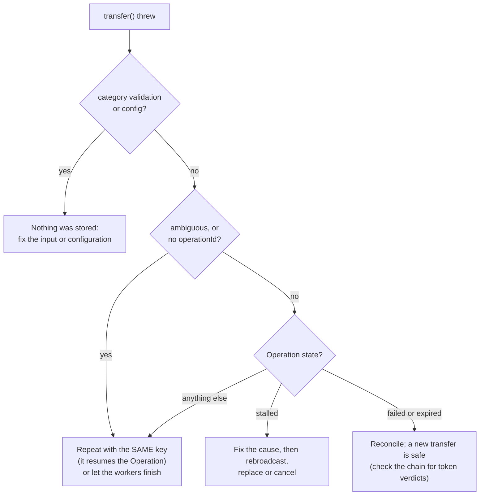

# Retries, ambiguity and recovery

> [!TIP]
> **The short version.** When a transfer goes wrong halfway, crypto-aio tells you exactly how:
> an **ambiguous** error (it may have paid), a **stalled** Operation (a node refused it, but its
> bytes may still land), or a clean failure before signing. The rule for your code is always
> the same: **never create a new transfer while the old one might land.** Retry with the same
> key, or use the Operation's own remedies. Background **workers** finish every Operation
> without anyone waiting, and **`recover()`** picks up after a crash, without ever signing.

**Builds on:** [When networks fail](../learn/engineering/failure.md),
[Idempotency](../learn/engineering/idempotency.md) and [The life of a transfer](./transfer.md).

## Three kinds of trouble

| What happened | What you see | Is anything in flight? | What to do |
| --- | --- | --- | --- |
| Failed **before signing** (funds, policy, validation) | An error; the Operation is `failed`, or nothing was stored | No | Fix the cause; a **new** key is safe |
| Broadcast outcome **unknown** | `error.ambiguous === true`; the Operation is `submitted` and `ambiguous` | Maybe | Repeat with the **same** key, or let workers resolve it |
| A node **refused** the signed bytes | An error with a code (`INSUFFICIENT_FUNDS`, `FEE_TOO_LOW`, …); the Operation is `stalled` | Maybe | Fix the cause, then `rebroadcast`, `replace` or `cancel`; never a new key |

An error about a stored Operation carries `context.operationId`, so you can read the Operation and
decide from its state rather than from the error alone. A missing id does not prove that nothing
was stored: a busy address lease (`SEQUENCE_BUSY`) or a custody timeout on a repeated call carries
none. Only `validation` and `config` errors are always raised before an Operation exists. When in
doubt, repeat the call with the same key: it resumes whatever exists, and never pays twice.



## Ambiguity, inside the library

A broadcast is the one step whose failure can leave money in motion, so the transport marks it
`ambiguous-on-failure`: if the request may have reached a node, the error is ambiguous, whatever
its code. The engine records that: the Operation becomes `submitted` with `ambiguous: true`, and
its signed bytes are already stored.

Repeating the call with the same key finds the Operation and **resends the stored bytes**, and
nothing is signed. Sending the same bytes twice is harmless, so the retry turns "unknown" into an
answer. If you do not retry, the workers will (below). An `AbortSignal` that fires after a
possible broadcast is reported the same way: ambiguous, never "cancelled".

## Stalled: a refusal is not a failure

A node that refuses a signed transaction ("insufficient funds", "fee too low", "nonce too high")
has not ended anything: the same bytes may become valid later, or may already have been relayed
by the node before it answered. So the Operation becomes **`stalled`**: it keeps its ordering
slot and its signed bytes, the workers keep observing it, and an `operation.stalled` event tells
you. You decide the remedy:

| Remedy | When | Needs |
| --- | --- | --- |
| `bc.rebroadcast(id)` | You fixed the cause (topped up the wallet); resend the same bytes | Nothing |
| `bc.replace(id, { fee })` | The fee was too low; a new Attempt in the same slot, with a higher fee | `replace-fee`, a synchronous signer |
| `bc.cancel(id)` | You want to stop it; a conflicting self-transfer, which wins only if it lands first | `cancel`, a synchronous signer |
| `bc.rebuild(id)` | Expiry and seqno chains, once the Operation is **proven** `expired` | A synchronous signer |
| `bc.abandon(id)` | Only before anything was signed: `created`, `prepared`, `awaiting-signature` | Nothing |

<!-- runnable -->
```ts
import { isCryptoAioError } from 'crypto-aio';
import { createFakeEnv } from 'crypto-aio/testing';

const env = await createFakeEnv();
env.chain.configureEndpoint('main', { refuseNext: 'insufficient funds for gas' });

const error = await env
  .run(env.bc.transfer({ to: env.stranger(), amount: 5n }, { idempotencyKey: 'w-5' }))
  .catch((e: unknown) => e);
if (!isCryptoAioError(error)) throw error;
const id = String(error.context.operationId);
console.log(error.code, error.ambiguous); // INSUFFICIENT_FUNDS false
console.log((await env.run(env.bc.getOperation(id)))?.state); // stalled

// The wallet was topped up: resend the same signed bytes.
const resent = await env.run(env.bc.rebroadcast(id));
console.log(resent.state); // submitted
```

The [Errors](../reference/errors.md) reference gives the safe action for every code, and
[Fix a stuck transfer](../build/stalled.md) each family's rules: Tron, Solana and TON, for
example, have no replace or cancel.

## Background workers

Nothing requires a caller to wait on its transfer. Workers claim **due** Operations from the
store, observe them through the driver, and act:

- they record inclusion, confirmations and reorgs (`tx.reorged`);
- they resend an Attempt nobody has seen for `droppedGracePeriodMs`, at most every
  `rebroadcastIntervalMs`;
- they report a nonce that blocks later ones (`nonce.gap`), and never invent a filler
  transaction;
- they apply **proven** verdicts: `final`, `failed`, `expired`.

```ts
const stop = new AbortController();
const workers = aio.monitor.start({ workerId: `api-${process.pid}`, signal: stop.signal });
// …or one pass from your own scheduler:
const claimed = await aio.monitor.runOnce({ workerId: 'cron-1' });
```

Any number of processes can run workers on shared stores. A claim is a lease with a token, so a
worker that paused past its claim has its writes refused (`FENCING`) once another took over
(stop 5). Workers never sign and need no signer: a resend needs only stored bytes.

## Startup recovery

`aio.operations.recover()` runs once at startup, before serving, and handles what a crash left:

| Stored state | What `recover()` does |
| --- | --- |
| `signed` (stored, maybe never sent) | Broadcasts the stored bytes |
| `submitted` and `ambiguous` | Broadcasts the stored bytes again |
| Other signed states | Checks them on chain |
| `created`, `prepared`, `awaiting-signature`, `stalled` | Skips them with a `recovery.skipped` event: they need you |
| Nonces allocated but never stored (a crash mid-allocation) | Returns them for reuse |

It returns a report, `{ rebroadcast, checked, skipped, failed, reconciled }`, and like the
workers, it never signs. The [persistence lesson](../learn/engineering/persistence.md#in-crypto-aio)
runs a crash and a recovery end to end; [Run workers and recover](../build/workers.md) shows the
startup sequence of a service.

## Where it lives

| Path | What is there |
| --- | --- |
| `src/core/lifecycle/engine.ts` | `rebroadcast`, `replace`, `cancel`, `rebuild`, `abandon`, and the broadcast classification |
| `src/core/lifecycle/workers.ts` | `monitor.start()`, `runOnce()`, claims, and `recover()` |
| `src/core/lifecycle/reconcile.ts` | Nonce reconciliation |
| `src/core/lifecycle/monitor.ts` | Observation, waiting, and applying verdicts |
| `src/testing/faulty-store.ts` | `FaultyOperationStore`: crashes on demand, for tests |

## Check yourself

1. A transfer throws an ambiguous `RPC_ERROR`. What is the one thing your code must not do?
2. Why does a refused transaction become `stalled` rather than `failed`?
3. Why do workers and `recover()` never need the signer?

<details markdown="1">
<summary>Answers</summary>

1. Create a new transfer (a new idempotency key) for the same payment. Repeat with the same key,
   or let the workers resolve it.
2. A refusal is one node's view at one moment, and the bytes may still land; only proof ends an
   Operation.
3. Everything they do after signing is resending stored bytes, observing, or applying proofs.

</details>

## What's next

A stalled nonce blocks every later one, and many processes share one wallet. How the library
keeps order across processes: [Nonces, leases and many processes](./ordering.md).
