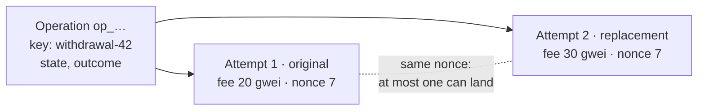
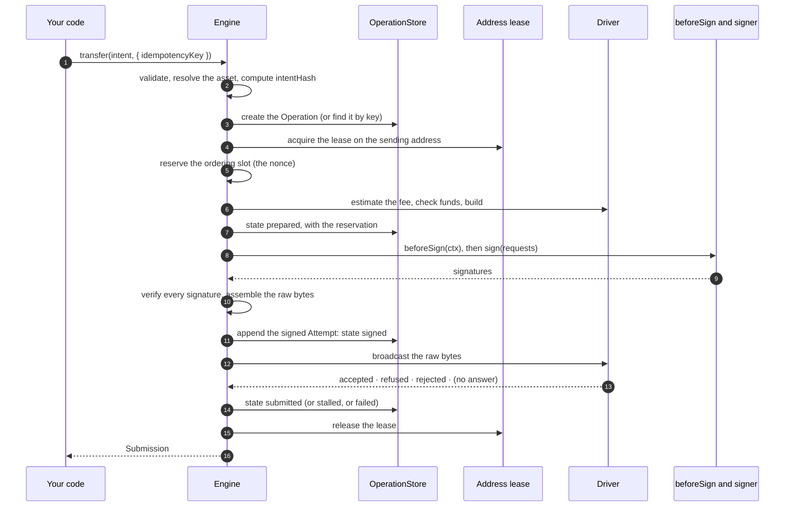
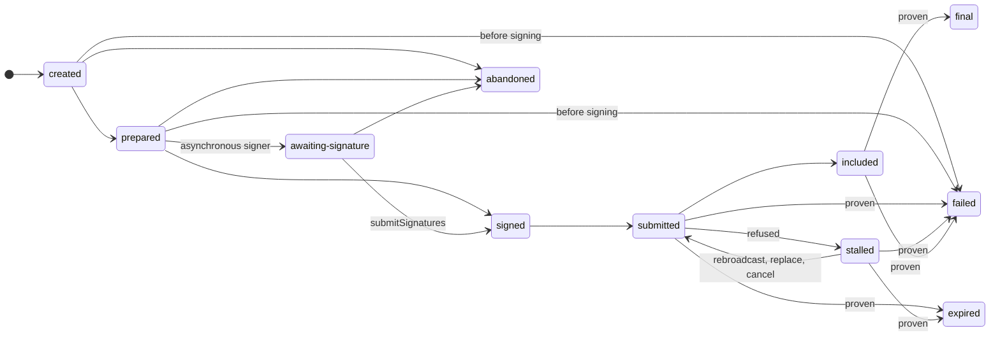

# The life of a transfer

> [!TIP]
> **The short version.** `transfer()` turns your intent into an **Operation**, a stored record
> of the payment, unique per idempotency key. It reserves the wallet's ordering slot, builds,
> asks your policy hook and the signer, stores the signed transaction as an **Attempt**, and
> only then broadcasts it. From there the Operation moves through a fixed set of states, and it
> can only end on proven evidence. A repeat of the call with the same key resumes the same
> Operation, wherever it stopped, and never signs twice.

**Builds on:** [Transactions](../learn/foundations/transactions.md),
[Idempotency](../learn/engineering/idempotency.md),
[Persistence and crash recovery](../learn/engineering/persistence.md) and
[Chains, families and drivers](./families.md).

## Operation and Attempt

Two records carry every payment, and keeping them apart is the key to the design:

- An **Operation** is the business fact: "pay this address this amount, for withdrawal 42". It
  is created once per idempotency key, stored, and survives restarts. It has a **state**, an
  **outcome** once it ends (`executed` or `cancelled`), and an `ambiguous` flag while its last
  broadcast's fate is unknown.
- An **Attempt** is one signed transaction that tries to carry out the Operation. It never
  changes once stored. Usually there is one; replacing a stuck transfer, cancelling it, or
  re-issuing an expired one adds another. One Attempt is the **active** one.



Because Attempts of one Operation share an ordering slot, at most one of them can land, and
when one is final, the others are marked replaced. That is how a fee bump can never become a
second payment.

## The steps of `transfer()`



Three steps carry most of the safety:

- **Step 3: one Operation per key.** If the key exists with the same `intentHash`, the engine
  returns the existing Operation and continues it from its stored state. With a different hash,
  it throws `IDEMPOTENCY_CONFLICT`.
- **Step 10: verify before use.** Every signature is checked against the public key it should
  come from. A bad one fails with `SIGNATURE_MISMATCH` and is never sent.
- **Step 11 before step 12: write-ahead signing.** The signed bytes are stored **before** the
  broadcast. A crash anywhere after step 11 leaves bytes that recovery can resend, so the
  library never has to sign again.

Failures before signing are clean: insufficient funds or a policy veto mark the Operation
`failed` and release the slot, and nothing was signed. For cold or custody signing,
`prepareTransfer` stores the unsigned transaction and returns its signing requests instead of
calling a signer, and `submitSignatures` takes the signatures back and resumes at step 10.

## Classifying the broadcast answer

Step 12 can end four ways, and each one maps to exactly one next state:

| The node's answer | Means | Operation becomes |
| --- | --- | --- |
| Accepted, or "already known" | The network has the transaction | `submitted` |
| No answer, or a transport failure | The bytes may have reached the network | `submitted`, with `ambiguous: true`; the error is ambiguous |
| **Refused**: a reason that can change (low fee, funds, nonce too high) | The bytes might still become valid, or already be relayed | `stalled`, with the error code |
| **Rejected**: the bytes can never be valid | Nothing can land | `failed` (`TX_REJECTED`) once every Attempt is rejected |

A node's claim that bytes are invalid is checked against the bytes the library sent, by the
driver, before it is believed. A claim the driver cannot confirm counts as a refusal, so a
lying endpoint can stall a payment but never make it look safely failed.

## The state machine



`final`, `failed`, `expired` and `abandoned` are terminal (`isTerminal(state)`). Once an
Operation is signed, it reaches a terminal state only on **proven** evidence, which stop 6
explains. `abandoned` is possible only before anything is signed.

## Watching it happen

The event bus shows each step. Here is one transfer, from call to proven finality:

<!-- runnable -->
```ts
import { createFakeEnv } from 'crypto-aio/testing';

const env = await createFakeEnv();
const trail: string[] = [];
env.aio.onAny((event) => {
  if (event.type === 'operation.state') trail.push(`operation → ${event.to}`);
  if (event.type === 'nonce.allocated') trail.push(`nonce ${event.value} reserved`);
  if (event.type === 'signer.completed') trail.push(`signer: ${event.status}`);
});

const sub = await env.run(
  env.bc.transfer({ to: env.stranger(), amount: 5n }, { idempotencyKey: 'order-7' }),
);
env.chain.mine(4);
await env.run(sub.wait({ finality: 'final' }));
for (const line of trail) console.log(line);
// Prints:
// operation → created
// nonce 0 reserved
// operation → prepared
// signer: signed
// operation → signed
// operation → submitted
// operation → final

const op = await env.run(env.bc.getOperation(sub.operationId));
console.log(op?.outcome, op?.attempts.length, op?.attempts[0]?.purpose); // executed 1 original
```

`transfer` returns a **`Submission`**: the Operation's view (`operationId`, `state`, `attempt`,
`attempts`, …) plus `wait(options)`. `bc.getOperation(id)` reads the same view at any time, from
any process that shares the stores.

## Where it lives

| Path | What is there |
| --- | --- |
| `src/core/lifecycle/engine.ts` | `transfer`, `prepare`, `submitSignatures`, `rebroadcast`, `replace`, `cancel`, `rebuild`, `abandon` |
| `src/core/lifecycle/intent.ts`, `src/core/model/intent.ts` | Normalizing an intent; computing its `intentHash` |
| `src/core/lifecycle/engine-rules.ts` | Lifecycle defaults and the state predicates |
| `src/core/lifecycle/views.ts` | `OperationView`, `AttemptView`, `Submission` |
| `src/core/store/types.ts` | The records as stored, and `TERMINAL_STATES` |

## Check yourself

1. Why are the Operation and the Attempt separate records?
2. A process crashes right after step 11. What does the next process find, and do?
3. A node answers "nonce too high". Is the payment failed?

<details markdown="1">
<summary>Answers</summary>

1. The Operation is the one payment you asked for; Attempts are the transactions that try to
   carry it out. A replacement adds an Attempt without creating a second payment.
2. A `signed` Operation with stored raw bytes. Recovery broadcasts those exact bytes; nothing is
   signed again.
3. No: it is a refusal, a reason that can change. The Operation is `stalled`, and its bytes may
   still land.

</details>

## What's next

`stalled`, ambiguous broadcasts and crashes are where the design earns its keep. How each one is
resolved: [Retries, ambiguity and recovery](./recovery.md).
